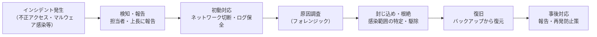

# 情報セキュリティ法規と制度

情報セキュリティは「技術で守る」だけでなく、**法律・制度によって守られ、違反すれば罰せられる**分野です。「何が違法で何が合法か」を知らずにデータを扱うと、意図せず法律を犯すことになります。

---

## はじめて読む人へ

「ハッキングは犯罪」と知っていても、具体的にどの法律に抵触するかは意外と知られていません。また被害を受けたときどこに相談すればよいかも重要です。

### 読む前に押さえること

特に前提知識は不要です。

### 読み終えたら説明できること

- 不正アクセス禁止法・個人情報保護法・サイバーセキュリティ基本法の内容を説明できる
- 組織のセキュリティ対策の基本方針（ISMS）を説明できる
- 被害に遭ったときの相談先を知っている

---

## 主な情報セキュリティ関連法律

### 不正アクセス禁止法

**正式名称：** 不正アクセス行為の禁止等に関する法律（1999年制定）

#### 禁止されている行為

| 行為 | 罰則 |
|------|------|
| **不正アクセス行為** | 3年以下の懲役または100万円以下の罰金 |
| **不正アクセスの助長** | 1年以下の懲役または50万円以下の罰金 |
| **フィッシング行為** | 1年以下の懲役または50万円以下の罰金 |
| **識別符号の不正取得・保管** | 1年以下の懲役または50万円以下の罰金 |

#### 「不正アクセス」とは何か

!!! info ""
    不正アクセスの例（すべて違法）:
      ✗ 他人のID・パスワードを使ってログイン
      ✗ SQLインジェクションなどでシステムへ侵入
      ✗ セキュリティホールを突いて管理者権限を取得
      ✗ 知り合いのSNSアカウントを「借りて」操作する
    
    合法（ただし条件あり）:
      ✓ 自分が所有・管理するシステムへのアクセス
      ✓ 契約に基づく正規のペネトレーションテスト
      ✓ バグバウンティプログラムの範囲内のセキュリティ調査

**大学生が注意すること：**
- 友人のSNSアカウントを「本人の許可なく」操作することも不正アクセスになりえます
- 「脆弱性の調査」と称した無許可の侵入テストは違法です

---

### 個人情報保護法

**正式名称：** 個人情報の保護に関する法律（2003年制定、2022年改正施行）

#### 個人情報取扱事業者の義務

| 義務 | 内容 |
|------|------|
| **利用目的の明示** | 収集する前に何のために使うかを明示する |
| **安全管理措置** | 漏洩・滅失・毀損を防ぐ措置を講じる |
| **第三者提供の制限** | 本人の同意なしに第三者に提供しない |
| **開示請求への対応** | 本人が自分のデータを確認・修正・削除できるようにする |
| **漏洩報告** | 要配慮情報の漏洩は個人情報保護委員会に報告義務 |

```python
# 卒業研究でのデータ取り扱い例

# NG: 氏名・メールアドレスをそのまま分析・公開
df_public = df[['name', 'email', 'score']]

# OK: 匿名化してから公開
import hashlib
df_safe = df.copy()
df_safe['user_id'] = df_safe['email'].apply(
    lambda x: hashlib.sha256(x.encode()).hexdigest()[:8]
)
df_safe = df_safe.drop(columns=['name', 'email'])
```

#### GDPR（EU 一般データ保護規則）との比較

| 項目 | 個人情報保護法 | GDPR |
|------|-------------|------|
| 適用範囲 | 日本 | EU 市民のデータ（世界中に適用） |
| 制裁金 | 1億円以下 | 年間売上の4% |
| 忘れられる権利 | 消去請求権あり（条件付き） | 強い消去権 |
| データポータビリティ | 規定なし | 権利として明記 |

---

### 不正競争防止法（営業秘密の保護）

企業の機密情報・営業秘密を不正に取得・使用する行為を禁止します。

!!! info ""
    禁止される行為の例:
      ✗ 退職時に会社のデータを持ち出す
      ✗ 競合他社の内部文書を不正に入手する
      ✗ 不正に入手した営業秘密を第三者に提供する
    
    罰則: 10年以下の懲役または2000万円以下の罰金

---

### サイバーセキュリティ基本法

**正式名称：** サイバーセキュリティ基本法（2014年制定）

- 国・地方公共団体・重要インフラ事業者のサイバーセキュリティ対策を義務化
- 内閣サイバーセキュリティセンター（NISC）の設置
- 「サイバーセキュリティ戦略」の策定

---

## 組織のセキュリティ体制

### ISMS（情報セキュリティマネジメントシステム）

組織全体で情報セキュリティを管理する枠組みです。国際規格 **ISO/IEC 27001** が代表的です。

!!! info ""
    ISMS の 3 要素:
      機密性（Confidentiality）: 許可された人だけがアクセスできる
      完全性（Integrity）: データが正確で改ざんされていない
      可用性（Availability）: 必要なときに使える
    
    PDCA サイクル:
      Plan（計画） → Do（実施） → Check（評価） → Act（改善）

### 情報セキュリティポリシー

組織がセキュリティをどう管理するかの方針・規則を文書化したものです。

!!! info ""
    一般的な内容:
      - パスワードの複雑さの要件
      - 端末の持ち出し・私物端末の利用ルール
      - インシデント発生時の報告手順
      - 定期的なセキュリティ教育の義務
      - アクセス権限の管理方針

### インシデント対応手順



---

## 被害に遭ったときの相談窓口

| 相談内容 | 相談窓口 |
|---------|---------|
| 不正アクセス・ハッキング被害 | **警察のサイバー犯罪相談窓口**（各都道府県警） |
| フィッシング詐欺 | **フィッシング対策協議会** |
| サポート詐欺・特殊詐欺 | **消費者ホットライン（188）** |
| 個人情報の漏洩 | **個人情報保護委員会** |
| ウイルス・マルウェア情報 | **IPA（情報処理推進機構）** |
| 脆弱性情報 | **JVN（Japan Vulnerability Notes）** |

!!! info ""
    IPA（独立行政法人 情報処理推進機構）:
    https://www.ipa.go.jp/security/
    
    不審なメール・ファイルの相談・報告ができる
    「安心相談窓口」「J-CRAT」なども提供

---

## 学生として知っておくべき注意点

!!! info ""
    【やってはいけないこと】
    ✗ 他人のID・パスワードを使ったログイン（不正アクセス禁止法違反）
    ✗ 無許可でサーバーへの侵入テスト
    ✗ 授業・研究で取得した個人情報の目的外利用
    ✗ GitHubにパスワード・APIキーをコミット
      （公開リポジトリに上げると世界中から使われる）
    
    【やるべきこと】
    ✓ 研究データは匿名化して管理する
    ✓ パスワードは強力にして使い回さない
    ✓ 不審なメール・リンクは開く前に確認する
    ✓ PCを共有する場合はログアウトする
    ✓ 学内ネットワークの利用ルールを確認する

---

## 確認問題

1. 友人のSNSアカウントに「本人に頼まれて」ログインした場合、不正アクセス禁止法に抵触しますか？理由も含めて説明してください。
2. 個人情報保護法における「要配慮個人情報」とは何ですか？取得時に通常と何が異なりますか？
3. 企業でインシデント（不正アクセス）が発生したとき、最初にすべき「初動対応」を 2 つ挙げてください。

---

## 関連ページ

- [セキュリティ基礎](セキュリティ.md) — Web セキュリティの実践
- [データ倫理・AI倫理](データ倫理.md) — 個人情報・アルゴリズムの倫理
- [認証・認可](認証・認可.md) — アカウント管理・アクセス制御の実装
- [マルウェア・サイバー攻撃](マルウェア・サイバー攻撃.md) — 技術的な脅威
- [OWASP Top 10](OWASP-Top10.md) — Web アプリの脆弱性
