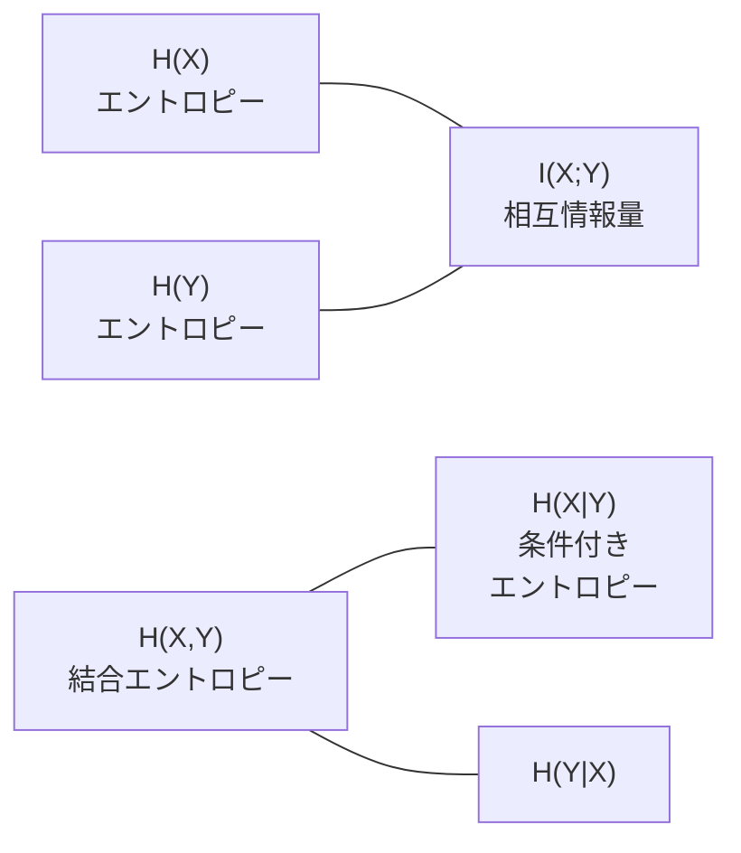

# 情報理論

「あるメッセージが届いたとき、どれだけの情報が得られたか」を定量化する数学です。シャノンが 1948 年に創始し、通信・圧縮・暗号の土台になりました。機械学習では**クロスエントロピー損失・KL ダイバージェンス・VAE の ELBO**として毎日使われています。

---

## はじめて読む人へ

ニューラルネットワークの分類問題で使う「クロスエントロピー損失」は情報理論から来ています。「なぜ二乗誤差ではなくクロスエントロピーを使うのか」「VAE の loss function の KL 項は何をしているのか」——これらの問いへの答えがこのページにあります。

### 読む前に押さえること

- [確率・統計基礎](確率・統計基礎.md) の確率分布・期待値の概念
- log（対数）の基本的な性質（$\log(ab) = \log a + \log b$、$\log(1/x) = -\log x$）

### 読み終えたら説明できること

- シャノンエントロピーが「不確かさ・情報量」を測ることを説明できる
- クロスエントロピー損失がなぜ分類問題の損失関数として自然かを説明できる
- KL ダイバージェンスが「2 つの分布の違い」を測ることを説明できる

---

## 情報量と驚き

「コインが表だった」という情報と「宝くじが当たった」という情報——どちらがより多くの情報を持っていますか？

```
直感：起きにくいことが起きたほど、情報量が多い

コインが表（確率 0.5）: 「まあそうだよね」 → 情報量 小
宝くじ当選（確率 0.000001）: 「えっ！？」 → 情報量 大
```

事象 $x$ の**自己情報量（情報量）** は：

$$
I(x) = -\log_2 p(x) \quad \text{[bits]}
$$

```python
import numpy as np

# 自己情報量
def self_info(p):
    return -np.log2(p)

print(f"コイン表（p=0.5）: {self_info(0.5):.2f} bits")   # 1.00 bits
print(f"サイコロ1（p=1/6）: {self_info(1/6):.2f} bits")  # 2.58 bits
print(f"確実な事象（p=1.0）: {self_info(1.0):.2f} bits") # 0.00 bits
```

確実なことが起きても情報量はゼロ。珍しいことが起きるほど情報量が大きくなります。

---

## シャノンエントロピー

確率分布全体の「平均的な情報量（不確かさ）」です。

$$
H(X) = -\sum_{x} p(x) \log_2 p(x) \quad \text{[bits]}
$$

```python
def entropy(probs):
    probs = np.array(probs)
    return -np.sum(probs * np.log2(probs + 1e-12))

# 公平なコイン: 最も不確か
print(f"公平コイン [0.5, 0.5]: {entropy([0.5, 0.5]):.3f} bits")       # 1.000

# 偏ったコイン: 少し予測しやすい
print(f"偏りコイン [0.9, 0.1]: {entropy([0.9, 0.1]):.3f} bits")       # 0.469

# 確実な事象: 不確かさゼロ
print(f"確実 [1.0, 0.0]: {entropy([1.0, 0.0]):.3f} bits")             # 0.000

# 公平なサイコロ: コインより不確か
print(f"公平サイコロ（均一 6面）: {entropy([1/6]*6):.3f} bits")        # 2.585
```

```
エントロピー最大：すべての結果が等確率（最も不確か）
エントロピー最小：1 つの結果が確実（不確かさゼロ）
```

---

## クロスエントロピー

「真の分布 $P$ のデータを、分布 $Q$ を使って符号化したときの平均ビット数」です。

$$
H(P, Q) = -\sum_{x} P(x) \log_2 Q(x)
$$

**$Q$ が $P$ に近いほど $H(P, Q)$ は小さくなります。**

```python
def cross_entropy(p_true, q_pred):
    p = np.array(p_true)
    q = np.array(q_pred)
    return -np.sum(p * np.log(q + 1e-12))

# 真のラベル（one-hot）: 猫=1, 犬=0, 鳥=0
p_true = [1.0, 0.0, 0.0]

# 予測 A（ほぼ正解）
q_good = [0.9, 0.05, 0.05]
# 予測 B（外れ）
q_bad  = [0.1, 0.8, 0.1]

print(f"良い予測のクロスエントロピー: {cross_entropy(p_true, q_good):.4f}")  # 小さい
print(f"悪い予測のクロスエントロピー: {cross_entropy(p_true, q_bad):.4f}")   # 大きい
```

### 神経ネットワークの損失関数

多クラス分類でよく使われる損失関数の本体は**クロスエントロピー**です。

```python
import torch
import torch.nn.functional as F

# ロジット（softmax 前の生の出力）
logits = torch.tensor([[2.0, 1.0, 0.1]])   # バッチサイズ 1、クラス数 3
labels = torch.tensor([0])                   # 正解クラス: 0

# PyTorch の cross_entropy = log_softmax + NLLLoss
loss = F.cross_entropy(logits, labels)
print(f"CrossEntropyLoss: {loss.item():.4f}")

# 手動で計算
probs = F.softmax(logits, dim=-1)[0]
manual = -torch.log(probs[labels[0]])
print(f"手動計算:          {manual.item():.4f}")  # 同じ値
```

---

## KL ダイバージェンス

2 つの分布 $P$（真の分布）と $Q$（近似分布）の**違いの大きさ**を測ります。

$$
D_{\mathrm{KL}}(P \| Q) = \sum_{x} P(x) \log \frac{P(x)}{Q(x)}
$$

$$
D_{\mathrm{KL}}(P \| Q) = H(P, Q) - H(P) \geq 0
$$

**KL ダイバージェンスの性質：**
- $D_{\mathrm{KL}} = 0$ ⟺ $P = Q$（完全に同じ分布）
- $D_{\mathrm{KL}}(P \| Q) \neq D_{\mathrm{KL}}(Q \| P)$（非対称）
- 常に 0 以上（ギブスの不等式）

```python
from scipy.stats import entropy as scipy_entropy
import numpy as np

p = np.array([0.4, 0.4, 0.2])    # 真の分布
q = np.array([0.33, 0.33, 0.34]) # 近似分布

kl_pq = scipy_entropy(p, q)       # D_KL(P || Q)
kl_qp = scipy_entropy(q, p)       # D_KL(Q || P)

print(f"D_KL(P||Q) = {kl_pq:.4f}")
print(f"D_KL(Q||P) = {kl_qp:.4f}")  # P と Q を入れ替えると値が変わる
```

### VAE への応用

変分オートエンコーダ（VAE）の損失関数：

$$
\mathcal{L} = \underbrace{-\mathbb{E}[\log p(x|z)]}_{\text{再構成誤差}} + \underbrace{D_{\mathrm{KL}}(q(z|x) \| p(z))}_{\text{正則化項}}
$$

- 再構成誤差：元の画像を復元できているか（クロスエントロピー or MSE）
- KL 項：潜在空間が標準正規分布 $\mathcal{N}(0, I)$ に近いか（正則化）

---

## 相互情報量

2 つの変数 $X$ と $Y$ が「どれだけ互いに情報を持っているか」を測ります。

$$
I(X; Y) = H(X) - H(X \mid Y) = H(Y) - H(Y \mid X)
$$

- $I(X; Y) = 0$：$X$ と $Y$ は独立（互いに情報を持たない）
- $I(X; Y)$ が大きいほど、$Y$ を知れば $X$ の不確かさが大きく減る

**特徴選択への応用：** 目的変数 $Y$ と各特徴量 $X_i$ の相互情報量を計算し、高い特徴量を選ぶ。

```python
from sklearn.feature_selection import mutual_info_classif
from sklearn.datasets import load_iris

data = load_iris()
mi = mutual_info_classif(data.data, data.target, random_state=42)

for name, score in zip(data.feature_names, mi):
    print(f"{name}: {score:.3f}")
# petal length cm: 最も高い → 品種判別に最も有用
```

---

## 情報量の関係図



| 量 | 意味 |
|---|---|
| $H(X)$ | $X$ 単体の不確かさ |
| $H(X \mid Y)$ | $Y$ を知った後の $X$ の不確かさ |
| $I(X;Y)$ | $Y$ を知ることで減る $X$ の不確かさ |
| $H(P, Q)$ | 分布 $Q$ で分布 $P$ を符号化するコスト |
| $D_{\mathrm{KL}}(P \| Q)$ | $P$ と $Q$ の違い（余分なコスト）|

---

## 確認問題

1. シャノンエントロピーが最大になるのはどんな確率分布のときですか？最小になるのは？
2. ニューラルネットワークの多クラス分類でクロスエントロピー損失を最小化することは、真の分布と予測分布のどの量を最小化することと同じですか？
3. VAE の損失関数の KL 項が 0 になるのはどんなときですか？それが「正則化」になる理由を説明してください。

---

## 関連ページ

- [確率・統計基礎](確率・統計基礎.md) — 確率分布・期待値の基礎
- [ベイズ理論](ベイズ理論.md) — KL ダイバージェンスとベイズ推論の接続
- [深層学習入門](深層学習入門.md) — クロスエントロピー損失の実装
- [生成モデル（GAN・Diffusion）](生成モデル.md) — VAE の ELBO への応用
- [特徴量エンジニアリング](特徴量エンジニアリング.md) — 相互情報量による特徴選択
