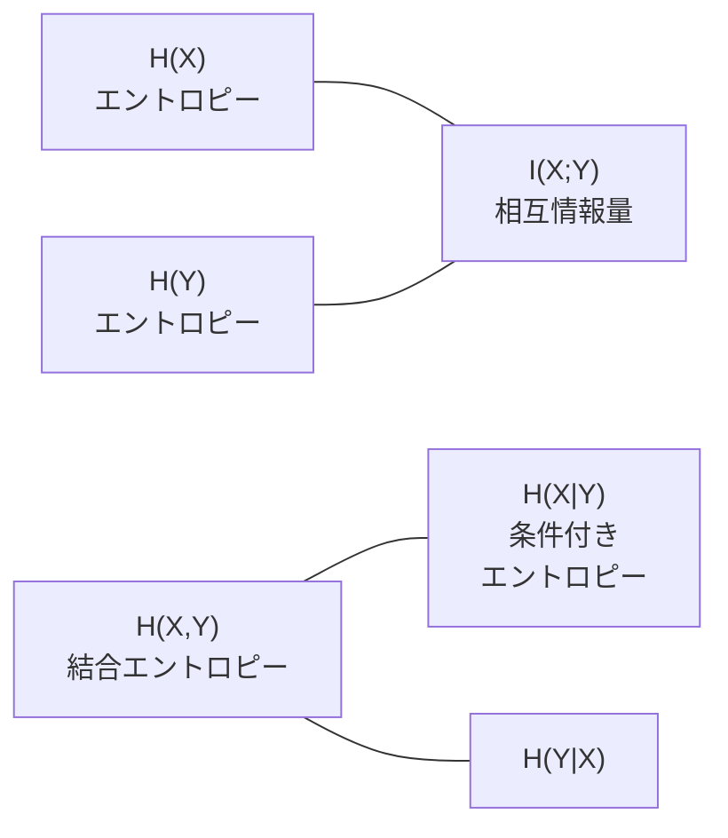

# 情報理論

「あるメッセージが届いたとき、どれだけの情報が得られたか」を定量化する数学です。シャノンが 1948 年に創始し、通信・圧縮・暗号の土台になりました。機械学習では**クロスエントロピー損失・KL ダイバージェンス・VAE の ELBO**として毎日使われています。

---

## はじめて読む人へ

ニューラルネットワークの分類問題で使う「クロスエントロピー損失」は情報理論から来ています。「なぜ二乗誤差ではなくクロスエントロピーを使うのか」「VAE の loss function の KL 項は何をしているのか」——これらの問いへの答えがこのページにあります。

### 読む前に押さえること

- [確率・統計基礎](確率・統計基礎.md) の確率分布・期待値の概念
- log（対数）の基本的な性質（$\log(ab) = \log a + \log b$、$\log(1/x) = -\log x$）

### 読み終えたら説明できること

- シャノンエントロピーが「不確かさ・情報量」を測ることを説明できる
- クロスエントロピー損失がなぜ分類問題の損失関数として自然かを説明できる
- KL ダイバージェンスが「2 つの分布の違い」を測ることを説明できる

---

## 情報量と驚き

「コインが表だった」という情報と「宝くじが当たった」という情報——どちらがより多くの情報を持っていますか？

直感：起きにくいことが起きたほど、情報量が多い

コインが表（確率 0.5）: 「まあそうだよね」 → 情報量 小
宝くじ当選（確率 0.000001）: 「えっ！？」 → 情報量 大
事象 $x$ の**自己情報量（情報量）** は：

$$
I(x) = -\log_2 p(x) \quad \text{[bits]}
$$

- コイン表（$p=0.5$）: $-\log_2 0.5 = 1$ bit
- サイコロ 1（$p=1/6$）: $-\log_2(1/6) \approx 2.58$ bits
- 確実な事象（$p=1$）: $-\log_2 1 = 0$ bits

確実なことが起きても情報量はゼロ。珍しいことが起きるほど情報量が大きくなります。

---

## シャノンエントロピー

確率分布全体の「平均的な情報量（不確かさ）」です。

$$
H(X) = -\sum_{x} p(x) \log_2 p(x) \quad \text{[bits]}
$$

- 公平なコイン [0.5, 0.5]: $H = 1.000$ bits（最も不確か）
- 偏ったコイン [0.9, 0.1]: $H = 0.469$ bits（少し予測しやすい）
- 確実 [1.0, 0.0]: $H = 0$ bits（不確かさゼロ）
- 公平なサイコロ（6 面）: $H = \log_2 6 \approx 2.585$ bits

エントロピー最大：すべての結果が等確率（最も不確か）
エントロピー最小：1 つの結果が確実（不確かさゼロ）
---

## クロスエントロピー

「真の分布 $P$ のデータを、分布 $Q$ を使って符号化したときの平均ビット数」です。

$$
H(P, Q) = -\sum_{x} P(x) \log_2 Q(x)
$$

**$Q$ が $P$ に近いほど $H(P, Q)$ は小さくなります。**

例：真のラベルが猫（1, 0, 0）のとき
- 良い予測 $Q = [0.9, 0.05, 0.05]$: $H = -\log 0.9 \approx 0.105$ nats（小さい）
- 悪い予測 $Q = [0.1, 0.8, 0.1]$: $H = -\log 0.1 \approx 2.303$ nats（大きい）

### 神経ネットワークの損失関数

多クラス分類でよく使われる損失関数の本体は**クロスエントロピー**です。PyTorch の `F.cross_entropy` は `log_softmax + NLLLoss` を合わせたものです。手動計算では `softmax` で確率に変換し、正解クラスの確率の `-log` を取ります。

---

## KL ダイバージェンス

2 つの分布 $P$（真の分布）と $Q$（近似分布）の**違いの大きさ**を測ります。

$$
D_{\mathrm{KL}}(P \| Q) = \sum_{x} P(x) \log \frac{P(x)}{Q(x)}
$$

$$
D_{\mathrm{KL}}(P \| Q) = H(P, Q) - H(P) \geq 0
$$

**KL ダイバージェンスの性質：**
- $D_{\mathrm{KL}} = 0$ ⟺ $P = Q$（完全に同じ分布）
- $D_{\mathrm{KL}}(P \| Q) \neq D_{\mathrm{KL}}(Q \| P)$（非対称）
- 常に 0 以上（ギブスの不等式）

`scipy.stats.entropy(p, q)` で $D_{\mathrm{KL}}(P \| Q)$ を計算できます。$P$ と $Q$ を入れ替えると値が変わる（非対称）ことに注意します。

### VAE への応用

変分オートエンコーダ（VAE）の損失関数：

$$
\mathcal{L} = \underbrace{-\mathbb{E}[\log p(x|z)]}_{\text{再構成誤差}} + \underbrace{D_{\mathrm{KL}}(q(z|x) \| p(z))}_{\text{正則化項}}
$$

- 再構成誤差：元の画像を復元できているか（クロスエントロピー or MSE）
- KL 項：潜在空間が標準正規分布 $\mathcal{N}(0, I)$ に近いか（正則化）

---

## 相互情報量

2 つの変数 $X$ と $Y$ が「どれだけ互いに情報を持っているか」を測ります。

$$
I(X; Y) = H(X) - H(X \mid Y) = H(Y) - H(Y \mid X)
$$

- $I(X; Y) = 0$：$X$ と $Y$ は独立（互いに情報を持たない）
- $I(X; Y)$ が大きいほど、$Y$ を知れば $X$ の不確かさが大きく減る

**特徴選択への応用：** 目的変数 $Y$ と各特徴量 $X_i$ の相互情報量を計算し、高い特徴量を選ぶ。scikit-learn の `mutual_info_classif` で計算できます。

---

## 情報量の関係図

| 量 | 意味 |
|---|---|
| $H(X)$ | $X$ 単体の不確かさ |
| $H(X \mid Y)$ | $Y$ を知った後の $X$ の不確かさ |
| $I(X;Y)$ | $Y$ を知ることで減る $X$ の不確かさ |
| $H(P, Q)$ | 分布 $Q$ で分布 $P$ を符号化するコスト |
| $D_{\mathrm{KL}}(P \| Q)$ | $P$ と $Q$ の違い（余分なコスト）|

---

## 数学的導出

### KL ダイバージェンス ≥ 0 の証明（ギブスの不等式）

$$
D_{\mathrm{KL}}(P \| Q) \geq 0, \quad \text{等号成立} \Leftrightarrow P = Q
$$

**証明（Jensen の不等式を使う）：**

$\ln$ は上に凸（concave）な関数なので、Jensen の不等式から：

$$
E[\ln X] \leq \ln E[X]
$$

$X = Q(x)/P(x)$ と置いて、期待値を $P$ に関して取ります：

$$
E_P\left[\ln \frac{Q(x)}{P(x)}\right] \leq \ln E_P\left[\frac{Q(x)}{P(x)}\right] = \ln \sum_x P(x) \cdot \frac{Q(x)}{P(x)} = \ln \sum_x Q(x) = \ln 1 = 0
$$

したがって：

$$
D_{\mathrm{KL}}(P \| Q) = E_P\left[\ln \frac{P(x)}{Q(x)}\right] = -E_P\left[\ln \frac{Q(x)}{P(x)}\right] \geq 0
$$

等号は $Q(x)/P(x) = \text{const}$ のとき（つまり $P = Q$ のとき）に成立します。

---

### クロスエントロピー = エントロピー + KL の分解

$$
H(P, Q) = H(P) + D_{\mathrm{KL}}(P \| Q)
$$

**証明：**

$$
H(P, Q) = -\sum_x P(x) \log Q(x)
$$

ここに $\log Q(x) = \log P(x) + \log \frac{Q(x)}{P(x)}$ を代入すると：

$$
= -\sum_x P(x) \log P(x) - \sum_x P(x) \log \frac{Q(x)}{P(x)} = H(P) + D_{\mathrm{KL}}(P \| Q)
$$

**重要な含意：**

$$
H(P, Q) \geq H(P) \quad (\text{KL} \geq 0 \text{ より})
$$

真の分布 $P$ のデータを符号化するとき、**真の分布 $P$ を使う（$Q=P$）より非効率な符号化は存在しない**。ニューラルネットの学習で「クロスエントロピーを最小化する」=「KL ダイバージェンスを最小化する」（$H(P)$ は定数）です。

---

### エントロピー最大化の証明（一様分布が最大）

$n$ 個の結果を持つ離散確率変数で、$H(P)$ が最大になるのはすべて等確率 $p_i = 1/n$ のときです。

**証明（ラグランジュ乗数法）：**

制約 $\sum_i p_i = 1$ のもとで $H = -\sum_i p_i \log p_i$ を最大化します。

ラグランジアン $\mathcal{L} = -\sum_i p_i \log p_i - \lambda (\sum_i p_i - 1)$ を偏微分してゼロとおくと：

$$
\frac{\partial \mathcal{L}}{\partial p_i} = -\log p_i - 1 - \lambda = 0 \Rightarrow p_i = e^{-(1+\lambda)}
$$

すべての $i$ で同じ値なので $p_i = 1/n$（一様分布）で、このとき $H = \log n$（最大）。

---

## 確認問題

1. Jensen の不等式を使って $D_{\mathrm{KL}}(P \| Q) \geq 0$ を証明してください。
2. クロスエントロピーを最小化することは、KL ダイバージェンスを最小化することと同じですか？$H(P,Q) = H(P) + D_{\mathrm{KL}}(P\|Q)$ を使って説明してください。
3. VAE の損失関数の KL 項が 0 になるのはどんなときですか？それが「正則化」になる理由を説明してください。

---

## 関連ページ

- [確率・統計基礎](確率・統計基礎.md) — 確率分布・期待値の基礎
- [ベイズ理論](ベイズ理論.md) — KL ダイバージェンスとベイズ推論の接続
- [深層学習入門](深層学習入門.md) — クロスエントロピー損失の実装
- [生成モデル（GAN・Diffusion）](生成モデル.md) — VAE の ELBO への応用
- [特徴量エンジニアリング](特徴量エンジニアリング.md) — 相互情報量による特徴選択
