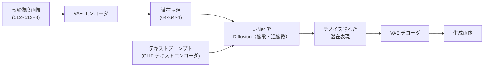

# 拡散モデルの数学（DDPM・スコアマッチング）

生成モデル.md で学んだ Diffusion モデルの数学的基礎です。スコアマッチング・DDPM（Denoising Diffusion Probabilistic Models）の ELBO 導出・DDIM による高速サンプリング・Latent Diffusion（Stable Diffusion）・Flow Matching を扱います。

---

## はじめて読む人へ

「なぜノイズを加えて除去するだけで画像が生成できるのか」——その答えは確率論にあります。Diffusion モデルは「ノイズ除去の逆過程が生成過程」という洞察を変分推論で数学的に定式化します。GAN のような不安定な学習が不要で、理論的に裏付けられた強力な生成モデルです。

### 読む前に押さえること

- [生成モデル（GAN・VAE・Diffusion）](生成モデル) — Diffusion の直感的理解
- [ベイズ理論](ベイズ理論) — 変分推論・ELBO の概念
- [確率過程](確率過程) — ブラウン運動・確率微分方程式

### 読み終えたら説明できること

- DDPM の順過程・逆過程の確率的定式化を説明できる
- ELBO の分解から「ノイズ予測」が目標になる理由を説明できる
- DDIM が DDPM より高速なサンプリングができる理由を説明できる

---

## Score Matching（スコアマッチング）

### Score Function（スコア関数）

データ分布 $p(x)$ のスコア関数：

$$
\mathbf{s}(x) = \nabla_x \log p(x)
$$

正規化定数に依存しない。データが高密度な方向（$\nabla_x \log p$ が正の方向）に向けることで、スコアを辿れば高確率な領域に到達できます。

### Denoising Score Matching

ノイズを加えたデータ $\tilde{x} = x + \sigma\varepsilon$（$\varepsilon \sim \mathcal{N}(0, I)$）のスコアを学習します：

$$
\mathcal{L}_{\text{DSM}} = \mathbb{E}_{x, \tilde{x}}\!\left[\left\|\mathbf{s}_\theta(\tilde{x}) - \nabla_{\tilde{x}} \log p(\tilde{x}|x)\right\|^2\right]
$$

$p(\tilde{x}|x) = \mathcal{N}(\tilde{x}; x, \sigma^2 I)$ なので：

$$
\nabla_{\tilde{x}} \log p(\tilde{x}|x) = -\frac{\tilde{x} - x}{\sigma^2} = \frac{\varepsilon}{\sigma}
$$

つまり**スコアは「加えたノイズの方向」を向いている**。スコアネットワークはノイズを予測するネットワークと本質的に同じです。

---

## DDPM（Denoising Diffusion Probabilistic Models）

### 順過程（Forward Process）：ノイズ付加

$T$ ステップかけて徐々にガウスノイズを加えていきます：

$$
q(x_t | x_{t-1}) = \mathcal{N}(x_t;\, \sqrt{1-\beta_t}\, x_{t-1},\, \beta_t I)
$$

$\beta_t$：ノイズスケジュール（時間とともに増加）。$\alpha_t = 1-\beta_t$、$\bar{\alpha}_t = \prod_{s=1}^t \alpha_s$ とおくと、任意の $t$ 步目に一発で計算できます：

$$
\boxed{q(x_t | x_0) = \mathcal{N}(x_t;\, \sqrt{\bar{\alpha}_t}\, x_0,\, (1-\bar{\alpha}_t) I)}
$$

**再パラメータ化で：** $x_t = \sqrt{\bar{\alpha}_t} x_0 + \sqrt{1-\bar{\alpha}_t}\, \varepsilon$（$\varepsilon \sim \mathcal{N}(0, I)$）。

$T \to \infty$ のとき $\bar{\alpha}_T \to 0$ なので $x_T \approx \mathcal{N}(0, I)$（純粋なガウスノイズ）。

### 逆過程（Reverse Process）：ノイズ除去

逆過程 $p_\theta(x_{t-1}|x_t)$ も正規分布で近似：

$$
p_\theta(x_{t-1}|x_t) = \mathcal{N}(x_{t-1};\, \mu_\theta(x_t, t),\, \Sigma_\theta(x_t, t))
$$

ニューラルネットワーク $\varepsilon_\theta(x_t, t)$（通常は U-Net）が $x_t$ に加わったノイズ $\varepsilon$ を予測し、逆過程の平均を計算します：

$$
\mu_\theta(x_t, t) = \frac{1}{\sqrt{\alpha_t}}\left(x_t - \frac{\beta_t}{\sqrt{1-\bar{\alpha}_t}}\varepsilon_\theta(x_t, t)\right)
$$

### ELBO の導出

変分下界（ELBO）を展開すると：

$$
-\log p_\theta(x_0) \leq \mathbb{E}_q\left[D_{\text{KL}}(q(x_T|x_0) \| p(x_T)) + \sum_{t>1} D_{\text{KL}}(q(x_{t-1}|x_t,x_0) \| p_\theta(x_{t-1}|x_t)) - \log p_\theta(x_0|x_1)\right]
$$

Ho et al. 2020 はこれを簡略化し、**ノイズ予測の MSE** に帰着させました：

$$
\boxed{\mathcal{L}_{\text{simple}} = \mathbb{E}_{t, x_0, \varepsilon}\!\left[\|\varepsilon - \varepsilon_\theta(\sqrt{\bar\alpha_t} x_0 + \sqrt{1-\bar\alpha_t}\,\varepsilon,\, t)\|^2\right]}
$$

**直感：** 「ランダムな時刻 $t$ でノイズを加えた $x_t$ から、加えたノイズ $\varepsilon$ を当てる」という単純な回帰問題に帰着しています。

---

## DDIM（Denoising Diffusion Implicit Models）

### DDPM のボトルネック：サンプリングが遅い

DDPM は $T = 1000$ ステップの逐次計算が必要で、高解像度画像 1 枚に数十秒かかります。

### DDIM の解決策：非マルコフ的逆過程

DDPM の学習済みモデル $\varepsilon_\theta$ をそのまま使いながら、**非マルコフ的な確定的サンプリング**に切り替えます：

$$
x_{t-1} = \sqrt{\bar\alpha_{t-1}} \underbrace{\left(\frac{x_t - \sqrt{1-\bar\alpha_t}\,\varepsilon_\theta}{\sqrt{\bar\alpha_t}}\right)}_{\hat{x}_0 \text{の予測}} + \sqrt{1-\bar\alpha_{t-1} - \sigma_t^2}\,\varepsilon_\theta + \sigma_t\,\varepsilon
$$

$\sigma_t = 0$（確定的）のとき、マルコフ性が不要になり、**任意のサブシーケンスでサンプリングできます**。$T=1000$ のうち 50 ステップだけ使って 20 倍高速化。

---

## ノイズスケジュール

| スケジュール | 式 | 特徴 |
|------------|-----|------|
| **Linear** | $\beta_t = \beta_{\min} + t(\beta_{\max}-\beta_{\min})/(T-1)$ | DDPM オリジナル |
| **Cosine** | $\bar\alpha_t = \cos^2\!\left(\frac{t/T + s}{1+s} \cdot \frac{\pi}{2}\right)$ | 高解像度画像に有効 |
| **Sigmoid** | より滑らかな移行 | Stable Diffusion 3 |

Cosine スケジュールは最終ステップまで情報を保持しやすく、ノイズが急激に増加しないため高品質な生成に繋がります。

---

## Latent Diffusion（Stable Diffusion）

ピクセル空間で拡散するのは計算コストが高すぎるため、**潜在空間で拡散**します。

潜在空間の次元が 48 分の 1 に圧縮されるため、計算コストが大幅に削減されます。

### Classifier-Free Guidance（CFG）

条件付き生成（テキスト→画像）を強化します：

$$
\hat\varepsilon = \varepsilon_\theta(x_t, \emptyset) + w \cdot \bigl(\varepsilon_\theta(x_t, c) - \varepsilon_\theta(x_t, \emptyset)\bigr)
$$

$c$：テキスト条件、$\emptyset$：無条件、$w$：Guidance スケール（大きいほどテキストに忠実）。

---

## Flow Matching（最新手法）

DDPM の後継として注目される手法です（Lipman et al., 2022）。

### アイデア

DDPM はノイズ → データへの「確率微分方程式（SDE）」を逆向きに解きますが、Flow Matching は**最適輸送（Optimal Transport）** によるよりシンプルな常微分方程式（ODE）を学習します：

$$
\frac{dx}{dt} = v_\theta(x, t)
$$

ノイズ分布からデータ分布への直線的な経路（または最適輸送経路）を学習します。

**利点：**
- DDIM より少ないステップで高品質なサンプリング
- 学習が安定・高速
- Stable Diffusion 3・Flux などで採用

---

## 数学的導出

### 順過程の任意時刻への閉形式

$q(x_t|x_{t-1}) = \mathcal{N}(\sqrt{1-\beta_t}\,x_{t-1}, \beta_t I)$ から出発します。

帰納法：$q(x_t|x_0) = \mathcal{N}(\sqrt{\bar\alpha_t}\,x_0, (1-\bar\alpha_t)I)$ が成立するとして、

$$
q(x_{t+1}|x_0) = \int q(x_{t+1}|x_t) q(x_t|x_0)\, dx_t
$$

ガウス分布の畳み込みは：

$$
\mathcal{N}(\sqrt{1-\beta_{t+1}}\mu, \beta_{t+1}I) * \mathcal{N}(\sqrt{\bar\alpha_t}x_0, (1-\bar\alpha_t)I)
$$

$$
= \mathcal{N}\!\left(\sqrt{1-\beta_{t+1}} \cdot \sqrt{\bar\alpha_t}\,x_0,\ (1-\beta_{t+1})(1-\bar\alpha_t)I + \beta_{t+1}I\right)
$$

平均 $= \sqrt{\alpha_{t+1}\bar\alpha_t}\,x_0 = \sqrt{\bar\alpha_{t+1}}\,x_0$、分散 $= (1 - \bar\alpha_{t+1})I$。■

---

## 確認問題

1. スコア関数 $\nabla_x \log p(x)$ がデータ生成に使える理由を「確率の高い領域への誘導」の観点から説明してください。
2. DDPM の ELBO がなぜ「ノイズ予測の MSE」という単純な目標に帰着するかを説明してください。
3. DDIM が DDPM の 20 倍高速でも品質が落ちにくい理由を「非マルコフ的サンプリング」の観点から説明してください。
4. Latent Diffusion がピクセル空間での拡散より計算効率が高い理由を次元数の観点から説明してください。

---

## 関連ページ

- [生成モデル（GAN・VAE・Diffusion）](生成モデル) — Diffusion の直感的概要
- [ベイズ理論](ベイズ理論) — ELBO・変分推論
- [確率過程](確率過程) — ブラウン運動・SDE
- [自己教師あり学習](自己教師あり学習) — スコアマッチングと SSL の接続
- [マルチモーダルAI](マルチモーダルAI) — Stable Diffusion のテキスト条件付け

---

[← ホームへ](Home)
