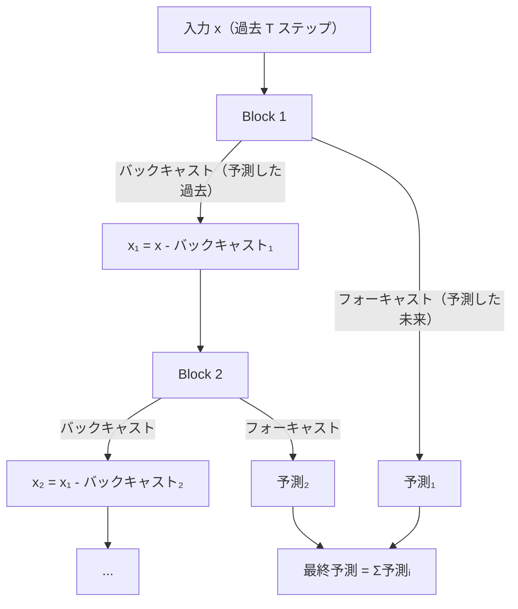
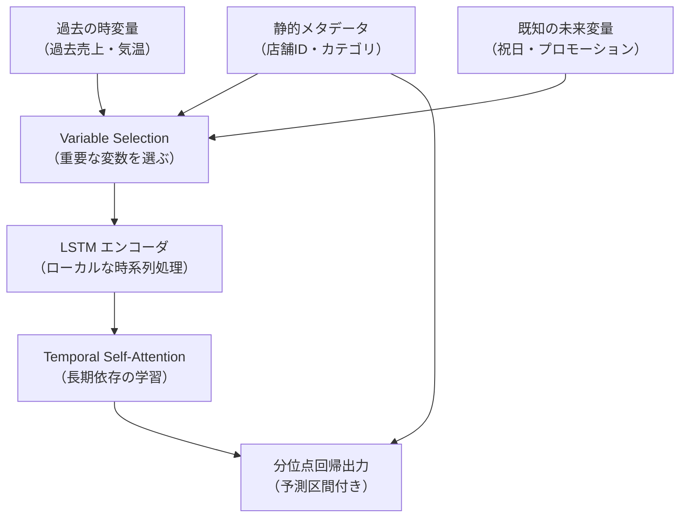
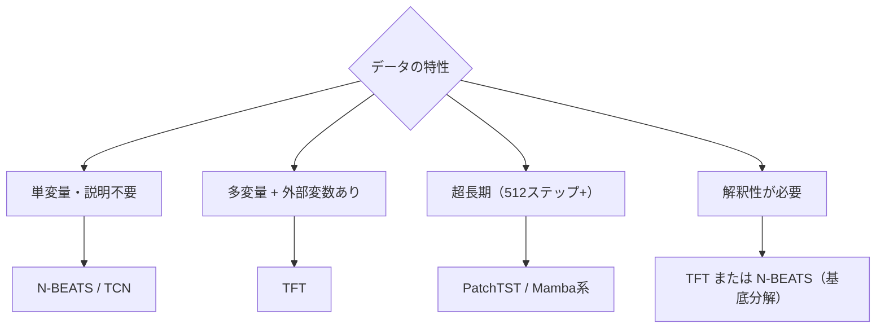

# 時系列の深層学習

ARIMA・Prophet などの古典的統計モデルを超え、深層学習で時系列予測を行う手法群です。TCN・N-BEATS・Temporal Fusion Transformer（TFT）・PatchTST・Mamba の仕組みと使い分けを扱います。電力需要予測・在庫最適化・金融・気象のような大規模・多変量・長期予測が主戦場です。

---

## はじめて読む人へ

「ARIMA は線形・単変量・短期予測に強いが、複数の外部変数を組み込んだ非線形な長期予測は苦手」——ここに深層学習モデルの出番があります。このページでは [時系列分析](時系列分析) で学んだ古典手法の限界から出発し、現代の時系列 DL の全体像を整理します。

### 読む前に押さえること

- [時系列分析](時系列分析) — ARIMA・定常性・移動平均
- [深層学習入門](深層学習入門) — NN・バックプロパゲーション
- [Transformer・Attention](Transformer-Attention) — Attention の仕組み

### 読み終えたら説明できること

- TCN が RNN より並列化できる理由を説明できる
- N-BEATS がトレンド・季節性を基底展開で分離する仕組みを説明できる
- PatchTST が時系列に Vision Transformer を適用できる理由を説明できる

---

## 古典手法の限界と DL の役割

| 手法 | 強み | 弱み |
|------|------|------|
| ARIMA | 解釈性高い・小データでも有効 | 線形・単変量・特徴量を組み込めない |
| Prophet | トレンド/季節性の自動分解 | 複雑な非線形パターン、多変量に弱い |
| **深層学習** | 非線形・多変量・長期・大量データ | データ量と計算コスト、解釈性が低い |

時系列 DL が特に有効な場面：
- **多変量予測：** 気温・降水量・日照時間を同時に使って電力需要予測
- **長期予測：** 数百〜数千ステップ先の予測
- **多変数コンテキスト：** カレンダー情報・祝日・プロモーションなどの外部変数

---

## TCN（Temporal Convolutional Network）

### なぜ RNN より TCN か

RNN（LSTM・GRU）は時系列の標準手法でしたが、逐次処理のため GPU の並列化が難しく学習が遅い問題がありました。TCN は 1D 畳み込みで時系列を処理します。

### 拡張因果畳み込み（Dilated Causal Convolution）

通常の畳み込み（dilation=1）では隣接する 3 つの時刻（例：時刻 3〜5）を参照します。

拡張畳み込み（dilation=2）では 1 つ飛ばしで参照するため、例えば時刻 2・4・6 の 3 点を参照し、同じパラメータ数でより長い系列をカバーできます（実効受容野が 2 倍に広がる）。

dilation を指数的に増やす（1, 2, 4, 8, ...）ことで、層数を増やすごとに受容野が指数的に広がります。$L$ 層・dilation $2^0, 2^1, \ldots, 2^{L-1}$ の場合の受容野：

$$
\text{受容野} = 1 + k \cdot (2^L - 1)
$$

$k$：カーネルサイズ。16 層なら 65,535 ステップ先まで参照できます。

**因果性の保証：** 未来の情報を使わないよう、左側にのみパディングを行います（Causal padding）。

---

## N-BEATS（Neural Basis Expansion Analysis for Interpretable Time Series Forecasting）

### アイデア

「フーリエ・多項式などの基底関数の重み付き和で時系列を表現する」という古典的な考え方を、ニューラルネットで実現します。

### アーキテクチャ

各ブロックは残差的に「残っているパターン」を順番に除去していきます。

### 基底展開

各ブロックの出力を基底ベクトルの線形結合で表現します。

$$
\hat{y} = \sum_{i=1}^P \theta_i^f \cdot \mathbf{b}_i^f
$$

| 基底の種類 | 意味 | 用途 |
|----------|------|------|
| **多項式基底** $[1, t, t^2, \ldots]$ | トレンド成分 | トレンド特化ブロック |
| **フーリエ基底** $[\cos, \sin]$ | 季節性成分 | 季節性特化ブロック |
| **汎用 MLP** | 学習可能な基底 | 汎用ブロック |

---

## Temporal Fusion Transformer（TFT）

多変量・外部変数・長期予測に対応した実務向け時系列 Transformer です（Lim et al., 2021）。

### 主要コンポーネント

**Variable Selection Network（VSN）：** 各時刻・各変数への重みを学習し、どの変数が予測に重要かを動的に判断します。

**分位点出力：** 点予測だけでなく、10%・50%・90% タイル予測（予測区間）を同時に出力します。

---

## PatchTST

### Vision Transformer を時系列に適用する発想

画像をパッチに分割して ViT に入力するように、時系列を **サブシーケンス（パッチ）** に分割して Transformer に入力します（Nie et al., 2023）。

時系列: [x₁, x₂, ..., x₅₁₂]
↓ パッチサイズ 16・ストライド 8 で分割
パッチ列: [x₁₋₁₆, x₉₋₂₄, x₁₇₋₃₂, ..., x₄₉₇₋₅₁₂]
↓ Transformer
各パッチの関係を学習 → 予測
**メリット：**
- 各トークンが**局所的な時系列パターン**を担う（1 点より意味のある単位）
- 系列長が $L$ → $L/s$（$s$：ストライド）に圧縮 → Self-Attention の $O(L^2)$ コストを削減
- チャンネル独立（CI）設定：各変数を独立に処理することで多変量にも対応

**Channel Independence vs Mixing：**

| 設定 | 意味 | 長所 |
|------|------|------|
| Channel-Independent (CI) | 変数間の相関を無視して独立に処理 | 過学習しにくい、小データに強い |
| Channel Mixing | 変数間の相関を学習 | 変数間依存が強い場合に有効 |

---

## Mamba・状態空間モデル（SSM）

### Transformer の限界と SSM

Self-Attention は $O(L^2)$ の計算コストで、超長期（数千ステップ）の時系列には重すぎます。Mamba は **選択的状態空間モデル**（S4 の発展）で $O(L)$ を達成します。

### 状態空間モデルの定式化

連続時間 SSM：

$$
\dot{h}(t) = A h(t) + B x(t), \quad y(t) = C h(t)
$$

離散化（zero-order hold）：

$$
h_k = \bar{A} h_{k-1} + \bar{B} x_k, \quad y_k = C h_k
$$

$\bar{A}, \bar{B}$ はサンプリング時刻 $\Delta$ でパラメータ化されます。

### Mamba の選択メカニズム

SSM を入力依存にすることで、どの過去情報を記憶・忘却するかを動的に選択します。LSTM のゲート機構を連続時間で実現したイメージです。

**時系列への応用（Mamba-based models）：**
- TimeMachine・S-Mamba・Bi-Mamba+ など 2024 年以降に多数提案
- 超長期予測（512〜3000 ステップ）で Transformer より高速・高精度の報告

---

## 手法の比較と選択ガイド

| 手法 | 多変量 | 外部変数 | 超長期 | 解釈性 | 実装難易度 |
|------|--------|--------|--------|--------|----------|
| TCN | ○ | ○ | ○ | △ | 低 |
| N-BEATS | △ | △ | ○ | ◎（基底分解）| 中 |
| TFT | ◎ | ◎ | ○ | ◎（変数選択）| 高 |
| PatchTST | ◎ | △ | ◎ | △ | 中 |
| Mamba系 | ◎ | ○ | ◎ | △ | 高 |

**実装：** `neuralforecast`（NeuralForecast ライブラリ）で N-BEATS・TFT・PatchTST を統一 API で利用できます。

---

## 数学的導出

### TCN の受容野の計算

$L$ 個の拡張畳み込み層（dilation $d_l = 2^{l-1}$、カーネルサイズ $k$）の受容野を帰納法で求めます。

$l$ 層目の受容野 $r_l$：

$$
r_1 = k, \quad r_l = r_{l-1} + (k-1) \cdot d_l
$$

$d_l = 2^{l-1}$ を代入して総和を取ると：

$$
r_L = 1 + (k-1) \sum_{l=1}^L 2^{l-1} = 1 + (k-1)(2^L - 1)
$$

### N-BEATS の残差構造が収束しやすい理由

各ブロックが「入力からバックキャスト（自分が説明できる過去）を引き算したもの」を次のブロックに渡します。これは **deep residual learning** の時系列版であり：

$$
x_{\text{残差}} = x_{\text{入力}} - \hat{x}_{\text{バックキャスト}}
$$

各ブロックが恒等写像を学べば $\hat{x}_{\text{バックキャスト}} = 0$ となり、学習初期の勾配消失を防ぎます。

---

## 確認問題

1. TCN の拡張因果畳み込みが RNN より並列化しやすい理由を説明してください。
2. N-BEATS が「トレンドブロック + 季節性ブロック」を積み重ねることで解釈性を持つ理由を説明してください。
3. PatchTST が時系列をパッチ化することで Self-Attention の計算コストを削減できる理由を説明してください。
4. Mamba が Transformer より $O(L^2) \to O(L)$ になる理由を状態空間モデルの観点から説明してください。

---

## 関連ページ

- [時系列分析](時系列分析) — ARIMA・Prophet・古典手法
- [Transformer・Attention](Transformer-Attention) — TFT・PatchTST の基盤
- [RNN・時系列](RNN-時系列) — LSTM・GRU との比較
- [フーリエ解析](フーリエ解析) — N-BEATS の周波数基底との接続
- [データエンジニアリング](データエンジニアリング) — 大規模時系列データの処理

---

[← ホームへ](Home)
