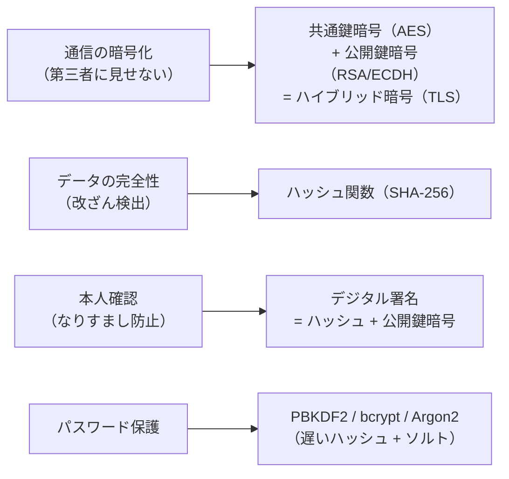

# 暗号技術

「通信を盗み見られても内容がわからない」「このデータは確かに本人が送ってきた」——これを数学的に保証するのが暗号技術です。HTTPS・パスワード保存・電子署名・ブロックチェーンはすべてここで学ぶ概念の上に成り立っています。

---

## はじめて読む人へ

日常的に使っている HTTPS は「通信が暗号化されている」と言いますが、実際には複数の暗号方式が組み合わさっています。このページでは「なぜその組み合わせなのか」「それぞれの仕組みはどうなっているか」を順を追って説明します。

### 読む前に押さえること

- 特に前提知識は不要です（数学の概念は平易に説明します）

### 読み終えたら説明できること

- 共通鍵暗号と公開鍵暗号の違いと使い分けを説明できる
- ハイブリッド暗号（TLS）の仕組みを説明できる
- ハッシュ関数とデジタル署名が何を保証するかを説明できる

---

## 暗号の基本概念

### 平文・暗号文・鍵

!!! info ""
    平文（元のデータ）
      「パスワードは abc123」
        ↓ 暗号化（鍵を使う）
    暗号文（変換後のデータ）
      「k8#mX$2qL!」（鍵がないと読めない）
        ↓ 復号（鍵を使う）
    平文
      「パスワードは abc123」

**鍵（key）**：暗号化・復号に使うパラメータです。同じアルゴリズムでも鍵が違えば違う暗号文になります。

### 暗号技術が達成すること

| 目標 | 意味 | 使われる技術 |
|------|------|------------|
| **機密性（Confidentiality）** | 第三者に内容を見られない | 共通鍵暗号・公開鍵暗号 |
| **完全性（Integrity）** | データが改ざんされていない | ハッシュ関数・デジタル署名 |
| **認証（Authentication）** | 送信者が本人であることの確認 | デジタル署名・証明書 |
| **否認不可能性（Non-repudiation）** | 「送ってない」と言えなくする | デジタル署名 |

---

## 共通鍵暗号（対称鍵暗号）

### 仕組み

暗号化と復号に**同じ鍵**を使います。

!!! info ""
    送信者                         受信者
      [平文] → 暗号化(鍵K) → [暗号文] → 復号(鍵K) → [平文]
                  ↑                              ↑
               同じ鍵 K ────────────────────── 同じ鍵 K

### 代表的なアルゴリズム

| アルゴリズム | 鍵長 | 状態 |
|-----------|------|------|
| **AES-256** | 256 bit | 現代の標準（推奨） |
| **AES-128** | 128 bit | 十分に安全 |
| 3DES | 168 bit | 旧式・非推奨 |
| DES | 56 bit | 解読済み・使用禁止 |

```python
from cryptography.fernet import Fernet

# 鍵の生成
key = Fernet.generate_key()
f = Fernet(key)

# 暗号化
plaintext = b"secret message"
ciphertext = f.encrypt(plaintext)
print(f"暗号文: {ciphertext[:30]}...")

# 復号
decrypted = f.decrypt(ciphertext)
print(f"復号: {decrypted}")
```

### 共通鍵暗号の弱点：「鍵配送問題」

!!! info ""
    問題:
      Alice が Bob に暗号化メッセージを送りたい
      → 事前に鍵 K を Bob に渡さなければならない
      → でも鍵 K を安全に渡すには暗号化が必要
      → 暗号化には鍵が必要... (無限ループ)

→ この問題を解決するのが**公開鍵暗号**です。

---

## 公開鍵暗号（非対称鍵暗号）

### 仕組み

**公開鍵**（誰でも使える）と**秘密鍵**（自分だけが持つ）のペアを使います。

!!! info ""
    【暗号化通信の流れ】
    Bob が公開鍵・秘密鍵のペアを生成
      → 公開鍵は全員に配布（Web サイトに公開してもよい）
      → 秘密鍵は Bob だけが保管
    
    Alice が Bob の公開鍵で暗号化 → 暗号文を送信
      → 暗号文は Bob の秘密鍵でしか復号できない
      → 盗聴されても解読不能

$$
\text{暗号文} = E(\text{公開鍵}, \text{平文}), \qquad \text{平文} = D(\text{秘密鍵}, \text{暗号文})
$$

### RSA の仕組み（概要）

RSA は「大きな数の素因数分解が難しい」という数学的困難性を利用します。

!!! info ""
    鍵の生成:
      1. 大きな素数 p, q を選ぶ（例: 各 2048 bit）
      2. n = p × q を計算（公開）
      3. 公開鍵: (n, e)、秘密鍵: (n, d)
    
    暗号化: C = M^e mod n
    復号:   M = C^d mod n
    
    安全性の根拠:
      n を素因数分解して p, q を求めることが
      現代のコンピュータでは計算上不可能（2048 bit の場合）

```python
from cryptography.hazmat.primitives.asymmetric import rsa, padding
from cryptography.hazmat.primitives import hashes

# 鍵ペアの生成
private_key = rsa.generate_private_key(public_exponent=65537, key_size=2048)
public_key = private_key.public_key()

# 公開鍵で暗号化
ciphertext = public_key.encrypt(
    b"secret",
    padding.OAEP(mgf=padding.MGF1(algorithm=hashes.SHA256()),
                 algorithm=hashes.SHA256(), label=None)
)

# 秘密鍵で復号
plaintext = private_key.decrypt(
    ciphertext,
    padding.OAEP(mgf=padding.MGF1(algorithm=hashes.SHA256()),
                 algorithm=hashes.SHA256(), label=None)
)
print(plaintext)  # b'secret'
```

### 公開鍵暗号の弱点

- **処理が遅い**：共通鍵暗号の 1000 倍以上遅い
- 長いデータの暗号化には向かない

→ この問題を解決するのが**ハイブリッド暗号**です。

---

## ハイブリッド暗号（TLS/HTTPS の仕組み）

共通鍵暗号の「速さ」と公開鍵暗号の「鍵配送問題の解決」を組み合わせます。

!!! info ""
    【TLS ハンドシェイクの流れ（簡略版）】
    
    1. Client → Server: "TLS 1.3 使いたい"
    
    2. Server → Client: サーバの公開鍵証明書（CA が署名済み）
    
    3. Client: サーバの公開鍵を取り出す
               ランダムなセッション鍵（共通鍵）を生成
               セッション鍵をサーバの公開鍵で暗号化 → 送信
    
    4. Server: 秘密鍵でセッション鍵を復号
               → 両者がセッション鍵を共有！
    
    5. 以降: セッション鍵（AES）で高速に暗号化通信

| フェーズ | 使う暗号 | 目的 |
|--------|---------|------|
| 鍵の共有 | 公開鍵暗号（RSA / ECDH） | 安全にセッション鍵を渡す |
| データ通信 | 共通鍵暗号（AES） | 高速に通信を暗号化 |

---

## ハッシュ関数

### 仕組み

任意の長さの入力から**固定長の値（ハッシュ値）**を生成します。

$$
h = H(\text{入力データ})
$$

```python
import hashlib

# SHA-256 ハッシュ
data = b"hello"
h = hashlib.sha256(data).hexdigest()
print(h)
# 2cf24dba5fb0a30e26e83b2ac5b9e29e1b161e5c1fa7425e73043362938b9824

# 1文字変えると全く別のハッシュ値になる（雪崩効果）
data2 = b"Hello"   # H が大文字
h2 = hashlib.sha256(data2).hexdigest()
print(h2)
# 185f8db32921bd46d35cc2e596e9d93c5b35b2bea69748ab4d77da8a91c9ae9f
```

### ハッシュ関数の性質

| 性質 | 意味 |
|------|------|
| **一方向性** | ハッシュ値から元のデータを復元できない |
| **衝突耐性** | 同じハッシュ値を持つ 2 つのデータを見つけるのが困難 |
| **雪崩効果** | 入力が 1 bit 変わるとハッシュ値が大きく変わる |
| **決定性** | 同じ入力には必ず同じハッシュ値 |

### 代表的なハッシュアルゴリズム

| アルゴリズム | 出力長 | 状態 |
|-----------|------|------|
| **SHA-256** | 256 bit | 現代の標準 |
| **SHA-3** | 256/512 bit | 新世代標準 |
| SHA-1 | 160 bit | 非推奨（衝突発見済み） |
| MD5 | 128 bit | 非推奨（衝突発見済み） |

### 使用例：パスワードの保存

```python
import hashlib, os

def hash_password(password: str) -> str:
    """パスワードをソルト付きでハッシュ化"""
    salt = os.urandom(32)   # ランダムなソルトを生成
    key = hashlib.pbkdf2_hmac(
        'sha256',
        password.encode(),
        salt,
        iterations=100_000   # 意図的に遅くしてブルートフォース対策
    )
    return salt.hex() + ':' + key.hex()

def verify_password(password: str, stored: str) -> bool:
    """入力パスワードが保存済みハッシュと一致するか確認"""
    salt_hex, key_hex = stored.split(':')
    salt = bytes.fromhex(salt_hex)
    key = hashlib.pbkdf2_hmac('sha256', password.encode(), salt, 100_000)
    return key.hex() == key_hex

# パスワードの保存（データベースにはこれだけ保存）
stored = hash_password("my_secret_password")
print("DB に保存:", stored[:40] + "...")

# ログイン時の検証
print(verify_password("my_secret_password", stored))  # True
print(verify_password("wrong_password", stored))       # False
```

**なぜプレーンテキストで保存してはいけないか：**
DB が漏洩したとき、ハッシュ化されていればすぐには解読できません。ソルトは「同じパスワードでも違うハッシュ値になる」ようにし、レインボーテーブル攻撃を防ぎます。

---

## デジタル署名

### 仕組み

「このデータは確かに私が送った（改ざんされていない）」を証明します。公開鍵暗号を**逆向き**に使います。

!!! info ""
    【署名の作成（送信者）】
    1. メッセージのハッシュ値を計算: h = H(メッセージ)
    2. ハッシュ値を秘密鍵で暗号化: 署名 = E(秘密鍵, h)
    3. メッセージ + 署名 を送信
    
    【署名の検証（受信者）】
    1. 署名を送信者の公開鍵で復号: h' = D(公開鍵, 署名)
    2. 受け取ったメッセージのハッシュ: h = H(メッセージ)
    3. h == h' なら → 正規の送信者・改ざんなし ✓

```python
from cryptography.hazmat.primitives.asymmetric import rsa, padding
from cryptography.hazmat.primitives import hashes

# 署名者が秘密鍵で署名
private_key = rsa.generate_private_key(public_exponent=65537, key_size=2048)
message = b"This is the official document."

signature = private_key.sign(
    message,
    padding.PSS(mgf=padding.MGF1(hashes.SHA256()),
                salt_length=padding.PSS.MAX_LENGTH),
    hashes.SHA256()
)

# 検証者が公開鍵で検証
public_key = private_key.public_key()
try:
    public_key.verify(
        signature, message,
        padding.PSS(mgf=padding.MGF1(hashes.SHA256()),
                    salt_length=padding.PSS.MAX_LENGTH),
        hashes.SHA256()
    )
    print("署名検証: 成功 ✓")
except Exception:
    print("署名検証: 失敗（改ざんの可能性）")
```

---

## 公開鍵証明書と認証局（CA）

「公開鍵が本物かどうか」を確認する仕組みが必要です。

!!! info ""
    問題:
      攻撃者が「私が google.com の公開鍵です」と偽造できる
      （中間者攻撃）
    
    解決: 認証局（CA）
      CA（VeriSign など）が公開鍵に署名した「証明書」を発行
      ブラウザには信頼できる CA のリストが事前インストール済み

!!! info ""
    SSL 証明書の確認（コマンドライン）:
    $ openssl s_client -connect google.com:443 2>/dev/null \
      | openssl x509 -noout -subject -issuer -dates

---

## まとめ：各技術の役割



---

## 確認問題

1. 共通鍵暗号と公開鍵暗号の処理速度の違いを説明し、なぜ TLS ではハイブリッド方式を使うのか答えてください。
2. パスワードを SHA-256 で保存するだけでは不十分な理由を、ソルトとレインボーテーブルの概念を使って説明してください。
3. デジタル署名はハッシュ関数と公開鍵暗号のどちらをどのように組み合わせていますか？何を保証しますか？

---

## 関連ページ

- [セキュリティ基礎](セキュリティ.md) — HTTPS の使い方・XSS・CSRF
- [セキュリティ詳解](セキュリティ詳解.md) — bcrypt・JWT の実装
- [認証・認可](認証・認可.md) — OAuth2・JWT の実践
- [ネットワーク詳解](ネットワーク詳解.md) — TLS ハンドシェイクの詳細
- [情報セキュリティ法規と制度](情報セキュリティ法規.md) — 法律・制度の概要
