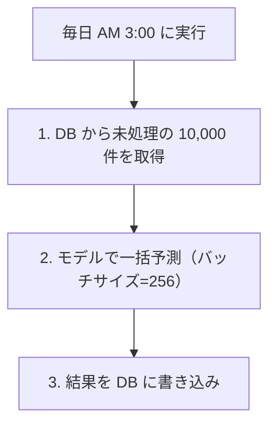
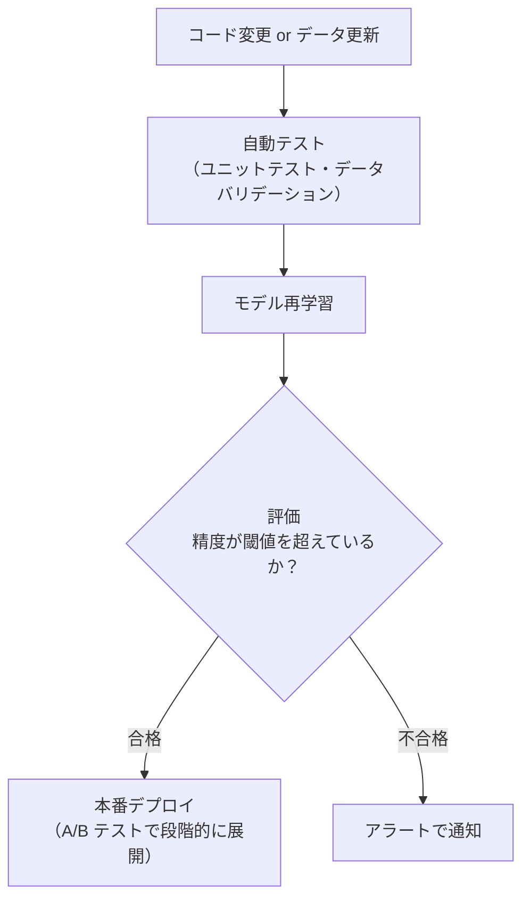
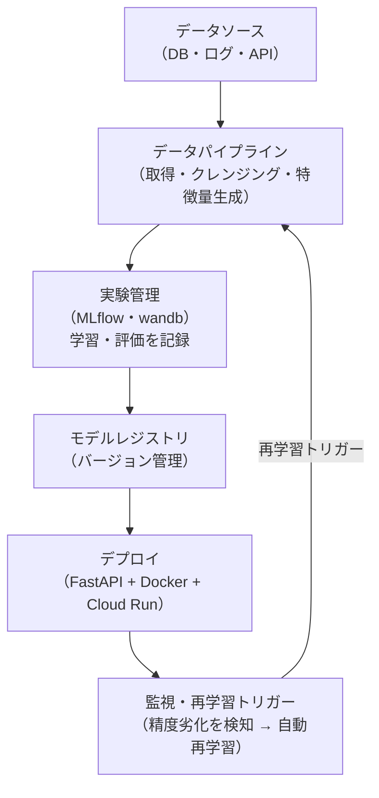

# 機械学習基盤

> モデルを「作る」だけでなく「動かし続ける」ための技術です。[機械学習モデルのデプロイ](MLデプロイ) の実装を踏まえ、より広い MLOps の観点を整理します。

---

## はじめて読む人へ

「先月まで精度 95% だったスパムフィルターが、最近どんどんスパムを通すようになった」——これはモデルが悪くなったのではなく、スパムのパターンが変化したのにモデルが更新されていないから起きます。現実のデータは常に変化するため、一度デプロイしたモデルを「放置」すると精度が劣化します。この問題に対処するのが機械学習基盤です。

[MLデプロイ](MLデプロイ.md) で「モデルを API として公開する方法」を学びました。このページではその先——「公開したモデルをいつまでも正確に動かし続けるには何が必要か」を扱います。

### 読む前に押さえること

- [MLデプロイ](MLデプロイ.md) を先に読んでいること
- オンライン推論：リクエストが来た瞬間に予測を返す（チャットBot・不正検知）
- バッチ推論：大量データをまとめて処理する（夜間の商品レコメンド更新）

### 読み終えたら説明できること

- オンライン推論とバッチ推論の使い分けを、具体例で説明できる
- データドリフトとは何か、なぜモデルが劣化するかを説明できる
- 予測ログと監視がなぜ「運用の中枢」かを説明できる

---

## モデルを API で提供する

学習済みモデルに HTTP リクエストを送ると予測結果が返ってくる仕組みです。

```mermaid
flowchart LR
    Client["クライアント"]
    API["API サーバー（FastAPI）"]
    Client -- "POST /predict\n{\"text\": \"このレビューは良い\"}" --> API
    API -- "200 {\"label\": \"positive\", \"score\": 0.92}" --> Client
```

**基本的な構成（FastAPI + scikit-learn）：**

APIとしてモデルを提供する場合、モデルはリクエストごとに読み込むのではなく、サーバー起動時に1回だけ読み込みます。モデルファイルの読み込みは重い処理なので、毎回行うと応答が遅くなります。

```python
from fastapi import FastAPI
import joblib

app = FastAPI()
model = joblib.load("model.pkl")  # 起動時にモデルをロードします

@app.post("/predict")
def predict(text: str):
    prediction = model.predict([text])
    return {"label": prediction[0]}
```

この例では、`joblib.load("model.pkl")` で学習済みモデルをメモリに載せ、`/predict` に来た入力を `model.predict` に渡しています。`predict` は通常、複数件の入力をまとめて受け取るため、1件だけでも `[text]` のようにリストにして渡しています。

**設計上の考慮点：**

| 項目 | 対策 |
|------|------|
| モデルの読み込み | 起動時に 1 回だけロードします（リクエストごとに読み込みません） |
| 入力バリデーション | Pydantic で型・範囲を検証します |
| エラーハンドリング | モデルが例外を投げたとき 500 にならないよう包みます |
| タイムアウト | 重いモデルには適切なタイムアウトを設けます |

---

## バッチ推論（Batch Inference）

大量のデータをまとめて一括処理する方式です。リアルタイムな応答は不要で、定期的な処理で十分なケースに使います。



**向いているユースケース：**
- レコメンデーション（翌朝までに全ユーザーの推薦を計算します）
- 異常検知（夜間バッチで 1 日分のログを分析します）
- 感情分析（問い合わせメールを毎時バッチ処理します）

**実装の工夫：**

```python
import pandas as pd
import joblib

model = joblib.load("model.pkl")
df = pd.read_sql("SELECT id, text FROM reviews WHERE predicted_at IS NULL", conn)

# バッチ処理（一括予測は単一予測より圧倒的に速いです）
df["label"] = model.predict(df["text"].tolist())

df.to_sql("reviews", conn, if_exists="replace")
```

バッチ推論では、1件ずつAPIを呼ぶのではなく、まとめてDataFrameとして読み込み、まとめて予測します。多くの機械学習ライブラリは一括処理に最適化されているため、単発予測を何千回も繰り返すより高速です。

ただし、`if_exists="replace"` はテーブル全体を置き換える動作なので、実運用では注意が必要です。通常は予測結果用の列だけを更新したり、別テーブルに結果を書き込んだりします。教科書としては「DBから読み、モデルで予測し、DBへ戻す」流れを押さえてください。

---

## オンライン推論（Online Inference）

オンライン推論は、ユーザーや別システムからリクエストが来たタイミングで、その場で予測を返す方式です。チャット、レコメンド、リアルタイムな異常検知などで使われます。

この方式では、精度だけでなく応答時間が重要です。モデルが重すぎるとユーザーを待たせてしまうため、モデルの読み込みを起動時に済ませる、バッチ化する、軽量化するなどの工夫が必要になります。

リクエストを受け取ったその場でリアルタイムに予測する方式です。

```
ユーザーが検索 → 即座にレコメンデーションを返します（< 100ms）
```

**バッチ推論との比較：**

| 項目 | バッチ推論 | オンライン推論 |
|------|-----------|--------------|
| レイテンシ | 気にしません | 低くする必要があります |
| スループット | 高い（一括処理） | 中程度 |
| インフラ | 定期実行ジョブ | 常駐サーバー |
| コスト | 安い（必要なときだけ起動） | 高い（常時稼働） |
| 向いているユース | 翌日反映でも良い処理 | 即時応答が必要な処理 |

**レイテンシを下げる工夫：**

```python
# 重いモデルは起動時に読み込んでキャッシュします
import functools

@functools.lru_cache(maxsize=1)
def get_model():
    return joblib.load("model.pkl")

# 前処理を軽くします（特徴量エンジニアリングのシンプル化）
# GPU 推論（PyTorch/TensorFlow）
# ONNX への変換で推論を高速化します
```

`lru_cache(maxsize=1)` を付けると、`get_model()` の戻り値がキャッシュされます。初回だけモデルを読み込み、2回目以降は同じモデルオブジェクトを再利用します。FastAPI では依存関係や起動時イベントと組み合わせて、重い初期化をリクエスト処理から切り離します。

---

## モデルのバージョン管理

コードと同じように、モデルにもバージョン管理が必要です。

**問題：** モデルファイル（.pkl, .pt）は大きいため Git には向きません。

**解決策：**

| ツール | 用途 |
|--------|------|
| MLflow | 実験管理・モデルレジストリ |
| DVC | データ・モデルの Git 連携バージョン管理 |
| Weights & Biases（wandb） | 実験追跡・可視化 |
| S3 / GCS | モデルファイルの保存 |

---

## MLOps

機械学習の開発・デプロイ・運用を継続的に回すための仕組み・文化です。DevOps の ML 版です。

### ML システムの難しさ

ソフトウェアのバグは「コードが間違っている」とわかりやすいですが、ML の問題は静かに悪化します。

| 問題 | 説明 |
|------|------|
| データドリフト | 本番データの分布が学習データとずれてきます |
| コンセプトドリフト | 予測したい関係性（ラベルの意味）が時間で変化します |
| サイレント失敗 | モデルは応答するが精度が低下しても気づきにくいです |

### MLOps の CI/CD（ML パイプライン）



このパイプラインでは、コードやデータの変化をきっかけに、テスト、学習、評価、デプロイが順番に進みます。通常のWebアプリと違い、MLでは「コードは変わっていないがデータが変わったのでモデルを作り直す」ことがあります。そのため、データ更新もパイプラインの入力として扱います。

### モデル監視

本番に出したモデルは継続的に監視します。

```python
# 予測ログを記録します
logger.info({
    "input": features,
    "prediction": result,
    "model_version": "v1.2.3",
    "latency_ms": elapsed,
})
```

このログは、予測に使った入力、予測結果、モデルバージョン、推論時間を記録しています。あとから「どのモデルが、どの入力に、どんな予測をしたか」を追えるようにするためです。障害調査だけでなく、精度低下や再学習データの収集にも使えます。

監視すべき指標：
- **精度の変化：** 定期的に正解データと比較してモデル精度を計算します
- **入力分布の変化：** 特徴量の平均・分散が学習時から乖離していないかを確認します
- **レイテンシ：** 推論に時間がかかるようになっていないかを確認します
- **エラー率：** 予測が失敗するリクエストの割合を把握します

---

## 全体アーキテクチャ



詳細な実装例は [機械学習モデルのデプロイ](MLデプロイ) を参照してください。

この全体像では、モデルは単体の `.pkl` ファイルではなく、データ取得、前処理、実験記録、モデル保存、デプロイ、監視の流れの中に置かれます。学習時の精度が高いだけでは不十分で、本番で安定して動き、劣化したら気づける仕組みまで含めて機械学習基盤です。

---


## 確認問題

1. 機械学習基盤 は、何の問題を解決するための考え方・道具ですか。
2. このページで出てきた重要語を 3 つ選び、それぞれ 1 文で説明してください。
3. コード例やコマンド例がある場合、入力・処理・出力を分けて説明してください。
4. このページの内容が、前後の STEP や自分の作りたいものにどうつながるか説明してください。

---

## 関連ページ

- [Python × Web API（FastAPI）](FastAPI) — REST API でモデルを公開する
- [Docker](Docker) — モデルサービングのコンテナ化
- [実験管理（MLflow/wandb）](実験管理) — モデルのバージョン管理・レジストリ
- [機械学習モデルのデプロイ](MLデプロイ) — sklearn → FastAPI → Docker の流れ
- [データパイプライン](データパイプライン) — バッチ推論パイプラインの構築

---

[← ホームへ](Home)
