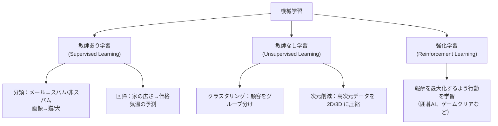

# 機械学習理論

**データからパターンを学習し、未知のデータに対して予測や判断をするアルゴリズムの総称** です。「なぜうまくいくのか」「なぜ失敗するのか」を理解することで、モデルを正しく使えるようになります。

---

## はじめて読む人へ

機械学習理論は、モデルがなぜ学習できるのか、なぜ失敗するのかを理解するための土台です。数式を完璧に覚えるより、損失を小さくする、過学習を防ぐ、汎化性能を見る、という流れを押さえましょう。

コードやコマンドが出てきたら、最初から全部を覚えようとしなくて大丈夫です。まずは「何を入力し、何が処理され、何が出力されるのか」を文章で説明できるように読むと、手を動かす前の理解が安定します。

### 読む前に押さえること

- 損失関数は、予測の外れ具合を数値化します。
- 勾配降下法は、損失を小さくする方向へパラメータを動かします。
- 過学習は、訓練データに合わせすぎて未知データに弱くなる現象です。

### 読み終えたら説明できること

- 損失関数と最適化の関係を説明できる。
- 学習率が大きすぎる・小さすぎる場合の問題を理解できる。
- バイアス・バリアンスの考え方を説明できる。

---

## 機械学習の分類

機械学習は、与えられるデータと目的によって大きく分類できます。正解ラベルがあるか、データの構造を見たいのか、行動を選んで報酬を得るのかで、使う手法が変わります。



この教材では、まず教師あり学習と教師なし学習を中心に扱います。強化学習は、環境との相互作用や報酬設計が必要になるため、別の発展的な分野として考えます。

---

## 損失関数

「モデルが良くなった」とはどういう意味でしょうか。それを定量化する仕組みが損失関数です。予測値と正解値のズレを数値にすることで、コンピュータは「どの方向に改善すればよいか」を計算できるようになります。学習とは、この損失を最小化するパラメータを探す作業です。

### 回帰の損失関数

回帰では、予測値と正解値のズレを数値で測ります。ただし「どのようにズレを測るか」によって、外れ値の扱いが変わります。たとえば二乗すると大きなズレが特に強く罰せられ、絶対値にすると外れ値の影響が抑えられます。損失関数の選択はそのモデルに何を重視させるかを決める設計判断です。

```python
import numpy as np

y_true = np.array([3.0, -0.5, 2.0, 7.0])
y_pred = np.array([2.5,  0.0, 2.0, 8.0])

# MSE（平均二乗誤差）：大きな誤差を重く罰する
mse = np.mean((y_true - y_pred) ** 2)

# RMSE（二乗平均平方根誤差）：元の単位で評価できる
rmse = np.sqrt(mse)

# MAE（平均絶対誤差）：外れ値に強い
mae = np.mean(np.abs(y_true - y_pred))

print(f"MSE: {mse:.3f}  RMSE: {rmse:.3f}  MAE: {mae:.3f}")
```

MSE は誤差を二乗するため、大きな誤差を強く罰します。MAE は絶対値を使うため外れ値に比較的強く、RMSE は元の単位で読めるため説明しやすい指標です。

### 分類の損失関数

分類では、正解クラスに高い確率を割り当てられているかを損失で測ります。クロスエントロピー損失は、正解クラスの確率が低いほど大きくなります。

```python
# クロスエントロピー損失（分類問題の標準）
from scipy.special import softmax

y_true_class = 2  # 正解クラス（0, 1, 2 のうち）
logits = np.array([1.0, 0.5, 3.0])  # モデルの出力

probs = softmax(logits)  # 確率に変換 [0.09, 0.06, 0.85]
log_loss = -np.log(probs[y_true_class])
print(f"確率: {probs[y_true_class]:.3f}  損失: {log_loss:.3f}")
# 確率が高いほど損失が小さくなる
```

`logits` は softmax 前の生のスコアです。softmax で合計 1 の確率に変換し、正解クラスの確率を取り出して損失を計算します。

---

## 勾配降下法

勾配降下法は、損失関数の値が小さくなる方向へ少しずつパラメータを動かす方法です。山の斜面を下るように、現在地での傾きから次に進む方向を決めます。

学習率は、その一歩の大きさです。大きすぎると谷を飛び越えて発散し、小さすぎるとほとんど進まず学習に時間がかかります。モデルが学習しないときは、データやモデルだけでなく学習率も疑います。

損失関数を最小化するパラメータを求める最適化アルゴリズムです。

次のコードは、`(w - 3)^2` という単純な関数を最小化する例です。最小値は w=3 ですが、勾配降下法では現在地から少しずつ近づいていきます。

```python
# 1 変数の勾配降下法（概念の理解用）
def loss(w):
    return (w - 3) ** 2   # 最小値は w=3 のとき

def gradient(w):
    return 2 * (w - 3)    # 微分（勾配）

w = 0.0       # 初期値
lr = 0.1      # 学習率

for i in range(20):
    grad = gradient(w)
    w = w - lr * grad     # パラメータを更新
    if i % 5 == 0:
        print(f"step {i}: w={w:.3f}  loss={loss(w):.3f}")
```

`gradient(w)` は、現在の `w` における傾きです。`w = w - lr * grad` は、損失が下がる方向へパラメータを動かす更新式です。

### 学習率の重要性

学習率は、1 回の更新でどれくらい大きく動くかを決めます。大きすぎても小さすぎても学習はうまく進みません。

```
学習率が大きすぎる → 最小値を飛び越えてしまう（発散）
学習率が小さすぎる → 収束に時間がかかりすぎる
適切な学習率     → 安定して損失が下がる
```

> **情報工学メモ：ミニバッチ確率的勾配降下法（SGD）**  
> 全データで勾配を計算する「バッチ勾配降下法」は正確ですが、データが多いと 1 ステップが重い。そこで **ランダムに選んだ小さなバッチ（32〜256 サンプル）で勾配を近似** するのがミニバッチ SGD です。計算は荒削りですが速く収束します。Adam・AdaGrad・RMSprop などは学習率を自動調整する SGD の改良版です。

---

## 過学習と正則化

### 過学習（Overfitting）

モデルは訓練データを何度も見続けることで精度を上げますが、行き過ぎると問題が起きます。訓練データ上の「ノイズ（偶然のバラつき）」まで覚えてしまうと、同じパターンが出てこない未知データでは正解できなくなります。これが過学習です。

過学習を見つけるには、訓練データの性能と検証・テストデータの性能を分けて見ます。訓練だけ良くて検証が悪い場合、モデルは訓練データの細部やノイズまで覚えている可能性があります。

```
訓練誤差 ↓↓  テスト誤差 ↑ = 過学習
訓練誤差 ↓   テスト誤差 ↓ = 汎化できている
訓練誤差 ↑   テスト誤差 ↑ = 未学習（モデルが単純すぎる）
```

### 正則化

モデルが複雑になりすぎないようにペナルティを加えます。

なぜ過学習が起きるかを考えると、対策が見えてきます。過学習したモデルは「訓練データに合わせるために係数が極端な値をとっている」状態です。であれば、係数が大きくなりすぎたときにペナルティを課すことで、モデルを「穏やかな係数」に引き戻すことができます。これが正則化の発想です。損失関数に「重みの大きさへのペナルティ項」を加えることで、精度と係数の穏やかさの両方を同時に最小化します。

```python
from sklearn.linear_model import Ridge, Lasso, ElasticNet

# Ridge（L2 正則化）：重みを小さく保つ
ridge = Ridge(alpha=1.0)  # alpha が大きいほど正則化が強い

# Lasso（L1 正則化）：不要な特徴量の重みを 0 にする（スパース）
lasso = Lasso(alpha=0.1)

# ElasticNet：L1 + L2 の組み合わせ
elastic = ElasticNet(alpha=0.1, l1_ratio=0.5)
```

Ridge は多くの重みを小さくし、Lasso は一部の重みを 0 にしやすい性質があります。ElasticNet はその中間で、L1 と L2 の両方を使います。

---

## 交差検証の考え方

テストデータが 1 種類の分割に依存すると、その分割の「運」で精度が変わります。交差検証はデータを k 分割して k 回評価し、平均精度を汎化性能の推定値とします。

```python
from sklearn.model_selection import cross_val_score, KFold
from sklearn.ensemble import RandomForestClassifier

model = RandomForestClassifier(n_estimators=100, random_state=42)

# k=5 の交差検証（5 回評価して平均を取る）
cv = KFold(n_splits=5, shuffle=True, random_state=42)
scores = cross_val_score(model, X, y, cv=cv, scoring="accuracy")

print(f"各 fold の精度: {scores.round(3)}")
print(f"平均 ± 標準偏差: {scores.mean():.3f} ± {scores.std():.3f}")
```

```
k=5 の場合：
分割1 → [fold1_val, fold2_train, fold3_train, fold4_train, fold5_train]
分割2 → [fold1_train, fold2_val, fold3_train, ...]
...（5 回分を平均）
```

`cross_val_score` は、`train_test_split` を k 回行い、毎回異なる fold を検証データにします。標準偏差が大きい場合はモデルが不安定な可能性があります。詳しくは [モデル評価・チューニング](モデル評価-チューニング) を参照してください。

---

## バイアス・バリアンストレードオフ

モデルがうまく動かないとき、失敗の原因は大きく 2 種類あります。「そもそも正解に近づけていない（高バイアス）」か「訓練データに特化しすぎて応用が利かない（高バリアンス）」か。この区別が次のアクションを決めます。

---

### 直感：テスト勉強のたとえ

```
【高バイアス（未学習）= 丸暗記すら足りない状態】
  「公式を 3 本しか覚えていない」
  → 訓練データ（教科書）でも、テスト（本番）でも正解できない
  → 訓練スコアも検証スコアも低い

【高バリアンス（過学習）= 過去問の丸暗記】
  「去年の過去問 100 問を全部丸暗記した」
  → 全く同じ問題は解ける（訓練スコアは高い）
  → 少し変わった問題は解けない（検証スコアは低い）

【バランスが取れた状態】
  「考え方を理解したうえで練習した」
  → 訓練スコアも検証スコアも両方高い
```

| 状態 | 訓練スコア | 検証スコア | 主な原因 |
|------|-----------|-----------|---------|
| 高バイアス（未学習）| **低** | 低 | モデルが単純すぎる・特徴量が少ない |
| 高バリアンス（過学習）| 高 | **低** | モデルが複雑すぎる・データが少ない |
| 良いバランス | 高 | 高（訓練に近い）| 適切な複雑さ・十分なデータ |

---

### 診断フロー：学習曲線を見る

学習曲線は「訓練データ数を増やしていったときに、スコアがどう変化するか」をグラフにしたものです。モデルの問題の種類を視覚的に診断できます。

```
高バイアスの学習曲線：               高バリアンスの学習曲線：
スコア                               スコア
  |  _ _ _ _ _ _ _  ← 訓練スコア      |  _______ ← 訓練スコア（高止まり）
  |                                   |
  | _ _ _ _ _ _ _ _ ← 検証スコア      |        _ _ ← 検証スコア（低い）
  |                                   |
  └──────────────→ データ数          └──────────────→ データ数
  （両方低い = 未学習）                （差が大きい = 過学習）
```

```python
from sklearn.model_selection import learning_curve
from sklearn.linear_model import LogisticRegression
from sklearn.preprocessing import StandardScaler
from sklearn.pipeline import make_pipeline
import numpy as np
import matplotlib.pyplot as plt

# 例：ロジスティック回帰で学習曲線を描く
model = make_pipeline(StandardScaler(), LogisticRegression())

train_sizes, train_scores, val_scores = learning_curve(
    model, X, y,
    cv=5,
    scoring="accuracy",
    train_sizes=np.linspace(0.1, 1.0, 8),
    shuffle=True,
    random_state=42
)

# 平均と標準偏差を計算
train_mean = train_scores.mean(axis=1)
train_std  = train_scores.std(axis=1)
val_mean   = val_scores.mean(axis=1)
val_std    = val_scores.std(axis=1)

plt.figure(figsize=(8, 5))
plt.plot(train_sizes, train_mean, label="訓練スコア", color="blue")
plt.fill_between(train_sizes, train_mean - train_std, train_mean + train_std, alpha=0.1)
plt.plot(train_sizes, val_mean,   label="検証スコア", color="orange")
plt.fill_between(train_sizes, val_mean - val_std, val_mean + val_std, alpha=0.1)
plt.xlabel("訓練サンプル数")
plt.ylabel("精度")
plt.legend()
plt.title("学習曲線")
plt.savefig("learning_curve.png", dpi=150)

# ─────────────────────────────────────────────
# 読み方：
#   両方低い → 高バイアス → モデルを複雑にする / 特徴量を増やす
#   差が大きい → 高バリアンス → 正則化 / データ増量 / モデルを単純にする
# ─────────────────────────────────────────────
```

---

### 実践的な対処法

```
高バイアス（未学習）の改善：
  ✓ モデルを複雑にする（決定木の深さを増やす、DNN の層を増やす）
  ✓ 特徴量を追加・生成する
  ✓ 正則化を弱める（α を小さくする）

高バリアンス（過学習）の改善：
  ✓ 訓練データを増やす（データ拡張を含む）
  ✓ 正則化を強める（Ridge / Lasso / Dropout）
  ✓ モデルを単純にする（決定木の深さを制限する）
  ✓ Early Stopping を使う
  ✓ 特徴量を減らす（重要度の低い特徴量を削除）
```

---


## 強化学習（概要）

教師あり学習・教師なし学習とは異なる第三の枠組みです。**エージェント**が**環境**と相互作用し、**報酬**を最大化する行動方策を学習します。

```
教師あり学習：入力 X → 正解 y を使って学習
教師なし学習：入力 X のみ（正解なし）
強化学習  ：行動 → 環境が変化 → 報酬 → 方策を改善
```

| 用語 | 意味 |
|------|------|
| エージェント | 行動を選ぶ主体（ゲームのキャラクター、ロボットなど） |
| 環境 | エージェントが作用する対象（ゲーム盤面、物理空間） |
| 状態 (s) | 現在の環境の観測値 |
| 行動 (a) | エージェントが選ぶ操作 |
| 報酬 (r) | 行動の良否を表すフィードバック |
| 方策 (π) | 状態に応じて行動を選ぶルール |

```python
# gymnasium（旧 OpenAI Gym）で CartPole を動かす例
import gymnasium as gym

env = gym.make("CartPole-v1", render_mode="human")
obs, _ = env.reset()

for step in range(200):
    action = env.action_space.sample()  # ランダム行動（方策なし）
    obs, reward, terminated, truncated, _ = env.step(action)
    if terminated or truncated:
        obs, _ = env.reset()

env.close()
```

実践的な強化学習アルゴリズム（Q学習・PPO・SAC など）は表形式データの機械学習とは設計が大きく異なります。ゲームAI・ロボット制御・自動取引などに応用されています。

---

## 確認問題

1. 機械学習理論 は、何の問題を解決するための考え方・道具ですか。
2. このページで出てきた重要語を 3 つ選び、それぞれ 1 文で説明してください。
3. コード例やコマンド例がある場合、入力・処理・出力を分けて説明してください。
4. このページの内容が、前後の STEP や自分の作りたいものにどうつながるか説明してください。

---

## 関連ページ

- [特徴量エンジニアリング](特徴量エンジニアリング) — 学習前のデータ準備
- [教師あり学習](教師あり学習) — 具体的なアルゴリズム
- [教師なし学習](教師なし学習) — ラベルなしデータの扱い
- [モデル評価・チューニング](モデル評価-チューニング) — 過学習の検出と改善
- [回帰分析](回帰分析) — 線形・ロジスティック回帰の統計的背景
- [サポートベクターマシン](サポートベクターマシン) — マージン最大化の理論
- [多変量解析](多変量解析) — 次元削減・クラスタリングの理論

---

[← ホームへ](Home)
