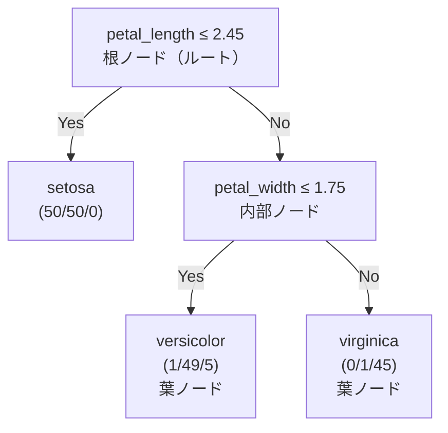

# 決定木

**データを「質問の連続」で分割してクラスや数値を予測する** アルゴリズムです。「年収 > 500 万円か？」「年齢 < 30 歳か？」のような条件分岐を木構造で積み重ねます。直感的に解釈できる点と、アンサンブル学習（ランダムフォレスト・XGBoost）の基礎になる点で重要な手法です。

---

## はじめて読む人へ

決定木は、スパムフィルタから医療診断まで幅広く使われます。「なぜそう予測したか」を人間が説明できるという **解釈可能性** が最大の強みです。一方で、深く育てすぎると過学習するという弱点があり、それを克服するためにランダムフォレストや XGBoost が生まれました。

### 読む前に押さえること

- 木の各 **ノード（節）** では 1 つの特徴量に対する条件を判定します。
- **葉ノード（リーフ）** が出力（クラスまたは数値）です。
- **深さ（depth）** が大きいほど複雑なモデルになります。

### 読み終えたら説明できること

- ジニ不純度と情報利得（エントロピー）の違いを説明できる。
- 過学習を防ぐための剪定（pruning）とハイパーパラメータを説明できる。
- 分類木と回帰木の違いを説明できる。
- 特徴量重要度がどのように計算されるか説明できる。

---

## 木の構造と用語



| 用語 | 意味 |
|------|------|
| 根ノード（root） | 木のトップ。最初の分割点 |
| 内部ノード（internal node） | 条件判定を行うノード |
| 葉ノード（leaf） | 最終的な予測値を持つノード |
| 深さ（depth） | 根から葉までの最大距離 |
| 分割（split） | ノードを 2 つの子ノードに分ける操作 |
| 剪定（pruning） | 過学習を防ぐために枝を切り落とす操作 |

---

## 分割基準：どこで木を分けるか

決定木はデータを「質問」で二分していきます。問題は「どの質問が最も有益か？」です。

!!! info ""
    例：動物を「犬 or 猫」に分類したい
    質問 A：「体重が 5kg 以上か？」
    → 5kg 以上: [犬5, 猫3]  5kg未満: [犬1, 猫6]
    → 分けられているが、まだ混在している

    質問 B：「鳴き声が "ワン" か？」
    → ワン: [犬9, 猫0]  ワン以外: [犬0, 猫9]
    → 完全に純粋なグループに分かれた！

    → 質問 B の方が「良い分割」＝ 不純度（混在度）が下がる
**分割基準 = 分割後にノードが「より純粋に」なる質問を選ぶ**

### ジニ不純度（Gini impurity）

あるノードのデータが **どれだけ混在しているか** を表す指標です。sklearn のデフォルトです。

ジニ不純度の式を導く前に、「純粋さ」を数値化するとはどういうことかを考えましょう。ノードに犬と猫が半々いる場合、ランダムに 2 匹を選ぶと「違うクラス」になる確率が高い——つまり「予測が難しい（不純粋）」状態です。逆に全員が犬なら、2 匹選んでも必ず同じクラス——「予測が簡単（純粋）」です。この「ランダムに 2 回選んだとき同じクラスになる確率」の補数がジニ不純度の直感です。

式にすると：各クラスの割合 p(k) を二乗して合計したものが「同じクラスを引く確率」、それを 1 から引けば「異なるクラスを引く確率」＝混在度になります。

$$
\text{Gini}(t) = 1 - \sum_k p(k \mid t)^2
$$

ここで $p(k \mid t)$ はノード $t$ に属するクラス $k$ の割合です。

!!! info ""
    例：
    [犬5, 猫5] → p(犬)=0.5, p(猫)=0.5 → Gini = 1 - (0.5² + 0.5²) = 0.5（最大 = 最も混在）
    [犬9, 猫1] → p(犬)=0.9, p(猫)=0.1 → Gini = 1 - (0.9² + 0.1²) = 0.18（割と純粋）
    [犬10, 猫0] → p(犬)=1.0, p(猫)=0.0 → Gini = 1 - (1.0² + 0.0²) = 0.0（完全に純粋）
- 純粋なノード（1 クラスのみ）：Gini = 0
- 最大の混在（2 クラスが等分）：Gini = 0.5

```python
import numpy as np

def gini_impurity(labels):
    """labels: クラスラベルの配列"""
    n = len(labels)
    if n == 0:
        return 0.0
    classes, counts = np.unique(labels, return_counts=True)
    probs = counts / n
    return 1 - np.sum(probs ** 2)

# 例：[A, A, A, B, B]
labels_mixed = ['A', 'A', 'A', 'B', 'B']
labels_pure  = ['A', 'A', 'A', 'A', 'A']
print(f"混在ノード Gini: {gini_impurity(labels_mixed):.3f}")   # 0.480
print(f"純粋ノード Gini: {gini_impurity(labels_pure):.3f}")    # 0.000
```

### 情報利得とエントロピー（Shannon entropy）

エントロピーは **情報理論** に基づく不確実性の指標です。

$$
H(t) = -\sum_k p(k \mid t) \log_2 p(k \mid t)
$$

```python
def entropy(labels):
    n = len(labels)
    if n == 0:
        return 0.0
    _, counts = np.unique(labels, return_counts=True)
    probs = counts / n
    # 0 * log(0) = 0 と扱う
    return -np.sum(probs * np.log2(probs + 1e-15))

labels_mixed = ['A', 'A', 'A', 'B', 'B']
print(f"エントロピー: {entropy(labels_mixed):.3f}")   # 0.971 bits（最大 1.0 bits）
```

**情報利得**：分割前のエントロピーから分割後の加重平均エントロピーを引いた値です。

$$
\text{IG}(t,\ \text{split}) = H(\text{parent}) - \sum_{\text{child}} \frac{|\text{child}|}{|\text{parent}|} \cdot H(\text{child})
$$

```python
def information_gain(parent_labels, left_labels, right_labels):
    n = len(parent_labels)
    weight_left  = len(left_labels) / n
    weight_right = len(right_labels) / n
    ig = (entropy(parent_labels)
          - weight_left  * entropy(left_labels)
          - weight_right * entropy(right_labels))
    return ig

parent = ['A', 'A', 'A', 'B', 'B', 'B', 'B', 'B']

# 分割案 1：左 [A,A,A]、右 [B,B,B,B,B]
split1_left  = ['A', 'A', 'A']
split1_right = ['B', 'B', 'B', 'B', 'B']

# 分割案 2：左 [A,A,B]、右 [A,B,B,B,B]
split2_left  = ['A', 'A', 'B']
split2_right = ['A', 'B', 'B', 'B', 'B']

print(f"分割案 1 の情報利得: {information_gain(parent, split1_left, split1_right):.3f}")
print(f"分割案 2 の情報利得: {information_gain(parent, split2_left, split2_right):.3f}")
# 分割案 1 の方が大きい → こちらを選ぶ
```

### ジニ不純度 vs エントロピー

| 観点 | ジニ不純度 | エントロピー |
|------|----------|------------|
| 計算速度 | 速い（log なし） | やや遅い |
| 結果の差 | ほぼ同じ | ほぼ同じ |
| sklearn | デフォルト | `criterion='entropy'` で指定 |

実務的には大差なく、sklearn のデフォルト（ジニ）を使えば問題ありません。

### 回帰木の分割基準

連続値を予測する場合は、分割後の **MSE（平均二乗誤差）** や **MAE** の減少量を最大化するように分割します。

$$
\text{MSE reduction} = \text{MSE}(\text{parent}) - \left(\frac{n_{\text{left}}}{n} \cdot \text{MSE}(\text{left}) + \frac{n_{\text{right}}}{n} \cdot \text{MSE}(\text{right})\right)
$$

---

## sklearn による実装

### 分類木

```python
from sklearn.tree import DecisionTreeClassifier, export_text, plot_tree
from sklearn.datasets import load_iris
from sklearn.model_selection import train_test_split
from sklearn.metrics import classification_report, accuracy_score
import matplotlib.pyplot as plt
import numpy as np

data = load_iris()
X, y = data.data, data.target
feature_names = data.feature_names
class_names   = data.target_names

X_train, X_test, y_train, y_test = train_test_split(X, y, test_size=0.3, random_state=42)

# モデル構築
clf = DecisionTreeClassifier(
    max_depth=3,          # 最大深さ（過学習防止の主要パラメータ）
    min_samples_split=10, # ノードを分割するのに必要な最小サンプル数
    min_samples_leaf=5,   # 葉ノードが持つべき最小サンプル数
    criterion='gini',     # 分割基準
    random_state=42
)
clf.fit(X_train, y_train)

y_pred = clf.predict(X_test)
print(f"精度: {accuracy_score(y_test, y_pred):.3f}")
print(classification_report(y_test, y_pred, target_names=class_names))
```

```python
# テキスト形式で木を表示
print(export_text(clf, feature_names=feature_names))
```

```python
# グラフィカルな可視化
fig, ax = plt.subplots(figsize=(16, 8))
plot_tree(clf,
          feature_names=feature_names,
          class_names=class_names,
          filled=True,         # クラスに応じた色塗り
          rounded=True,
          fontsize=10,
          ax=ax)
plt.title('Iris 決定木（max_depth=3）')
plt.tight_layout()
plt.show()
```

### 回帰木

```python
from sklearn.tree import DecisionTreeRegressor
from sklearn.datasets import load_diabetes
from sklearn.metrics import mean_squared_error, r2_score

data = load_diabetes()
X_train, X_test, y_train, y_test = train_test_split(
    data.data, data.target, test_size=0.2, random_state=42)

reg = DecisionTreeRegressor(max_depth=4, min_samples_leaf=10, random_state=42)
reg.fit(X_train, y_train)
y_pred = reg.predict(X_test)

print(f"R²:   {r2_score(y_test, y_pred):.3f}")
print(f"RMSE: {mean_squared_error(y_test, y_pred, squared=False):.2f}")
```

---

## 決定境界の可視化

```python
from sklearn.inspection import DecisionBoundaryDisplay

# 2 特徴量に絞って可視化
X_2d = X[:, 2:4]  # petal length / petal width
X_train2, X_test2, y_train2, y_test2 = train_test_split(
    X_2d, y, test_size=0.3, random_state=42)

fig, axes = plt.subplots(1, 3, figsize=(15, 4))

for ax, depth in zip(axes, [1, 3, 10]):
    clf_d = DecisionTreeClassifier(max_depth=depth, random_state=42)
    clf_d.fit(X_train2, y_train2)
    acc = clf_d.score(X_test2, y_test2)

    DecisionBoundaryDisplay.from_estimator(
        clf_d, X_2d, ax=ax, alpha=0.4, cmap='RdYlGn'
    )
    ax.scatter(X_2d[:, 0], X_2d[:, 1], c=y, cmap='RdYlGn', edgecolors='k', s=20)
    ax.set_title(f'max_depth={depth}\n精度={acc:.3f}')
    ax.set_xlabel('petal length')
    ax.set_ylabel('petal width')

plt.suptitle('深さによる決定境界の変化')
plt.tight_layout()
plt.show()
```

---

## 過学習と剪定（Pruning）

### なぜ過学習するか

制約なしに育てると、訓練データの各サンプルを完全に分類しようとして、汎化しない複雑な境界を学習します（深さ = サンプル数になり得る）。

```python
# 深さと精度の関係を確認
train_scores, test_scores = [], []
depths = range(1, 20)

for d in depths:
    clf_d = DecisionTreeClassifier(max_depth=d, random_state=42)
    clf_d.fit(X_train, y_train)
    train_scores.append(clf_d.score(X_train, y_train))
    test_scores.append(clf_d.score(X_test, y_test))

plt.figure(figsize=(8, 4))
plt.plot(depths, train_scores, 'b-o', label='訓練精度', markersize=4)
plt.plot(depths, test_scores,  'r-o', label='テスト精度', markersize=4)
plt.xlabel('max_depth'); plt.ylabel('精度')
plt.title('深さと過学習の関係')
plt.legend(); plt.grid(True, alpha=0.3)
plt.show()
# depth=3~5 あたりでテスト精度がピークになり、以降は過学習
```

### コスト複雑度剪定（Post-pruning / CCP）

`cost_complexity_pruning_path` で最適な剪定強度 ccp_alpha を探します。

```python
path = clf.cost_complexity_pruning_path(X_train, y_train)
ccp_alphas = path.ccp_alphas[::5]  # 間引き

train_scores, test_scores = [], []
for alpha in ccp_alphas:
    clf_a = DecisionTreeClassifier(ccp_alpha=alpha, random_state=42)
    clf_a.fit(X_train, y_train)
    train_scores.append(clf_a.score(X_train, y_train))
    test_scores.append(clf_a.score(X_test, y_test))

plt.figure(figsize=(8, 4))
plt.plot(ccp_alphas, train_scores, 'b-o', label='訓練精度', markersize=4)
plt.plot(ccp_alphas, test_scores,  'r-o', label='テスト精度', markersize=4)
plt.xlabel('ccp_alpha（剪定強度）'); plt.ylabel('精度')
plt.title('コスト複雑度剪定')
plt.legend(); plt.grid(True, alpha=0.3)
plt.show()

# 最適な alpha を選択
best_alpha = ccp_alphas[np.argmax(test_scores)]
print(f"最適 ccp_alpha: {best_alpha:.5f}")
```

### 主要ハイパーパラメータ一覧

| パラメータ | 役割 | 大きくすると | 小さくすると |
|-----------|------|-----------|-----------|
| `max_depth` | 木の最大深さ | 過学習 | 未学習 |
| `min_samples_split` | 分割に必要な最小サンプル数 | 単純な木 | 複雑な木 |
| `min_samples_leaf` | 葉の最小サンプル数 | 単純な木 | 複雑な木 |
| `max_features` | 各分割で考慮する特徴量数 | 低ランダム性 | 高ランダム性 |
| `ccp_alpha` | 剪定強度（後剪定） | 強い剪定 | 弱い剪定 |
| `max_leaf_nodes` | 葉ノードの最大数 | 単純な木 | 制限なし |

---

## 特徴量重要度

各特徴量が分割でどれだけ不純度を減少させたかの累積で計算します。

```python
# 特徴量重要度の可視化
importances = clf.feature_importances_
indices = np.argsort(importances)[::-1]

plt.figure(figsize=(8, 4))
plt.bar(range(len(importances)), importances[indices], alpha=0.8)
plt.xticks(range(len(importances)),
           [feature_names[i] for i in indices], rotation=15)
plt.xlabel('特徴量'); plt.ylabel('重要度（Gini 不純度の減少量）')
plt.title('特徴量重要度')
plt.tight_layout(); plt.show()

for i in indices:
    print(f"  {feature_names[i]:<25}: {importances[i]:.4f}")
```

> **注意：特徴量重要度の限界**  
> ジニベースの重要度は **高カーディナリティ（値の種類が多い）の特徴量を過大評価** することが知られています。より信頼性の高い評価には排列重要度（Permutation Importance）を使います。

```python
from sklearn.inspection import permutation_importance

result = permutation_importance(clf, X_test, y_test, n_repeats=10, random_state=42)
perm_importances = result.importances_mean

for i, (name, imp) in enumerate(zip(feature_names, perm_importances)):
    print(f"  {name:<25}: {imp:.4f} ± {result.importances_std[i]:.4f}")
```

---

## CART アルゴリズム（内部の動作）

sklearn の決定木は **CART（Classification And Regression Trees）** アルゴリズムを実装しています。

```python
def find_best_split(X, y, criterion='gini'):
    """
    すべての特徴量・すべての閾値を試して最良分割を返す（概念実装）
    """
    best_gain = -np.inf
    best_feature, best_threshold = None, None
    n = len(y)

    for feature_idx in range(X.shape[1]):
        thresholds = np.unique(X[:, feature_idx])

        for threshold in thresholds:
            left_mask  = X[:, feature_idx] <= threshold
            right_mask = ~left_mask

            if left_mask.sum() == 0 or right_mask.sum() == 0:
                continue

            # 情報利得を計算
            gain = information_gain(y, y[left_mask], y[right_mask])

            if gain > best_gain:
                best_gain      = gain
                best_feature   = feature_idx
                best_threshold = threshold

    return best_feature, best_threshold, best_gain

# 例：Iris の最初の分割を見つける
feature_idx, threshold, gain = find_best_split(X_train, y_train)
print(f"最良分割: {feature_names[feature_idx]} ≤ {threshold:.2f}  (IG={gain:.4f})")
```

---

## 欠損値の扱い

sklearn の `DecisionTreeClassifier` は欠損値を直接扱えません。

```python
from sklearn.impute import SimpleImputer
from sklearn.pipeline import Pipeline

pipe = Pipeline([
    ('imputer', SimpleImputer(strategy='median')),
    ('clf',     DecisionTreeClassifier(max_depth=5, random_state=42))
])
pipe.fit(X_train, y_train)
print(f"精度: {pipe.score(X_test, y_test):.3f}")
```

XGBoost・LightGBM は欠損値を内部で処理できます（[教師あり学習](教師あり学習) 参照）。

---

## カテゴリ変数の扱い

```python
import pandas as pd
from sklearn.preprocessing import OrdinalEncoder

# カテゴリ変数を含むデータ例
df = pd.DataFrame({
    '年齢': [25, 35, 45, 22, 60],
    '職業': ['学生', '会社員', '会社員', '学生', '自営業'],
    '収入': [200, 500, 700, 180, 800],
    '貸出可否': [0, 1, 1, 0, 1]
})

X_cat = df[['年齢', '職業', '収入']]
y_cat = df['貸出可否']

# OrdinalEncoder でラベル変換（決定木は順序を誤解するが許容範囲）
encoder = OrdinalEncoder()
X_encoded = encoder.fit_transform(X_cat)

clf_cat = DecisionTreeClassifier(max_depth=3, random_state=42)
clf_cat.fit(X_encoded, y_cat)
print(export_text(clf_cat, feature_names=['年齢', '職業', '収入']))
```

> カテゴリ変数が多い場合は One-Hot Encoding より OrdinalEncoder の方が決定木と相性が良い（分岐の爆発を防ぐ）。

---

## アンサンブル学習への発展

決定木単体は過学習しやすいですが、複数の木を組み合わせることで強力になります。

```python
from sklearn.ensemble import RandomForestClassifier, GradientBoostingClassifier
from sklearn.metrics import accuracy_score

# ランダムフォレスト：独立した木を多数作って多数決
rf = RandomForestClassifier(n_estimators=100, max_depth=5, random_state=42)
rf.fit(X_train, y_train)

# 勾配ブースティング：前の木の誤差を次の木が補正
gb = GradientBoostingClassifier(n_estimators=100, max_depth=3, learning_rate=0.1, random_state=42)
gb.fit(X_train, y_train)

results = {
    '単一決定木 (depth=3)': clf.score(X_test, y_test),
    'ランダムフォレスト':    rf.score(X_test, y_test),
    '勾配ブースティング':    gb.score(X_test, y_test),
}
for name, score in results.items():
    print(f"  {name:<25}: {score:.3f}")
```

| 手法 | ベースモデル | 木の組み方 | 強み |
|------|-----------|----------|------|
| 単一決定木 | 1 本の深い木 | — | 解釈性が高い |
| バギング | 多数の深い木 | 並列・多数決 | 分散を減らす |
| ランダムフォレスト | 多数の木（特徴量もランダム） | 並列・多数決 | 安定・高精度 |
| 勾配ブースティング | 多数の浅い木 | 逐次・誤差補正 | 最高精度 |
| XGBoost / LightGBM | 勾配ブースティングの高速版 | 逐次 | 大規模・欠損値対応 |

---

## 決定木の解釈ツール

### SHAP による個別予測の説明

```python
import shap

explainer = shap.TreeExplainer(clf)
shap_values = explainer.shap_values(X_test)

# 最初のサンプルの予測根拠を説明
shap.initjs()
shap.force_plot(
    explainer.expected_value[0],
    shap_values[0][0],
    X_test[0],
    feature_names=feature_names
)

# 全体の特徴量重要度（SHAP ベース）
shap.summary_plot(shap_values[0], X_test, feature_names=feature_names)
```

### 決定経路の追跡

```python
sample = X_test[0:1]

# このサンプルが通ったノードを追跡
node_indicator   = clf.decision_path(sample)
leaf_node_ids    = clf.apply(sample)
feature_indices  = clf.tree_.feature
thresholds       = clf.tree_.threshold

print(f"予測クラス: {class_names[clf.predict(sample)[0]]}")
print("\n通ったノード：")
for node_id in node_indicator.indices:
    if feature_indices[node_id] >= 0:  # 葉ノードでない
        feat = feature_names[feature_indices[node_id]]
        thr  = thresholds[node_id]
        val  = sample[0, feature_indices[node_id]]
        side = "≤" if val <= thr else ">"
        print(f"  Node {node_id}: {feat} = {val:.2f} {side} {thr:.2f}")
```

---

## 交差検証によるハイパーパラメータ最適化

```python
from sklearn.model_selection import GridSearchCV, cross_val_score

param_grid = {
    'max_depth':        [2, 3, 4, 5, 6, None],
    'min_samples_split': [2, 5, 10, 20],
    'min_samples_leaf':  [1, 2, 5, 10],
    'criterion':        ['gini', 'entropy'],
}

grid_search = GridSearchCV(
    DecisionTreeClassifier(random_state=42),
    param_grid,
    cv=5,
    scoring='accuracy',
    n_jobs=-1,
    verbose=0
)
grid_search.fit(X_train, y_train)

print(f"最適パラメータ: {grid_search.best_params_}")
print(f"交差検証精度:   {grid_search.best_score_:.3f}")
print(f"テスト精度:     {grid_search.best_estimator_.score(X_test, y_test):.3f}")
```

---

## 決定木の強みと弱み

| 強み | 弱み |
|------|------|
| 解釈・説明が容易（if-then ルールに変換できる） | 過学習しやすい（アンサンブルで補完） |
| 特徴量のスケーリング不要 | 小さな変化で木の構造が大きく変わる（不安定性） |
| 欠損値に対応しやすい（XGBoost など） | 線形な関係の学習が苦手 |
| カテゴリ変数・数値変数を同時に扱える | クラスが不均衡だと偏った木になりやすい |
| 特徴量選択の効果がある（不要な特徴量は無視される） | 深くすると過学習、浅すぎると未学習のトレードオフ |

---

## 確認問題

1. ジニ不純度が 0 になるのはどのような状態か説明してください。また、0.5 に近いほどどのような状態を意味しますか？
2. `max_depth=1`（深さ 1 の決定木、「決定株」とも呼ぶ）と `max_depth=None`（制限なし）それぞれの問題点を述べてください。
3. CART が「すべての特徴量・すべての閾値を試す」のに対し、ランダムフォレストが特徴量をランダムに選ぶのはなぜか説明してください。
4. 特徴量重要度（Gini ベース）の限界と、排列重要度（Permutation Importance）の違いを説明してください。
5. 決定木を `max_depth=3` に制限したとき、学習データと検証データの精度差が小さくなるのはなぜか、バイアス-バリアンスの観点から説明してください。

---

## 関連ページ

- [多変量解析](多変量解析) — LDA・クラスター分析（木と比較可能な分類手法）
- [サポートベクターマシン](サポートベクターマシン) — マージン最大化による分類（決定木との比較）
- [教師あり学習](教師あり学習) — ランダムフォレスト・XGBoost の実装
- [機械学習理論](機械学習理論) — バイアス-バリアンストレードオフ・過学習・正則化
- [特徴量エンジニアリング](特徴量エンジニアリング) — 決定木で使う特徴量の準備
- [モデル評価・チューニング](モデル評価-チューニング) — 交差検証・GridSearchCV

---

[← ホームへ](Home)
