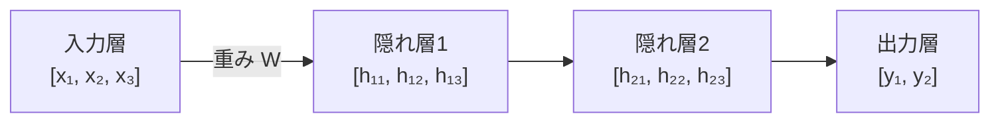
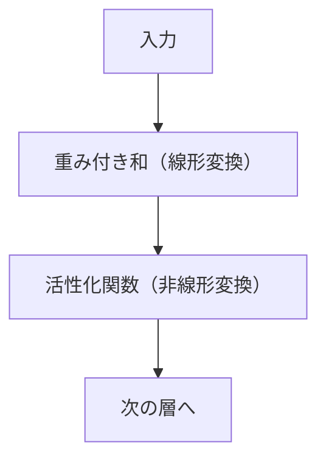

# 深層学習入門

**多層のニューラルネットワーク（深いネット = Deep Learning）** です。画像認識・音声認識・自然言語処理など、従来の機械学習が苦手だった分野で人間レベルを超える性能を実現しました。

---

## はじめて読む人へ

深層学習は、多層のニューラルネットワークで複雑なパターンを学習する方法です。画像、音声、テキストなど、特徴量を手作業で作りにくいデータで特に強力です。


### 読む前に押さえること

- ニューラルネットワークは、入力を少しずつ変換して出力を作ります。
- 活性化関数は、非線形な表現を可能にします。
- 正則化や学習率調整は、安定して学習するために重要です。

### 読み終えたら説明できること

- 層、重み、活性化関数の役割を説明できる。
- バックプロパゲーションの大まかな流れを理解できる。
- 過学習を防ぐ代表的な方法を説明できる。

---

## ニューラルネットワークの構造

ニューラルネットワークの最小単位は、**パーセプトロン** と呼ばれる単純な計算モデルです。パーセプトロンは、複数の入力を受け取り、それぞれに重みをかけて足し合わせ、最後に出力を決めます。

たとえば、学生の合否を「勉強時間」「出席率」「課題提出率」から予測するとします。このとき、どの特徴量をどれくらい重視するかを表すのが **重み** です。勉強時間を強く重視するなら、その入力に対応する重みが大きくなります。

最も基本的な形は、次のような線形計算です。

$$
z = w_1 x_1 + w_2 x_2 + w_3 x_3 + b
$$

ここで `x` は入力、`w` は重み、`b` はバイアスです。バイアスは、すべての入力が 0 のときでも出力を調整できるようにする定数です。この `z` は、入力を重み付きで足しただけなので、まだ **線形変換** です。



各ノード（ニューロン）は入力の重み付き和に活性化関数を適用します。

$$
\text{output} = \text{activation}(W \times \text{input} + b)
$$

$W$：重み行列、$b$：バイアス、activation：ReLU、sigmoid、tanh など

つまり、ニューラルネットワークの 1 層は「線形に足し合わせる処理」と「活性化関数を通す処理」のセットです。



もし活性化関数がなければ、何層重ねても結局は 1 つの大きな線形変換と同じになります。線形変換だけでは、曲線的な境界や複雑なパターンを表現しにくいです。活性化関数を挟むことで、ニューラルネットワークは非線形な関係を学習できるようになります。

「深層」とは、この層を何段も重ねることです。低い層では単純な特徴を取り出し、高い層ではそれらを組み合わせた複雑な特徴を作ります。画像なら、最初は線や角、次に模様、さらに上の層では目・鼻・輪郭のような部品に近い表現を学ぶ、というイメージです。

---

## 活性化関数

活性化関数は、重み付き和 `z` を次の層へ渡す前に変換する関数です。名前は難しく見えますが、役割は「ニューロンがどれくらい反応するかを決める関数」と考えると分かりやすいです。

代表的な活性化関数には、ReLU、Sigmoid、Tanh、GELU があります。どれも入力を別の値に変換しますが、出力の範囲や勾配の性質が違います。

```python
import numpy as np
import matplotlib.pyplot as plt

x = np.linspace(-5, 5, 100)

# ReLU（Rectified Linear Unit）- 深い層で最もよく使われる
relu = np.maximum(0, x)

# Sigmoid - 確率出力（2値分類の出力層）
sigmoid = 1 / (1 + np.exp(-x))

# Tanh - -1〜1 の出力（RNN の隠れ層など）
tanh = np.tanh(x)

# GELU - Transformer で標準的
gelu = x * 0.5 * (1 + np.tanh(np.sqrt(2 / np.pi) * (x + 0.044715 * x**3)))

fig, axes = plt.subplots(1, 4, figsize=(16, 4))
for ax, func, name in zip(axes, [relu, sigmoid, tanh, gelu], ["ReLU", "Sigmoid", "Tanh", "GELU"]):
    ax.plot(x, func)
    ax.axhline(0, color="k", lw=0.5)
    ax.axvline(0, color="k", lw=0.5)
    ax.set_title(name)
plt.tight_layout()
plt.savefig("activations.png", dpi=150)
```

ReLU は、0 以下を 0 にし、正の値はそのまま通します。計算が単純で、深いネットワークでも勾配が消えにくいため、現在の基本的な選択肢です。

Sigmoid は出力を 0〜1 に押し込むため、2値分類の確率のような値を出したいときに使われます。ただし、中間層で多用すると勾配が小さくなりやすく、深いネットワークでは学習が進みにくくなることがあります。

Tanh は -1〜1 に値を押し込む関数です。RNN などで使われることがありますが、Sigmoid と同じく勾配消失には注意が必要です。GELU は Transformer 系のモデルでよく使われる滑らかな活性化関数です。

---

## バックプロパゲーション（誤差逆伝播）

### なぜ逆伝播が必要か

ニューラルネットワークの学習は「重みを少しずつ調整して、損失を下げていく」プロセスです。ただし、重みはモデルの内部に何百万個もあります。「どの重みをどちら方向にどれだけ動かせば損失が下がるか」を一つひとつ試すのは非現実的です。

「すべての重みで試行錯誤する」方法は計算量が爆発します。パラメータが100万個あれば、1つずつ少し動かして損失を測る——これを繰り返すだけで100万回の計算が必要です。しかし実は、微積分の連鎖律を使えば**1回の逆向きの計算ですべての重みの勾配を一度に求められます**。

**逆伝播（バックプロパゲーション）** を使うと、連鎖律（Chain Rule）によってすべての重みへの影響を一度に効率よく計算できます。

---

### STEP 1：全体の流れ

**■ 順伝播（Forward Pass）**：データ → モデル → 予測 → 損失を計算

入力 $x$ → [重み $w_1$] → 中間値 $z$ → [活性化] → 出力 → 損失 $L$

**■ 逆伝播（Backward Pass）**：損失 → 各重みへの「責任の割り当て」を逆向きに計算

$$L \to \frac{\partial L}{\partial \text{out}} \to \frac{\partial L}{\partial z} \to \frac{\partial L}{\partial w_1} \quad \text{（連鎖律で逆向きに伝播）}$$

**■ 重みを更新：**

$$w_1 \leftarrow w_1 - lr \times \frac{\partial L}{\partial w_1}$$

これを何千回も繰り返すことで、モデルが学習されます。

---

### STEP 2：1 ニューロンで完全に手計算する

最もシンプルな設定で、順伝播から逆伝播まで全ステップを追います。

!!! info ""
    ```text
    ネットワークの設定：
      入力     x = 2.0
      重み     w = 0.5
      バイアス b = 0.1
      正解ラベル y_true = 1.0

    構造：  x → (線形変換) → z → (sigmoid) → out → (MSE 損失) → L
    ```
**■ 順伝播（Forward Pass）**

!!! info ""
    STEP 2-1: 線形変換
    z = w * x + b
    = 0.5 * 2.0 + 0.1
    = 1.1

    STEP 2-2: 活性化関数（sigmoid）
    out = sigmoid(z) = 1 / (1 + e^(-1.1))
    ≈ 0.750

    STEP 2-3: 損失計算（MSE）
    L = (out - y_true)²
    = (0.750 - 1.0)²
    = (-0.25)²
    = 0.0625
**■ 逆伝播（Backward Pass） — 連鎖律を使って逆向きに計算**

!!! info ""
    ```text
    目標：∂L/∂w（「w を少し増やしたとき、損失はどう変わるか」）を求める

    経路：L ← out ← z ← w  の逆向き

    STEP 2-4: 損失 → out への勾配
      ∂L/∂out = 2 * (out - y_true)
               = 2 * (0.750 - 1.0)
               = -0.500       ← out が増えると損失は 0.5 の速さで変化

    STEP 2-5: out → z への勾配（sigmoid の微分）
      ∂out/∂z = sigmoid(z) * (1 - sigmoid(z))
               = 0.750 * 0.250
               = 0.188

    STEP 2-6: z → w への勾配
      ∂z/∂w = x = 2.0       ← w が増えると z は 2 倍の速さで増える

    STEP 2-7: 連鎖律でつなぐ
      ∂L/∂w = ∂L/∂out × ∂out/∂z × ∂z/∂w
             = (-0.500) × 0.188 × 2.0
             = -0.188

      ∂L/∂b = ∂L/∂out × ∂out/∂z × ∂z/∂b
             = (-0.500) × 0.188 × 1.0     ← ∂z/∂b = 1
             = -0.094
    ```
$\partial L/\partial w$ = **-0.188** という結果を言葉で確認しましょう。偏微分は「その変数を少し増やしたとき、関数がどれだけ・どの方向に動くか」を表します。-0.188 という**負の値**は、「w を増やすと損失が 0.188 の速さで減る方向に動く」ことを意味します。ということは、w を増やせば損失が小さくなります。学習則 $w \leftarrow w - lr \times \partial L/\partial w$ にこの負の値を代入すると、マイナス×マイナスでプラスになるので w は増える方向に更新されます——直感と一致しています。

**■ 重みの更新（lr = 0.1）**

```
  w_new = w - lr * ∂L/∂w = 0.5 - 0.1 * (-0.188) = 0.519
  b_new = b - lr * ∂L/∂b = 0.1 - 0.1 * (-0.094) = 0.109
```

更新後に再度順伝播：
!!! info ""
    z_new   = 0.519 * 2.0 + 0.109 = 1.147
    out_new = sigmoid(1.147) ≈ 0.759
    L_new   = (0.759 - 1.0)² = 0.0581   ← 元の 0.0625 より小さくなった！
1 回の更新で損失が少しだけ減りました。これを何千回と繰り返すのが学習です。

---

### STEP 3：Python で実装・確認

```python
import numpy as np

def sigmoid(x):
    return 1 / (1 + np.exp(-x))

def sigmoid_deriv(x):
    s = sigmoid(x)
    return s * (1 - s)

# 設定
x, w, b, y_true = 2.0, 0.5, 0.1, 1.0
lr = 0.1

print("=== 学習のループ（10 ステップ）===")
for step in range(10):
    # ─ 順伝播 ─────────────────────
    z   = w * x + b
    out = sigmoid(z)
    L   = (out - y_true) ** 2

    # ─ 逆伝播 ─────────────────────
    dL_dout = 2 * (out - y_true)
    dout_dz  = sigmoid_deriv(z)
    dz_dw    = x
    dz_db    = 1.0

    dL_dw = dL_dout * dout_dz * dz_dw
    dL_db = dL_dout * dout_dz * dz_db

    # ─ 更新 ───────────────────────
    w -= lr * dL_dw
    b -= lr * dL_db

    if step % 2 == 0:
        print(f"step {step:2d}: L={L:.4f}  out={out:.3f}  w={w:.3f}  b={b:.3f}")

# step  0: L=0.0625  out=0.750  w=0.519  b=0.109
# step  2: L=0.0452  out=0.787  ...
# ...  損失が徐々に下がっていく
```

---

### STEP 4：PyTorch の自動微分との対応

上記を手で計算したことを、PyTorch では `loss.backward()` が全パラメータについて自動でやります。

```python
import torch

x_t = torch.tensor([2.0])
w_t = torch.tensor([0.5], requires_grad=True)  # 勾配を追跡
b_t = torch.tensor([0.1], requires_grad=True)
y_t = torch.tensor([1.0])

# 順伝播
z_t   = w_t * x_t + b_t
out_t = torch.sigmoid(z_t)
L_t   = (out_t - y_t) ** 2

# 逆伝播（自動微分）
L_t.backward()

print(f"∂L/∂w（自動）: {w_t.grad.item():.4f}")   # ≈ -0.1878
print(f"∂L/∂b（自動）: {b_t.grad.item():.4f}")   # ≈ -0.0939
# 手計算（-0.188, -0.094）とほぼ一致！
```

> **情報工学メモ：勾配消失問題**  
> sigmoid / tanh は値を 0〜1（または -1〜1）に圧縮します。層が深くなると、この圧縮が何度も積み重なって勾配がほぼゼロに近づき、最初の層まで勾配が届かなくなります（**勾配消失問題**）。ReLU は正の領域で勾配を 1 に保つため、深いネットでも学習が進みやすい。100 層を超えるネットには **残差接続（ResNet）** が使われ、勾配が直接届く経路を作ります。

---

## 正則化テクニック

深層学習モデルは表現力が高い分、訓練データを覚えすぎることがあります。訓練データでは正解できるのに、未知のデータでは外す状態を **過学習** と呼びます。

正則化は、過学習を抑えて未知データに強いモデルにするための工夫です。ここでは、バッチ正規化、ドロップアウト、学習率スケジューリングを見ます。

### バッチ正規化

各層の出力を平均 0・標準偏差 1 に正規化します。学習が安定し、学習率を大きくできます。

```python
# PyTorch での例
import torch.nn as nn

model = nn.Sequential(
    nn.Linear(128, 64),
    nn.BatchNorm1d(64),   # 全結合層の後に配置
    nn.ReLU(),
    nn.Linear(64, 10),
)
```

バッチ正規化は、層の途中の値の分布が大きく変わりすぎるのを抑えます。値のスケールが安定すると、次の層が学習しやすくなり、学習率を少し大きくしても発散しにくくなります。

### ドロップアウト

学習時にランダムにニューロンを無効化します。過学習を防ぎます。

```python
model = nn.Sequential(
    nn.Linear(128, 256),
    nn.ReLU(),
    nn.Dropout(p=0.5),    # 50% のニューロンをランダムに無効化
    nn.Linear(256, 10),
)
```

ドロップアウトは、毎回一部のニューロンを使えない状態にして学習します。これにより、特定のニューロンだけに頼るモデルになりにくくなります。テスト時にはドロップアウトを無効にして、全てのニューロンを使って予測します。

### 学習率スケジューリング

学習率は、重みを 1 回の更新でどれくらい動かすかを決める値です。大きすぎると最小値を飛び越え、小さすぎると学習が進みません。学習率スケジューリングは、学習の進み具合に応じて学習率を変える方法です。

```python
from torch.optim.lr_scheduler import CosineAnnealingLR, OneCycleLR

optimizer = torch.optim.Adam(model.parameters(), lr=1e-3)
scheduler = CosineAnnealingLR(optimizer, T_max=100)  # 100 エポックで余弦状に減衰
```

### Early Stopping

検証損失が改善しなくなったら学習を止めて過学習を防ぐ実践的な手法です。

```python
class EarlyStopping:
    def __init__(self, patience=10, min_delta=1e-4):
        self.patience  = patience    # 改善なしを何エポック許容するか
        self.min_delta = min_delta   # 「改善」とみなす最小の変化量
        self.counter   = 0
        self.best_loss = float("inf")

    def step(self, val_loss):
        if val_loss < self.best_loss - self.min_delta:
            self.best_loss = val_loss
            self.counter = 0
            return False          # 継続
        self.counter += 1
        return self.counter >= self.patience  # True なら停止

early_stop = EarlyStopping(patience=10)

for epoch in range(200):
    # ... 訓練ループ ...
    val_loss = compute_validation_loss()
    if early_stop.step(val_loss):
        print(f"Early stopping at epoch {epoch}")
        break
```

`patience` を大きくすると停止が遅れ、小さくすると早期に止まりすぎます。通常は 5〜20 の範囲でデータ量に合わせて調整します。

---

## 損失関数の選択

損失関数は、モデルの予測がどれくらい外れているかを数値にする関数です。タスクによって「外れ方」の意味が違うため、損失関数も変わります。

分類では、正しいクラスに高い確率を割り当てられているかを見ます。回帰では、予測値と正解値の距離を見ます。損失関数を間違えると、モデルは目的と違う方向に学習してしまいます。

| タスク | 損失関数 | PyTorch クラス |
|--------|---------|--------------|
| 2値分類 | Binary Cross-Entropy | `nn.BCEWithLogitsLoss()` |
| 多クラス分類 | Cross-Entropy | `nn.CrossEntropyLoss()` |
| 回帰 | MSE | `nn.MSELoss()` |
| 回帰（外れ値に強い）| Huber Loss | `nn.SmoothL1Loss()` |

---

## Attention 機構（基礎）

Attention は、入力の全要素に「どこを重視するか」の重みを付けて加重平均する仕組みです。RNN のように順序に縛られず、離れた要素間の依存関係を捉えられます。これが Transformer の中核です。

```python
import torch
import torch.nn.functional as F

def scaled_dot_product_attention(Q, K, V):
    """
    Q: Query (seq_len, d_k)
    K: Key   (seq_len, d_k)
    V: Value (seq_len, d_v)
    """
    d_k = Q.size(-1)
    scores = Q @ K.transpose(-2, -1) / d_k**0.5  # スケーリング
    weights = F.softmax(scores, dim=-1)           # attention 重み（0〜1、合計 1）
    return weights @ V, weights                   # (出力, 重み)

# 簡単な例：文字列の各トークンが他のどのトークンに注目するか
seq_len, d_model = 5, 8
Q = torch.randn(seq_len, d_model)
K = torch.randn(seq_len, d_model)
V = torch.randn(seq_len, d_model)

output, attn_weights = scaled_dot_product_attention(Q, K, V)
print(f"出力形状: {output.shape}")           # (5, 8)
print(f"Attention 重み形状: {attn_weights.shape}")  # (5, 5)
```

!!! info ""
    入力トークン列:  [猫, が, 魚, を, 食べた]
    ↓ Attention 重み（注目度）
    「食べた」← 誰が何を食べたか? → 「猫」と「魚」に強く注目
Attention 重みを可視化すると「このトークンはあのトークンを参照して予測した」という解釈が得られます。`MultiheadAttention`（PyTorch 組み込み）では、複数の独立した Attention ヘッドが異なる関係を並列に学習します。

詳細は [NLP 基礎](NLP基礎) の Transformer 解説を参照してください。

---

## 深層学習 vs 従来の機械学習

深層学習は強力ですが、すべての問題で最初に選ぶべき方法ではありません。データが少ない表形式データでは、ランダムフォレストや XGBoost のような従来の機械学習モデルの方が扱いやすく、性能も高いことがあります。

一方で、画像・音声・テキストのように、人間が特徴量を手で作るのが難しいデータでは、深層学習の強みが出やすいです。深層学習は、特徴量設計そのものをモデルの内部で学習できるからです。

| | 従来の ML | 深層学習 |
|--|-----------|---------|
| データ量 | 少なくても動く | 多いほど良い |
| 特徴量設計 | 手動で重要 | 自動（End-to-End） |
| 解釈性 | 高い | 低い（ブラックボックス） |
| 計算資源 | CPU で十分 | GPU が望ましい |
| 向いているタスク | 表形式データ | 画像・音声・テキスト |

> 表形式データ（CSV）は依然として XGBoost・ランダムフォレストが競争力を持ちます。深層学習が圧倒的に有効なのは非構造化データ（画像・音声・テキスト）です。

---


## 確認問題

1. 深層学習入門 は、何の問題を解決するための考え方・道具ですか。
2. このページで出てきた重要語を 3 つ選び、それぞれ 1 文で説明してください。
3. コード例やコマンド例がある場合、入力・処理・出力を分けて説明してください。
4. このページの内容が、前後の STEP や自分の作りたいものにどうつながるか説明してください。

---

## 関連ページ

- [機械学習理論](機械学習理論) — 勾配降下法・損失関数の理論
- [PyTorch 入門](PyTorch入門) — 実際にニューラルネットを実装する
- [CNN（画像認識）](CNN) — 画像向けアーキテクチャ

---

[← ホームへ](Home)
