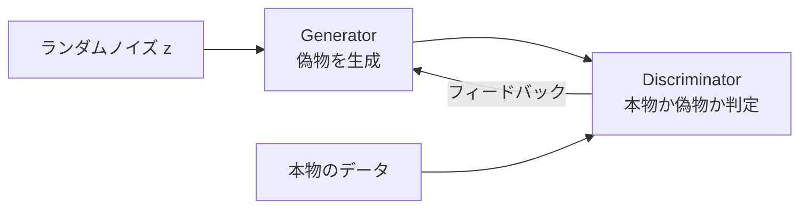
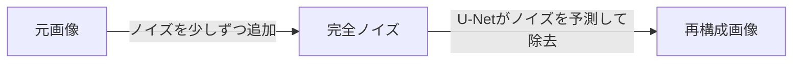

# 生成モデル（GAN・VAE・Diffusion）

「本物に見える画像・文章・音楽を新たに生成する」モデルの総称です。これまでの機械学習が「入力 → 予測（識別）」だったのに対し、生成モデルは「ランダムなノイズ → 意味のあるデータ」を作ります。ChatGPT・Stable Diffusion・DALL-E はすべてこのカテゴリです。

---

## はじめて読む人へ

識別モデル（分類・回帰）は「この画像は猫か犬か」を答えます。生成モデルは「猫の画像を新しく作る」ことができます。このページでは3種類の生成モデルのしくみを理解し、現代の画像生成AI（Stable Diffusion 等）がどう動いているかを掴みます。

### 読む前に押さえること

- [深層学習入門](深層学習入門.md) のニューラルネットワーク・誤差逆伝播の基本
- [PyTorch入門](PyTorch入門.md) の nn.Module・学習ループの書き方
- [Transformer・Attention](Transformer-Attention.md) を読んでおくと Diffusion の理解が深まります

### 読み終えたら説明できること

- GAN・VAE・Diffusion の3つの生成アプローチの違いを説明できる
- Stable Diffusion が「ノイズ除去 + テキスト誘導」で動く仕組みを説明できる
- PyTorch で簡単な GAN を実装できる

---

## 識別 vs 生成

```
識別モデル（これまで）:
  入力: 猫の画像 → モデル → 出力: 「猫」

生成モデル（このページ）:
  入力: ランダムなノイズ (z) → モデル → 出力: 猫の画像（本物らしい）
```

生成モデルの目標は「本物のデータの分布 p_data(x)」を学習し、そこからサンプリングすることです。3 つの代表的アプローチは「どうやってその分布を学ぶか」が異なります。

---

## GAN（Generative Adversarial Network）

2 つのネットワークを**互いに競わせて**学習します。



| ネットワーク | 目標 |
|------------|------|
| **Generator（G）** | 本物に見える偽データを作って Discriminator を騙す |
| **Discriminator（D）** | 本物と偽物を見破る |

この「騙し合い」を繰り返すうち、G は本物と区別できない画像を生成できるようになります。

### PyTorch で手書き数字（MNIST）を生成する

```python
import torch
import torch.nn as nn
from torchvision import datasets, transforms
from torch.utils.data import DataLoader

# データ準備
transform = transforms.Compose([
    transforms.ToTensor(),
    transforms.Normalize([0.5], [0.5])  # -1 ~ 1 に正規化
])
dataset = datasets.MNIST("./data", train=True, download=True, transform=transform)
loader  = DataLoader(dataset, batch_size=128, shuffle=True)

LATENT_DIM = 100  # ノイズの次元

# Generator: ノイズ(100次元) → 28×28画像
class Generator(nn.Module):
    def __init__(self):
        super().__init__()
        self.net = nn.Sequential(
            nn.Linear(LATENT_DIM, 256),
            nn.ReLU(),
            nn.Linear(256, 512),
            nn.ReLU(),
            nn.Linear(512, 784),   # 28×28 = 784
            nn.Tanh()              # -1 ~ 1 の出力
        )

    def forward(self, z):
        return self.net(z).view(-1, 1, 28, 28)

# Discriminator: 28×28画像 → 本物確率(0~1)
class Discriminator(nn.Module):
    def __init__(self):
        super().__init__()
        self.net = nn.Sequential(
            nn.Flatten(),
            nn.Linear(784, 512),
            nn.LeakyReLU(0.2),
            nn.Linear(512, 256),
            nn.LeakyReLU(0.2),
            nn.Linear(256, 1),
            nn.Sigmoid()
        )

    def forward(self, x):
        return self.net(x)

device = "cuda" if torch.cuda.is_available() else "cpu"
G = Generator().to(device)
D = Discriminator().to(device)

opt_G = torch.optim.Adam(G.parameters(), lr=2e-4)
opt_D = torch.optim.Adam(D.parameters(), lr=2e-4)
criterion = nn.BCELoss()

for epoch in range(20):
    for real_imgs, _ in loader:
        real_imgs = real_imgs.to(device)
        B = real_imgs.size(0)

        # --- Discriminator を学習 ---
        z = torch.randn(B, LATENT_DIM, device=device)
        fake_imgs = G(z).detach()  # G の勾配を止める

        real_loss = criterion(D(real_imgs), torch.ones(B, 1, device=device))
        fake_loss = criterion(D(fake_imgs), torch.zeros(B, 1, device=device))
        d_loss = (real_loss + fake_loss) / 2

        opt_D.zero_grad(); d_loss.backward(); opt_D.step()

        # --- Generator を学習 ---
        z = torch.randn(B, LATENT_DIM, device=device)
        g_loss = criterion(D(G(z)), torch.ones(B, 1, device=device))  # D を騙せたら損失小

        opt_G.zero_grad(); g_loss.backward(); opt_G.step()

    print(f"Epoch {epoch+1}: D={d_loss.item():.4f}  G={g_loss.item():.4f}")
```

---

## VAE（Variational Autoencoder）

データを**潜在空間の確率分布**として表現します。GAN と違い、「どんな潜在変数がどんな画像を生成するか」を解釈しやすい構造です。

```
Encoder: 画像 → 平均μ と 分散σ（潜在空間の分布パラメータ）
           ↓ μ と σ からサンプリング（再パラメータ化トリック）
Decoder: 潜在変数 z → 再構成画像
```

```python
class VAE(nn.Module):
    def __init__(self, latent_dim=20):
        super().__init__()
        # Encoder: 画像 → μ と log_var
        self.encoder = nn.Sequential(nn.Flatten(), nn.Linear(784, 400), nn.ReLU())
        self.fc_mu      = nn.Linear(400, latent_dim)
        self.fc_log_var = nn.Linear(400, latent_dim)
        # Decoder: z → 再構成画像
        self.decoder = nn.Sequential(
            nn.Linear(latent_dim, 400), nn.ReLU(),
            nn.Linear(400, 784), nn.Sigmoid()
        )

    def reparameterize(self, mu, log_var):
        # z = μ + ε × σ （ε は標準正規分布からのサンプル）
        std = torch.exp(0.5 * log_var)
        eps = torch.randn_like(std)
        return mu + eps * std

    def forward(self, x):
        h       = self.encoder(x)
        mu      = self.fc_mu(h)
        log_var = self.fc_log_var(h)
        z       = self.reparameterize(mu, log_var)
        return self.decoder(z), mu, log_var

def vae_loss(recon_x, x, mu, log_var):
    # 再構成誤差 + KL 散逸（潜在空間を標準正規分布に近づける正則化）
    recon_loss = nn.functional.binary_cross_entropy(recon_x, x.view(-1, 784), reduction="sum")
    kl_loss    = -0.5 * torch.sum(1 + log_var - mu.pow(2) - log_var.exp())
    return recon_loss + kl_loss
```

---

## Diffusion Model（拡散モデル）

現在の画像生成 AI（Stable Diffusion・DALL-E）の主流技術です。

**核心アイデア：「ノイズを少しずつ足していく（拡散）」の逆を学ぶ**

```
Forward process（データ → ノイズ）:
  猫の画像 → 少しノイズを加える → もっとノイズを加える → ... → 完全なランダムノイズ

Reverse process（モデルが学習）:
  ランダムノイズ → 少しノイズを取り除く → ... → 猫の画像
  ↑ ここを U-Net（ニューラルネット）が予測する
```



学習時は「T ステップ後のノイズ画像」と「追加されたノイズ」を使って、「どれだけノイズが乗っているか」を U-Net に予測させます。

### Stable Diffusion の仕組み

Stable Diffusion はここに **テキスト条件付け** を加えます。

```
「宇宙を旅する猫」 → CLIP テキストエンコーダ → テキスト埋め込みベクトル
                                                        ↓
ランダムノイズ → U-Net（テキストを参照しながらノイズ除去） → 猫の画像
```

**主要コンポーネント：**

| コンポーネント | 役割 |
|-------------|------|
| テキストエンコーダ（CLIP） | テキストを埋め込みベクトルに変換 |
| U-Net | ノイズ除去を担う中核ネットワーク |
| VAE エンコーダ/デコーダ | 画素空間 ↔ 潜在空間の変換（計算コスト削減）|
| スケジューラ | ノイズ除去のステップ数・強度を制御 |

```python
# diffusers ライブラリで Stable Diffusion を実行
# pip install diffusers transformers accelerate
from diffusers import StableDiffusionPipeline
import torch

pipe = StableDiffusionPipeline.from_pretrained(
    "runwayml/stable-diffusion-v1-5",
    torch_dtype=torch.float16
)
pipe = pipe.to("cuda")

image = pipe(
    prompt="a photo of an astronaut riding a horse on mars",
    num_inference_steps=50,   # ノイズ除去ステップ数（多いほど高品質・遅い）
    guidance_scale=7.5        # テキスト条件の強さ
).images[0]

image.save("output.png")
```

---

## 3 手法の比較

| | GAN | VAE | Diffusion |
|--|-----|-----|-----------|
| 生成品質 | 高い（シャープ）| 少しぼける | 最高 |
| 多様性 | Mode collapse の問題あり | 良い | 非常に高い |
| 学習の安定性 | 不安定（敵対的学習）| 安定 | 安定 |
| 生成速度 | 速い | 速い | 遅い（多ステップ）|
| 潜在空間の解釈性 | 低い | 高い | 中程度 |
| 現在の主流 | 限定的 | 補助的 | **画像生成の主流** |

---

## 確認問題

1. GAN の Generator と Discriminator はそれぞれ何を最小化しようとしていますか？
2. VAE で「再パラメータ化トリック」が必要な理由を説明してください（サンプリングと逆伝播の関係）。
3. Diffusion モデルの Forward process と Reverse process の違いを説明してください。

---

## 関連ページ

- [深層学習入門](深層学習入門.md) — ニューラルネットワーク・誤差逆伝播の基礎
- [CNN（画像認識）](CNN.md) — U-Net の基盤となる畳み込み
- [Transformer・Attention](Transformer-Attention.md) — Stable Diffusion が使う Cross-Attention
- [LLM活用入門](LLM活用入門.md) — テキスト生成モデルの活用
- [Hugging Face入門](HuggingFace入門.md) — diffusers ライブラリの使い方
