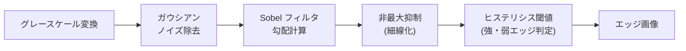

# 画像処理基礎

「画像」をコンピュータで扱い、変換・分析・特徴抽出を行う技術です。CNN による深層学習モデルの前に、フィルタリング・エッジ検出・色空間変換・形態学的処理といった古典的手法を理解することで、「なぜ畳み込みが有効か」「前処理でどう画像を整えるか」の根拠が見えます。

---

## はじめて読む人へ

CNN に画像を入力する前には必ず前処理があります。ノイズ除去・サイズ正規化・色空間変換——これらは古典的な画像処理の操作そのものです。「Sobel フィルタは手動でエッジを検出する畳み込み」「CNN の初期層は自動的に Sobel 的フィルタを学習している」——この対応関係を知ると、深層学習の理解が深まります。

### 読む前に押さえること

- [線形代数](線形代数) — 行列演算・畳み込みの数学的基礎
- [フーリエ解析](フーリエ解析) — 空間周波数・畳み込み定理

### 読み終えたら説明できること

- 画像が数値行列として表現されることを理解できる
- 空間フィルタリング（畳み込み）の意味と代表的なフィルタを説明できる
- エッジ検出・二値化・形態学的処理の目的を説明できる

---

## 画像の表現

### ピクセルと色空間

デジタル画像は **ピクセル（画素）の 2 次元配列** です。

| 種類 | 形状 | 値の範囲 | 例 |
|------|------|---------|---|
| グレースケール | $H \times W$ | 0〜255（8bit）| 白黒写真 |
| カラー（RGB） | $H \times W \times 3$ | 各チャンネル 0〜255 | カラー写真 |
| カラー（float） | $H \times W \times 3$ | 0.0〜1.0 | NN への入力 |

NumPy では `img.shape` が `(480, 640, 3)` なら「高さ 480、幅 640、RGB 3 チャンネル」の画像です。

### 色空間

| 色空間 | 説明 | 用途 |
|--------|------|------|
| **RGB** | 赤・緑・青の加法混色 | 表示・一般処理 |
| **BGR** | OpenCV のデフォルト（RGB の逆順） | OpenCV 関数の入力 |
| **HSV** | 色相(Hue)・彩度(Saturation)・明度(Value) | 色による物体検出・しきい値処理 |
| **Lab** | 知覚的均一性が高い（人間の視覚に近い距離） | 色差の計算・色補正 |
| **グレースケール** | $Y = 0.299R + 0.587G + 0.114B$ | 輝度処理・二値化 |

**HSV が有用な理由：** RGB では照明が変わると赤も緑も青も変化しますが、HSV の色相 H は照明変化に比較的ロバストです。「赤いボールを検出する」ような色ベースのセグメンテーションに便利です。

---

## 空間フィルタリング

### 畳み込み（Convolution）

カーネル（フィルタ）$k$ と画像 $I$ の畳み込み：

$$
(I * k)[i, j] = \sum_{m}\sum_{n} I[i-m, j-n] \cdot k[m, n]
$$

各ピクセルをその周辺ピクセルの**加重平均**に置き換える操作です。カーネルの係数が「どのような重み付けをするか」を決めます。

!!! info ""
    ```text
    画像の一部:      ガウシアンカーネル:    出力（中心ピクセル）:
    [100  80  90]   [1 2 1]              100×1 + 80×2 + 90×1
    [ 70 120  85] * [2 4 2] / 16   →    + 70×2 + 120×4 + 85×2
    [ 60  95 110]   [1 2 1]              + ...  ÷ 16 = 平滑化値
    ```
### 代表的なカーネル

**平滑化フィルタ（低域通過）：**

$$
\text{均一（Box）} = \frac{1}{9}\begin{bmatrix} 1&1&1 \\ 1&1&1 \\ 1&1&1 \end{bmatrix}, \quad
\text{ガウシアン} = \frac{1}{16}\begin{bmatrix} 1&2&1 \\ 2&4&2 \\ 1&2&1 \end{bmatrix}
$$

ガウシアンフィルタは「近いピクセルほど重く」した加重平均で、均一フィルタよりノイズ除去後の自然さが高いです。

**エッジ検出（微分フィルタ・高域通過）：**

$$
\text{Sobel}_{x} = \begin{bmatrix} -1&0&1 \\ -2&0&2 \\ -1&0&1 \end{bmatrix}, \quad
\text{Sobel}_{y} = \begin{bmatrix} -1&-2&-1 \\ 0&0&0 \\ 1&2&1 \end{bmatrix}
$$

Sobel フィルタは $x$ 方向・$y$ 方向の輝度勾配 $\nabla I$ を近似します。

$$
|\nabla I| = \sqrt{I_x^2 + I_y^2}, \quad \theta = \arctan(I_y / I_x)
$$

**シャープニング（鮮鋭化）：**

$$
\text{Laplacian} = \begin{bmatrix} 0&-1&0 \\ -1&4&-1 \\ 0&-1&0 \end{bmatrix}
$$

ラプラシアンフィルタは「周囲との差」を強調し、ぼやけた画像を鮮明にします。シャープニングは `I + \alpha \cdot \text{Laplacian}(I)` で実現します。

### Canny エッジ検出

単純な微分より精度が高いエッジ検出アルゴリズムです。



**ヒステリシス閾値：** 強エッジ（上限 $T_h$）は確実にエッジ、弱エッジ（$T_l < $ 勾配 $< T_h$）は強エッジと繋がっていればエッジとして採用します。これにより途切れにくい連続したエッジが得られます。

`cv2.Canny(img, threshold1, threshold2)` で実行できます。

---

## 二値化（閾値処理）

グレースケール画像を 0（黒）/255（白）の 2 値に変換します。

### グローバル閾値

$$
\text{dst}[i,j] = \begin{cases} 255 & I[i,j] > T \\ 0 & \text{otherwise} \end{cases}
$$

### Otsu の二値化

「2 クラスの**クラス間分散を最大化**する」閾値を自動的に選択します。

$$
\hat{T} = \arg\max_T \sigma_B^2(T) = \arg\max_T \omega_0 \omega_1 (\mu_0 - \mu_1)^2
$$

$\omega_0, \omega_1$：各クラスの画素数の割合、$\mu_0, \mu_1$：各クラスの平均輝度。

均一な照明条件では Otsu 法が最も簡単で効果的です。照明ムラがある場合は**適応的閾値処理**（局所的な平均を閾値にする）を使います。

---

## 形態学的処理

2 値画像（または グレースケール）に対して「形」を変形する操作です。**構造要素（カーネル）** を画像の上でスライドさせます。

### 基本演算

| 操作 | 定義 | 効果 |
|------|------|------|
| **膨張（Dilation）** | 構造要素内に白画素があれば白 | 白領域を拡大・穴埋め |
| **収縮（Erosion）** | 構造要素内がすべて白なら白 | 白領域を縮小・小ノイズ除去 |
| **開演算（Opening）** | 収縮 → 膨張 | 小さい突起や孤立点を除去（外側ノイズ除去） |
| **閉演算（Closing）** | 膨張 → 収縮 | 小さい穴や隙間を埋める（内側ノイズ除去） |

!!! info ""
    ```text
    元の2値画像:           膨張後:               収縮後:
    █████                █████████            ███
    ██ ██  →  膨張  →   █████████  →  収縮  → ███
    █████                █████████            ███
                      （拡大）              （縮小）
    ```
### 応用：OCR 前処理

文字認識では「収縮でノイズ除去 → 膨張で文字を繋げる」といった処理が典型的です。

---

## 幾何学的変換

### アフィン変換

スケーリング・回転・平行移動・せん断を統一的に扱います。

$$
\begin{bmatrix} x' \\ y' \\ 1 \end{bmatrix} = \begin{bmatrix} a_{11}&a_{12}&t_x \\ a_{21}&a_{22}&t_y \\ 0&0&1 \end{bmatrix} \begin{bmatrix} x \\ y \\ 1 \end{bmatrix}
$$

3 点の対応関係から行列 $A$ を一意に決定できます（`cv2.getAffineTransform`）。

### 透視変換（ホモグラフィ）

書類の斜め撮影を正面視に補正する「ドキュメントスキャン」に使います。4 点の対応から 3×3 のホモグラフィ行列を推定します（`cv2.getPerspectiveTransform`）。

### データ拡張への応用

画像分類の学習データ拡張では、これらの変換を使って「ランダム回転・フリップ・クロップ」で訓練データを増やします。torchvision.transforms や Albumentations はこれらをパイプライン化するライブラリです。

---

## ヒストグラム処理

### ヒストグラム均等化（HE）

コントラストが低い画像（暗すぎる・明るすぎる）に対して、輝度の分布を均等に広げます。

**CDF を用いた変換：**

$$
\text{dst}[i,j] = \text{round}\!\left(\frac{CDF(I[i,j]) - CDF_{\min}}{(H \times W) - CDF_{\min}} \times 255\right)
$$

$CDF$：累積分布関数。CLAHE（Contrast Limited Adaptive Histogram Equalization）は局所的なヒストグラム均等化で、過剰なコントラスト強調を防ぎます。医療画像（X 線・MRI）の前処理に広く使われます。

---

## OpenCV / Pillow の使い分け

| ライブラリ | 強み | デフォルト色順 |
|-----------|------|-------------|
| **OpenCV** (`cv2`) | 高速・豊富な関数（検出・追跡・キャリブレーション）| BGR |
| **Pillow** (`PIL`) | シンプル・Python 的・フォーマット対応 | RGB |
| **scikit-image** | NumPy ネイティブ・学術向け | RGB |
| **torchvision** | PyTorch パイプライン統合 | RGB（float32） |

OpenCV は `cv2.imread` で BGR に読み込むため、matplotlib で表示する際は `cv2.cvtColor(img, cv2.COLOR_BGR2RGB)` で変換が必要です。

---

## CNN との接続

CNN の初期層が学習するフィルタを可視化すると、Gabor フィルタ（指向性エッジ検出）に類似した形状が現れます。

| 古典的手法 | CNN における対応 |
|-----------|----------------|
| Sobel フィルタ（エッジ） | 第1層の畳み込みフィルタ |
| ガウシアンピラミッド | プーリング層 |
| HOG 特徴量 | 中間層の特徴マップ |
| 色ヒストグラム | GAP 後の全結合層への入力 |

古典的な画像処理では特徴を**手動設計**しますが、CNN は**データから自動的に**最適な特徴を学習します。CNN が強力な理由の一つは、古典的手法では気づけなかった複雑な特徴も学習できる点です。

---

## 数学的導出

### 畳み込みの周波数域表現（畳み込み定理）

空間域の畳み込みは、**周波数域では乗算** に対応します：

$$
\mathcal{F}\{I * k\} = \mathcal{F}\{I\} \cdot \mathcal{F}\{k\}
$$

**意味：**
- ガウシアンカーネルは低周波を通過させ高周波を遮断する → 低域通過フィルタ
- Laplacian カーネルは高周波を強調する → 高域通過フィルタ

大きな画像への畳み込みを FFT を使って $O(N \log N)$ で計算できるのも、この定理のおかげです（`scipy.signal.fftconvolve`）。

### Sobel フィルタが微分の近似である理由

連続関数の $x$ 方向微分 $\partial I / \partial x$ の有限差分近似：

$$
\frac{\partial I}{\partial x}\bigg|_{(i,j)} \approx \frac{I[i, j+1] - I[i, j-1]}{2}
$$

Sobel フィルタはさらに $y$ 方向のガウシアン平滑化を組み合わせて、ノイズに対してロバストにした微分近似です：

$$
k_x = \frac{1}{8}\begin{bmatrix} -1&0&1 \\ -2&0&2 \\ -1&0&1 \end{bmatrix} = \underbrace{\frac{1}{4}\begin{bmatrix} 1\\2\\1 \end{bmatrix}}_{\text{Gauss}_y} \cdot \underbrace{\frac{1}{2}\begin{bmatrix} -1&0&1 \end{bmatrix}}_{\text{差分}_x}
$$

---

## 確認問題

1. ガウシアンフィルタが「低域通過フィルタ」である理由を畳み込み定理を使って説明してください。
2. Canny エッジ検出のヒステリシス閾値が単純な閾値処理より優れている点は何ですか？
3. 開演算と閉演算の違いを、除去するノイズの種類の観点から説明してください。
4. Otsu の二値化が「クラス間分散の最大化」である理由を直感的に説明してください。

---

## 関連ページ

- [フーリエ解析](フーリエ解析) — 畳み込み定理・空間周波数
- [線形代数](線形代数) — 行列演算（畳み込みとの接続）
- [CNN（画像認識）](CNN) — 深層学習による画像特徴抽出
- [コンピュータビジョン応用](コンピュータビジョン応用) — 物体検出・セグメンテーション
- [データ可視化](データ可視化) — 画像の可視化

---

[← ホームへ](Home)
