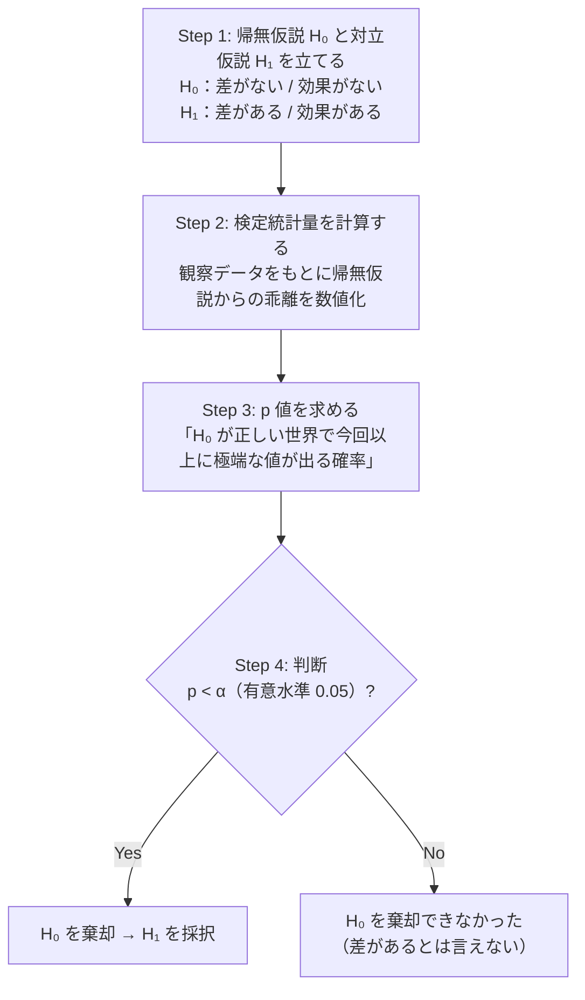
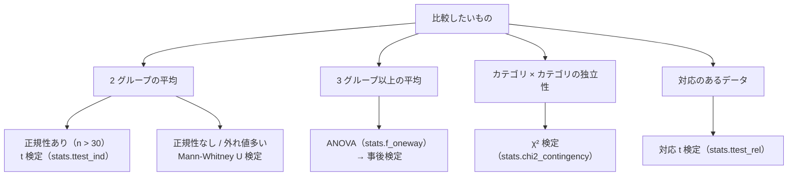

# 確率・統計基礎

機械学習や実験結果の評価で「そのモデルは本当に良いのか」「この差は偶然か」を判断するための数学的ツールです。大学の統計の授業で習った内容を、**Python と実装の視点から** 整理します。

---

## はじめて読む人へ

確率・統計は、データから不確実性を読み取るための道具です。平均や分散を計算するだけでなく、「この差は偶然か」「どれくらい信頼できるか」を考えるために使います。


### 読む前に押さえること

- 分布を見ると、平均だけでは分からない偏りやばらつきが分かります。
- p値や信頼区間は、不確実性を数値で扱うための考え方です。
- 相関は関係の強さを表しますが、因果を証明するものではありません。

### 読み終えたら説明できること

- 期待値・分散・標準偏差の意味を説明できる。
- p値と信頼区間の基本的な読み方を理解できる。
- 統計量が機械学習の前処理にどう使われるか説明できる。

---

## 確率変数と分布

### 確率変数とは

結果が確定していない「ランダムな量」のことです。サイコロの目、テストのスコア、ユーザーの購入金額などがあたります。

次のコードでは、サイコロを 10000 回振ったと仮定して、1〜6 の目がどれくらい出たかを数えています。確率分布を、シミュレーションで観察する例です。

```python
import numpy as np
import matplotlib.pyplot as plt
from scipy import stats

rng = np.random.default_rng(42)

# サイコロ 10000 回の試行
dice = rng.integers(1, 7, size=10000)
print(np.unique(dice, return_counts=True))
```

`rng.integers(1, 7, size=10000)` は、1 以上 7 未満の整数を 10000 個生成します。サイコロが公平なら、各目の回数はだいたい同じくらいになります。

### 期待値・分散・標準偏差

| 指標 | 意味 | NumPy |
|------|------|-------|
| 期待値（平均）$E[X]$ | 長期的な平均値 | `np.mean(x)` |
| 分散 $\text{Var}(X)$ | 散らばりの大きさ（二乗単位） | `np.var(x)` |
| 標準偏差 $\text{SD}(X)$ | 散らばりの大きさ（元の単位） | `np.std(x)` |

平均だけでは、データがどれくらい散らばっているかは分かりません。分散と標準偏差は、値が平均からどれくらい離れているかを表します。

```python
data = np.array([50, 60, 70, 80, 90, 100])

print(f"平均：{np.mean(data):.1f}")       # 75.0
print(f"分散：{np.var(data):.1f}")        # 291.7
print(f"標準偏差：{np.std(data):.1f}")    # 17.1
```

標準偏差は元のデータと同じ単位で読めるため、分散より直感的です。テスト点数なら「平均からだいたい何点くらい散らばっているか」と考えられます。

### 正規分布（ガウス分布）

自然界に最もよく現れる分布です。平均 $\mu$、標準偏差 $\sigma$ で形が決まります。

次のコードでは、平均 70、標準偏差 15 の正規分布から点数データを生成し、平均 ±1 標準偏差に入る割合を確認しています。

```python
mu, sigma = 70, 15  # 平均 70 点、標準偏差 15 点のテスト

# 正規分布から 1000 個サンプリング
scores = rng.normal(mu, sigma, 1000)

# 68-95-99.7 ルール（覚えておく価値あり）
# 平均 ± 1σ 以内に約 68% のデータが収まる
# 平均 ± 2σ 以内に約 95% のデータが収まる
# 平均 ± 3σ 以内に約 99.7% のデータが収まる
within_1sigma = np.sum(np.abs(scores - mu) <= sigma) / len(scores)
print(f"±1σ 以内の割合：{within_1sigma:.1%}")  # ≈ 68%
```

正規分布では、平均から 1 標準偏差以内に約 68% のデータが入ります。この性質は、外れ値検出や標準化の理解にもつながります。

> **情報工学メモ：なぜ正規分布が重要か（中心極限定理）**  
> 独立した確率変数の和は、個々の分布によらず、サンプル数が増えると **正規分布に近づく** — これを **中心極限定理** と呼びます。例えばテストの平均点は、各受験者のスコアの和÷n なので、受験者数が多くなると正規分布に近似できます。これが「データが正規分布に従う」という仮定が多くの統計手法で使われる理由です。

---

## 仮説検定

「2 つのグループの差は偶然か、本物か」を数学的に判定する方法です。A/B テスト、新薬の効果検証、アルゴリズムの比較など、データを使った意思決定の場面で必ず登場します。帰無仮説を $H_0$、対立仮説を $H_1$ と書き、有意水準 $\alpha$（通常 0.05）と比較します。

---

### STEP 1：コインで p 値の直感をつかむ

まず最もシンプルな例で流れを掴みます。

```
問い：「このコインは公平（表と裏が 50:50）か？」

実験：コインを 10 回投げたら、表が 9 回出た。

どう考える？
  ・公平なコインでも偶然 9 回表が出ることはある
  ・ただし、それはどれくらい珍しいことか？
```

```python
import numpy as np
from scipy import stats

# 「公平なコイン（p=0.5）で 10 回中 9 回以上表が出る確率」を計算
from scipy.stats import binom

n, p_fair = 10, 0.5
# P(X >= 9) = P(X=9) + P(X=10)
prob = binom.pmf(9, n, p_fair) + binom.pmf(10, n, p_fair)
print(f"公平なコインで 9 回以上表が出る確率: {prob:.4f}")  # ≈ 0.0107

# つまり約 1% → 100 回に 1 回しか起きない → 「珍しすぎる」→ コインは公平でなさそう
```

---

### STEP 2：仮説検定の 4 ステップ

STEP 1 のコインの例でやったことを整理すると、仮説検定の流れが見えてきます。「公平なコイン（H₀）を仮定して、そのもとで今回の結果が偶然起きる確率（p 値）を計算し、それが小さければ H₀ は疑わしいと判断した」——この流れはどんな検定でも同じです。



**p 値の本当の意味（よく誤解される）**：

```
✗ 誤解：p = 0.03 → 「差がある確率が 97%」
✓ 正解：p = 0.03 → 「帰無仮説が正しい世界で、偶然こんな結果が出る確率が 3%」
                    → 3% は珍しすぎる → 帰無仮説を疑う → 差があると判断する
```

p 値は「効果の大きさ」を表しません。サンプル数が多ければ小さな差でも p < 0.05 になります。「効果量」（Cohen's d など）を合わせて確認することが重要です。

---

### STEP 3：t 検定を使う（2 グループの平均比較）

```
問い：新しい UI（B 案）は旧 UI（A 案）より本当にクリック率が高いか？
```

```python
from scipy import stats
import numpy as np

# A/B テスト：クリック(1) / 非クリック(0) のデータ
group_a = np.array([1, 0, 1, 1, 0, 0, 1, 0, 1, 1])  # A 案 クリック率 60%
group_b = np.array([0, 0, 1, 0, 0, 1, 0, 0, 1, 0])  # B 案 クリック率 30%

print(f"A 案の平均: {group_a.mean():.2f}")   # 0.60
print(f"B 案の平均: {group_b.mean():.2f}")   # 0.30
print(f"差: {group_a.mean() - group_b.mean():.2f}")  # 0.30

# H₀：「A 案と B 案のクリック率に差はない」
# H₁：「差がある」
t_stat, p_value = stats.ttest_ind(group_a, group_b)
print(f"\nt 統計量：{t_stat:.3f}")
print(f"p 値：{p_value:.3f}")

alpha = 0.05
if p_value < alpha:
    print(f"p={p_value:.3f} < 0.05 → 有意差あり → 差は本物と判断")
else:
    print(f"p={p_value:.3f} ≥ 0.05 → 有意差なし → 差は偶然の可能性がある")
    print("（サンプル数が少ない可能性も考える）")
```

`t_stat`（t 統計量）は「差の大きさ」をグループ内のばらつきで割ったものです。t が大きくなるのは「差が大きい」か「ばらつきが小さい」かのどちらかです——どちらの場合も「偶然にしては差が大きすぎる」という証拠が強まるので、p 値は小さくなります。

---

### STEP 4：よくある落とし穴

```
落とし穴 1：サンプル数が少ない
  → 10 件のデータでは、p > 0.05 でも本当に差があるかもしれない
  → 効果検出に必要なサンプル数を事前に計算（検出力分析）することが理想

落とし穴 2：多重比較問題
  → A・B・C の 3 案を 3 回比較すると、偶然 p < 0.05 になる確率が増える
  → Bonferroni 補正：α を比較回数で割る（例: 0.05/3 ≈ 0.017）

落とし穴 3：p < 0.05 ≠ 重要な発見
  → 100 万件データなら 0.01% の差でも有意になる
  → 「効果量」（どれくらい大きな差か）を必ず確認する
```

### p 値と有意水準

### 信頼区間

信頼区間は、標本から推定した平均などにどの程度の不確実性があるかを区間で表します。点推定だけでなく幅を見ることで、データ数やばらつきの影響を理解できます。

```python
# 平均値の 95% 信頼区間を計算
sample = rng.normal(70, 15, 30)  # 30 件のサンプル

mean = np.mean(sample)
ci = stats.t.interval(0.95, df=len(sample)-1,
                      loc=mean,
                      scale=stats.sem(sample))

print(f"平均：{mean:.1f}")
print(f"95% 信頼区間：{ci[0]:.1f} 〜 {ci[1]:.1f}")
# 「真の平均が 95% の確率でこの区間内にある」
```

厳密には、同じ手順で何度も区間を作ったとき、その 95% が真の値を含む、という意味です。単に「この区間に 95% の確率で真の平均がある」と雑に解釈しすぎないよう注意します。

---

## 相関と共分散

相関は、2 つの変数が一緒に増減する傾向を表します。正の相関なら片方が大きいともう片方も大きくなりやすく、負の相関なら片方が大きいともう片方は小さくなりやすい、という関係です。

```python
x = np.array([1, 2, 3, 4, 5])
y = np.array([2, 4, 5, 4, 5])

# ピアソン相関係数（-1 〜 1）
r, p = stats.pearsonr(x, y)
print(f"相関係数：{r:.3f}  p値：{p:.3f}")

# pandas での相関行列
import pandas as pd
df = pd.DataFrame({"x": x, "y": y, "z": [5, 3, 4, 2, 1]})
print(df.corr())
```

`stats.pearsonr` は相関係数と p 値を返します。`df.corr()` は DataFrame の数値列同士の相関行列を作るため、特徴量同士の関係をざっと見るのに便利です。

| 相関係数の目安 | 解釈 |
|--------------|------|
| 0.7 〜 1.0 | 強い正の相関 |
| 0.3 〜 0.7 | 中程度の正の相関 |
| -0.3 〜 0.3 | 相関なし |
| -0.7 〜 -0.3 | 中程度の負の相関 |

> **情報工学メモ：相関と因果の違い**  
> 相関は「2 つの変数が一緒に動く」ことを表しますが、**因果関係（一方が他方を引き起こす）を意味しません**。アイスクリームの売上と溺死者数は正の相関がありますが（どちらも夏に多い）、アイスが溺死を引き起こすわけではありません。交絡因子（ここでは気温）に注意が必要です。

---

## 確率分布の種類

正規分布以外にも、現実のデータには様々な分布が現れます。分布の形を知ると、モデルの前提やデータの性質を判断しやすくなります。

```python
import numpy as np
import matplotlib.pyplot as plt
from scipy import stats

fig, axes = plt.subplots(1, 3, figsize=(15, 4))

# 二項分布（Binomial）：n 回試行して k 回成功する確率
n, p = 20, 0.4
x_binom = np.arange(0, n + 1)
axes[0].bar(x_binom, stats.binom.pmf(x_binom, n, p), alpha=0.7)
axes[0].set_title(f"二項分布 B(n={n}, p={p})\nコイン投げ・クリック率")

# ポアソン分布（Poisson）：単位時間・面積あたりの発生回数
lambdas = [1, 4, 10]
x_pois = np.arange(0, 20)
for lam in lambdas:
    axes[1].plot(x_pois, stats.poisson.pmf(x_pois, lam), marker="o", ms=4, label=f"λ={lam}")
axes[1].set_title("ポアソン分布\nアクセス数・不良品数")
axes[1].legend()

# t 分布（小サンプルの正規近似）
x_t = np.linspace(-4, 4, 100)
for df in [1, 5, 30]:
    axes[2].plot(x_t, stats.t.pdf(x_t, df), label=f"df={df}")
axes[2].plot(x_t, stats.norm.pdf(x_t), "--", label="正規分布")
axes[2].set_title("t 分布\nサンプル数が小さいとき")
axes[2].legend()

plt.tight_layout()
plt.savefig("distributions.png", dpi=150)
```

| 分布 | パラメータ | 使用例 |
|------|-----------|-------|
| 正規分布 $N(\mu, \sigma^2)$ | 平均 $\mu$、分散 $\sigma^2$ | 身長・テスト点数 |
| 二項分布 $B(n, p)$ | 試行数 $n$、成功率 $p$ | クリック率・陽性率 |
| ポアソン分布 $\text{Po}(\lambda)$ | 平均発生数 $\lambda$ | アクセス数・故障件数 |
| $t$ 分布 $t(df)$ | 自由度 $df$ | 小サンプルの平均検定 |
| $\chi^2$ 分布 $\chi^2(df)$ | 自由度 $df$ | 分散の検定・独立性検定 |

---

## 統計検定の選び方

データの種類や比較の目的によって、使う検定が変わります。



### カイ二乗検定（χ² 検定）

カテゴリカルデータ同士が **独立か（関係がないか）** を検定します。

```python
from scipy.stats import chi2_contingency

# クリックの有無 × デバイス種類のクロス集計
# 行：デバイス（PC / スマホ）、列：クリック有無（Yes / No）
contingency = np.array([
    [45, 55],   # PC ユーザー：クリック 45, 非クリック 55
    [30, 70],   # スマホユーザー：クリック 30, 非クリック 70
])

chi2, p, dof, expected = chi2_contingency(contingency)
print(f"χ² 統計量: {chi2:.3f}")
print(f"p 値: {p:.3f}")
print(f"自由度: {dof}")
print(f"期待度数:\n{expected.round(1)}")
```

`expected` は「独立の場合に期待される度数」です。実際の度数と期待度数のズレが大きいほど χ² 統計量が大きくなり、独立でないと判断します。

### Mann-Whitney U 検定（ノンパラメトリック）

正規分布を仮定しないグループ比較です。外れ値が多いデータ、順序尺度データ、小サンプルに有効です。

```python
from scipy.stats import mannwhitneyu

# 施策 A / B の応答時間（ミリ秒）—— 正規分布と言えないデータ
group_a = np.array([120, 145, 130, 160, 115, 180, 200, 125])
group_b = np.array([100, 110, 108, 115, 102, 190, 112, 105])

stat, p = mannwhitneyu(group_a, group_b, alternative="two-sided")
print(f"U 統計量: {stat:.1f}  p 値: {p:.3f}")
```

---

## 効果量と多重比較

### 効果量（Cohen's d）

p 値だけでは「差の大きさ」は分かりません。効果量は、差がどの程度の大きさかを標準化した指標です。

```python
def cohens_d(group1, group2):
    """Cohen's d — 効果量（差の大きさの標準化）"""
    n1, n2 = len(group1), len(group2)
    pooled_std = np.sqrt(((n1-1)*group1.std(ddof=1)**2 + (n2-1)*group2.std(ddof=1)**2) / (n1+n2-2))
    return (group1.mean() - group2.mean()) / pooled_std

d = cohens_d(group_a.astype(float), group_b.astype(float))
print(f"Cohen's d = {d:.2f}")
```

| Cohen's d の目安 | 解釈 |
|-----------------|------|
| 0.2 未満 | 小さい効果 |
| 0.2 〜 0.5 | 中程度の効果 |
| 0.5 以上 | 大きい効果 |

> **注意：多重比較問題**  
> A/B/C の 3 グループを t 検定で 3 回（A-B, B-C, A-C）比較すると、どれか 1 つが有意になる確率は 5% × 3 = 最大 15% に膨らみます（多重比較問題）。Bonferroni 補正は有意水準を比較回数で割ります（α/n）。正確には `statsmodels.stats.multicomp.multipletests` を使います。

---

## 機械学習との接続

| 概念 | ML での使われ方 |
|------|--------------|
| 平均・分散 | StandardScaler でのスケーリング（$(x - \mu) / \sigma$） |
| 正規分布 | 残差の検定・ベイズ推定の事前分布 |
| p 値 | 特徴量の有意性検定・A/B テスト |
| 相関係数 | 特徴量エンジニアリングでの特徴量選択 |

機械学習では、統計量は前処理や評価の中で何度も使われます。たとえば StandardScaler は、各列から平均を引き、標準偏差で割ることでスケールをそろえます。

```python
from sklearn.preprocessing import StandardScaler

scaler = StandardScaler()
X_scaled = scaler.fit_transform(X)

# StandardScaler は内部でこれをやっています：
# X_scaled = (X - X.mean(axis=0)) / X.std(axis=0)
print(f"変換後の平均：{X_scaled.mean(axis=0).round(5)}")   # ≈ 0
print(f"変換後の標準偏差：{X_scaled.std(axis=0).round(5)}")  # ≈ 1
```

標準化後の各列は、平均がほぼ 0、標準偏差がほぼ 1 になります。距離や勾配に基づくモデルでは、特徴量のスケールをそろえることで学習が安定します。

---


## 確認問題

1. 確率・統計基礎 は、何の問題を解決するための考え方・道具ですか。
2. このページで出てきた重要語を 3 つ選び、それぞれ 1 文で説明してください。
3. コード例やコマンド例がある場合、入力・処理・出力を分けて説明してください。
4. このページの内容が、前後の STEP や自分の作りたいものにどうつながるか説明してください。

---

## 関連ページ

- [NumPy / pandas](pandas-sklearn) — 統計量の計算ツール
- [データ可視化](データ可視化) — 分布やグラフの可視化
- [機械学習理論](機械学習理論) — 確率・統計の ML への応用
- [モデル評価・チューニング](モデル評価-チューニング) — 検定を使ったモデル比較
- [回帰分析](回帰分析) — 統計的推論・係数の有意性検定
- [多変量解析](多変量解析) — PCA・因子分析・クラスター分析

---

[← ホームへ](Home)
