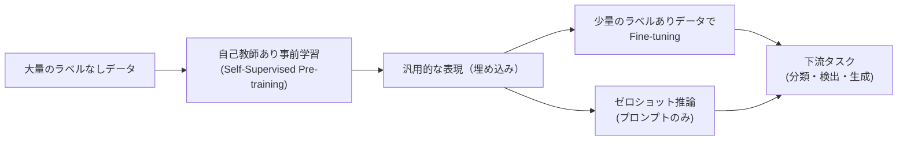

# 自己教師あり学習（Self-Supervised Learning）

ラベルなしデータから有用な表現を学習する手法群です。コントラスト学習（SimCLR・MoCo）・Bootstrap 系（BYOL・DINO）・マスク予測（MAE・BERT）の 3 つのパラダイムが現代 AI の中核を担っています。GPT・BERT・ViT の事前学習はすべてこの枠組みです。

---

## はじめて読む人へ

人間は「ラベルなし」で多くのことを学びます。赤ちゃんは「これはリンゴ」と教えられなくても、見て・触って・食べて「リンゴ」の概念を形成します。自己教師あり学習（SSL）は「データ自体を教師信号にする」ことで、ラベルなし大規模データから豊かな表現を学習します。

### 読む前に押さえること

- [深層学習入門](深層学習入門) — NN・バックプロパゲーション
- [CNN（画像認識）](CNN) — 特徴抽出の基礎
- [情報理論](情報理論) — 相互情報量の概念

### 読み終えたら説明できること

- コントラスト学習が「同じ画像の異なる見え方は近く、違う画像は遠く」を学ぶ仕組みを説明できる
- MAE が画像の大部分をマスクして復元する理由を説明できる
- SSL の事前学習が下流タスクの精度を上げる理由を説明できる

---

## なぜ自己教師あり学習か

### ラベル付けの限界

| データ量 | ラベルあり | ラベルなし |
|---------|---------|---------|
| ImageNet | 120 万枚（人手でラベル付け） | — |
| 実際の画像データ | ほぼゼロ | 数兆枚（Web 上） |
| 自然言語テキスト | 限定的 | 数千億トークン（Web） |

「インターネット上のすべてのテキスト・画像」は実質的にラベルなしです。SSL はこの膨大なデータを活用できます。

### SSL の位置づけ



---

## パラダイム 1：コントラスト学習

### 基本アイデア

「同じ画像から生成した 2 つのビュー（データ拡張）は近く、異なる画像のビューは遠く」なるような埋め込み空間を学習します。

!!! info ""
    ```
    同じ画像の 2 つのビュー:
      元画像 → [クロップ+色変換] → ビュー q
              → [クロップ+ぼかし] → ビュー k
    
    学習目標:
      q と k の埋め込みは近く（正例）
      q と他の画像のビューは遠く（負例）
    ```

### SimCLR（Simple Framework for Contrastive Learning）

**損失関数（NT-Xent：Normalized Temperature-scaled Cross Entropy）：**

$$
\mathcal{L}_{i,j} = -\log \frac{\exp(\text{sim}(\mathbf{z}_i, \mathbf{z}_j)/\tau)}{\sum_{k=1}^{2N} \mathbb{1}_{[k \neq i]} \exp(\text{sim}(\mathbf{z}_i, \mathbf{z}_k)/\tau)}
$$

- $\mathbf{z}_i, \mathbf{z}_j$：同じ画像の 2 ビューの埋め込み（正例ペア）
- $\tau$：温度パラメータ（小さいほど分類が厳しくなる）
- $N$：バッチサイズ（各画像 2 ビューで $2N$ 個）

**重要な発見（SimCLR の論文から）：**
1. データ拡張の組み合わせが重要（特に色変換 + ランダムクロップ）
2. 線形層のプロジェクションヘッドが表現の質を上げる
3. 大バッチが必要（負例が多いほど良い）

### MoCo（Momentum Contrast）

SimCLR は大バッチが必要でメモリ集約的です。MoCo はキューと運動量エンコーダを使って解決しました。

!!! info ""
    ```
    オンラインエンコーダ q: 通常の勾配更新
    モーメンタムエンコーダ k: ゆっくり更新（指数移動平均）
      θ_k ← m·θ_k + (1-m)·θ_q  (m≈0.999)
    
    キュー: 過去のバッチのキー埋め込みをストア（大量の負例として使用）
    ```

運動量エンコーダにより、一貫性のある負例表現が得られます。

### コントラスト学習の限界

**崩壊（Collapse）問題：** すべての入力を同じベクトルに写像すれば損失はゼロになります。これを防ぐために：
- SimCLR：大量の負例でプッシュアウト
- BYOL/DINO：負例なしで崩壊を防ぐ別のアプローチ

---

## パラダイム 2：Bootstrap 系（負例不要）

### BYOL（Bootstrap Your Own Latent）

**衝撃：** 負例なしでもコントラスト学習と同等以上の表現が学べることを示しました。

!!! info ""
    ```
    オンラインネットワーク:
      画像 → エンコーダ f_θ → プロジェクション g_θ → 予測 q_θ
    
    ターゲットネットワーク（勾配なし）:
      画像（別拡張）→ エンコーダ f_ξ → プロジェクション g_ξ
    
    損失: MSE(q_θ(z), sg(z'))
      sg: stop-gradient（ターゲット側は勾配を止める）
      ターゲットのパラメータ: ξ ← m·ξ + (1-m)·θ
    ```

**なぜ崩壊しないのか：** ターゲットネットワークが stop-gradient とモーメンタム更新によって「一定ステップ遅れたオンラインネットワーク」になります。オンラインが追いかけるターゲットが常に「少し違う」状態を維持するため崩壊が防がれます。

### DINO（Self-DIstillation with NO labels）

Vision Transformer（ViT）に BYOL ライクな自己蒸留を適用しました。

**CLS トークンの自己蒸留：**
- 学生（オンライン）と教師（ターゲット）の ViT
- 学生は小さいクロップ、教師は大きいクロップを処理
- 学生の出力が教師の出力に一致するよう学習（温度付き Softmax で）

**DINO の驚くべき性質：**
- 学習後の ViT のアテンションマップが自然に物体のセグメンテーションになる（ラベルなしで！）
- KNN 分類器（線形 Fine-tuning すら不要）で高精度

---

## パラダイム 3：マスク予測

### BERT（テキスト）

入力トークンの 15% をマスクし、マスクされたトークンを予測します。

!!! info ""
    ```
    入力:   "The [MASK] sat on the [MASK]"
            ↓ BERT エンコーダ（双方向 Transformer）
    出力:   "cat" の確率、"mat" の確率
    ```

マスクされたトークンを正しく予測するには、文脈全体を理解する必要があります。これが双方向の文脈理解を学ぶ動機になっています。

### MAE（Masked Autoencoders、画像）

BERT の発想を画像に適用しましたが、2 つの工夫があります。

**1. 高い マスク率（75%）：** テキストより情報が冗長な画像では、75% をマスクしても文脈から補完できます。これにより：
  - 計算効率が劇的に改善（エンコーダが 25% のパッチのみ処理）
  - 単純なコピー解法が使えず、本当に意味のある表現を学ぶ必要がある

**2. 非対称エンコーダ-デコーダ：**

!!! info ""
    ```
    入力（全パッチ）
      ↓ ランダムマスク（75% を除去）
    可視パッチのみ（25%）
      ↓ 大きなエンコーダ（ViT-Large など）
    エンコーダ出力 + マスクトークン
      ↓ 小さなデコーダ
    全パッチの再構成
      ↓ 損失
    マスクされたパッチのピクセル MSE
    ```

デコーダは小さく（軽量）、エンコーダの表現の質に計算を集中させます。

---

## SSL 3 パラダイムの比較

| 手法 | 教師信号 | 負例 | 適用ドメイン | 代表的なモデル |
|------|---------|------|------------|-------------|
| **コントラスト** | 正例/負例ペア | 必要 | 画像・音声 | SimCLR・MoCo・wav2vec |
| **Bootstrap** | 自己蒸留 | 不要 | 画像 | BYOL・DINO・EMA |
| **マスク予測** | 文脈から予測 | 不要 | テキスト・画像・音声 | BERT・GPT・MAE・wav2vec2 |

---

## 現代 AI の基礎としての SSL

| モデル | SSL 手法 | ドメイン |
|-------|---------|--------|
| **BERT** | Masked Language Modeling | テキスト |
| **GPT 系** | Causal Language Modeling（次トークン予測）| テキスト |
| **CLIP** | コントラスト学習（テキスト-画像ペア）| マルチモーダル |
| **wav2vec 2.0** | コントラスト学習（音声） | 音声 |
| **DINO / DINOv2** | 自己蒸留 | 画像 |
| **MAE** | マスク予測 | 画像 |

**重要な含意：** ChatGPT・GPT-4 の能力の大部分は「次のトークンを予測する」という自己教師あり事前学習から生まれています。ラベルなしテキストから世界の知識を暗黙的に学習する——これが現代の大規模言語モデルの本質です。

---

## 数学的導出

### コントラスト損失と相互情報量の関係

NT-Xent 損失を最小化することは、正例ペアの**相互情報量の下界を最大化**することと等価です（van den Oord et al., 2018）：

$$
I(z_i; z_j) \geq \log(N) - \mathcal{L}_{\text{NT-Xent}}
$$

$N$：負例の数。負例が多いほど（大バッチ）、下界がタイトになります。これが「大バッチが有効な理由」の情報理論的な正当化です。

### BYOL の崩壊回避の理論的解釈

BatchNorm なしで崩崩壊を防げるのは、指数移動平均更新によってターゲットが「古い」パラメータを持つためです。これは：

$$
\phi(x) = \arg\min_z \|z - f_{\text{target}}(x)\|^2 + \lambda \|z\|^2
$$

という正則化付き回帰問題を繰り返し解くことと解釈でき、ゼロ解（崩壊）が最適解にならないことが示せます。

---

## 確認問題

1. コントラスト学習で「データ拡張の多様性」が重要な理由を、「不変な表現の学習」の観点から説明してください。
2. BYOL が負例なしで崩壊を防げる理由を、stop-gradient とモーメンタム更新の役割から説明してください。
3. MAE でマスク率を 75% と高く設定する理由を、テキストの BERT（15%）と比較して説明してください。
4. GPT の「次トークン予測」が自己教師あり学習である理由を説明してください。

---

## 関連ページ

- [深層学習入門](深層学習入門) — NN の基礎
- [Transformer・Attention](Transformer-Attention) — BERT・GPT・ViT の構造
- [マルチモーダルAI](マルチモーダルAI) — CLIP の SSL による画像-テキスト対応
- [ファインチューニング詳解](ファインチューニング詳解) — SSL 表現を下流タスクに適応
- [情報理論](情報理論) — 相互情報量との接続
- [音声処理基礎](音声処理基礎) — wav2vec による音声 SSL

---

[← ホームへ](Home)
