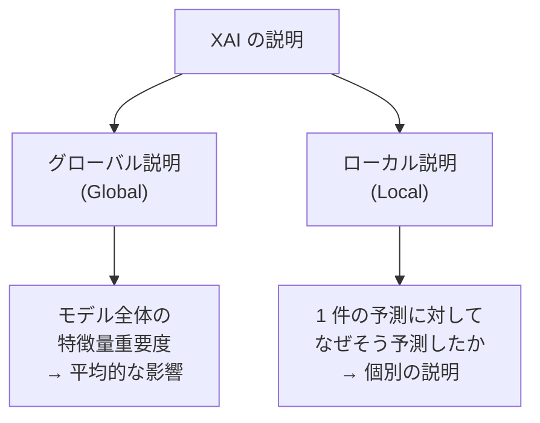
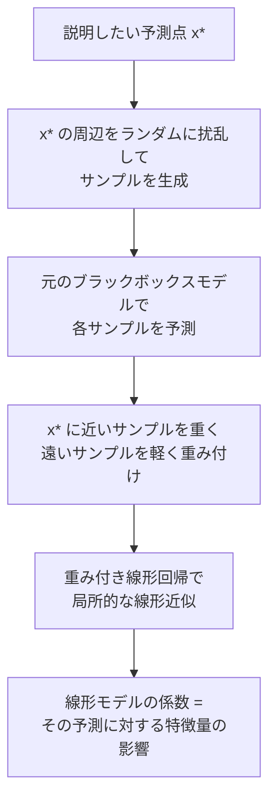

# 説明可能AI（XAI）

「このモデルがなぜこの予測をしたのか」を人間が理解できる形で示す技術です。SHAP・LIME・Grad-CAM を中心に、ブラックボックスモデルの予測根拠を定量的・視覚的に説明します。AI の信頼性・公平性・規制対応（EU AI Act など）の観点から、実務・研究を問わず必須の知識です。

---

## はじめて読む人へ

精度が高い機械学習モデルほど「なぜそう予測したのか」が分かりにくくなりがちです。医療診断で「がんの疑いあり」と判定されたとき、「どの特徴量が根拠か」が分からなければ医師は使えません。XAI（Explainable AI）はこの問題に答えます。

### 読む前に押さえること

- [教師あり学習](教師あり学習) — 予測モデルの基本
- [特徴量エンジニアリング](特徴量エンジニアリング) — 特徴量の概念

### 読み終えたら説明できること

- グローバル説明とローカル説明の違いを説明できる
- SHAP 値の意味をゲーム理論の観点から説明できる
- Grad-CAM がなぜ CNN の「注目領域」を示せるかを説明できる

---

## XAI の必要性

### ブラックボックス問題

```
                              入力        出力
単純なモデル（線形回帰）: x₁, x₂, x₃ → ŷ = 0.3x₁ + 0.5x₂ - 0.2x₃  ← 解釈しやすい
複雑なモデル（深層学習）: x₁, x₂, x₃ → ŷ = ???                      ← ブラックボックス
```

高精度 vs 説明可能性のトレードオフは常に存在しますが、XAI によって「精度を犠牲にせず説明を追加する」アプローチが可能です。

### XAI が求められる場面

| 場面 | 要求 |
|------|------|
| 医療診断支援 | 「なぜがんと判断したか」を医師が確認できる |
| 融資審査 | 「なぜ否決されたか」を申請者に説明できる（EU 規制） |
| 不正検知 | 「なぜこのトランザクションが怪しいか」を説明できる |
| モデルデバッグ | 「どの特徴量が効いているか」を確認して問題を発見 |

---

## 説明の種類

### グローバル説明 vs ローカル説明



| 種類 | 対象 | 代表手法 |
|------|------|---------|
| **グローバル** | モデル全体 | 特徴量重要度・PDP・SHAP summary plot |
| **ローカル** | 1 件の予測 | LIME・SHAP・Grad-CAM |

### モデル依存 vs モデル非依存

| 種類 | 対象モデル | 代表手法 |
|------|----------|---------|
| **モデル非依存**（Agnostic） | どんなモデルにも適用 | LIME・SHAP |
| **モデル依存**（Specific） | 特定のモデル構造が必要 | Grad-CAM（CNN専用）・DeepLIFT |

---

## 特徴量重要度

### 不純度ベース（木モデル）

決定木・RandomForest では、各特徴量が「どれだけ不純度を減らしたか」の累積で重要度を計算します。

$$
\text{Importance}(j) = \sum_{\text{node } t \text{ uses } j} p(t) \cdot \Delta I(t)
$$

$p(t)$：ノード $t$ に到達するサンプルの割合、$\Delta I(t)$：不純度の減少量。

**注意：** カーディナリティが高い特徴量（ユニーク値が多い）ほど過大評価される傾向があります。

### Permutation Importance

特徴量 $j$ の値をランダムにシャッフルしてスコアを測定し、元のスコアとの差を重要度とします。

$$
\text{PI}(j) = \text{Score}_{\text{baseline}} - \text{Score}_{\text{permuted}_j}
$$

- モデル非依存で使えるグローバル重要度
- テストセットで計算することで過学習の影響を排除できる

---

## 部分依存プロット（PDP）

特徴量 $j$ の値を変化させたとき、**平均的な予測値** がどう変わるかを可視化します。

$$
\hat{f}_j(x_j) = \frac{1}{n}\sum_{i=1}^n \hat{f}(x_j, \mathbf{x}_{-j}^{(i)})
$$

$\mathbf{x}_{-j}^{(i)}$：$i$ 番目のサンプルから特徴量 $j$ を除いたもの。

```
PDP の例（住宅価格 vs 築年数）:

価格  ↑
      │──────────────
      │              \
      │               \──────
      └────────────────────── 築年数
       新しい          古い
→「築年数が増えるほど価格が下がる」という一般的な傾向が見える
```

**ICE（Individual Conditional Expectation）プロット：** PDP が平均を示すのに対し、ICE は各サンプル個別の曲線を描きます。交互作用があると ICE 曲線が交差します。

---

## LIME（Local Interpretable Model-agnostic Explanations）

### 基本原理

「複雑なモデルの局所的な近似を、解釈可能な単純モデル（線形回帰）で作る」という発想です。



### 数式

$$
\xi(x^*) = \arg\min_{g \in G} \mathcal{L}(f, g, \pi_{x^*}) + \Omega(g)
$$

- $f$：ブラックボックスモデル
- $g$：解釈可能な近似モデル（線形回帰・決定木）
- $\pi_{x^*}$：$x^*$ からの距離に基づく重み
- $\Omega(g)$：モデルの複雑さへのペナルティ

### LIME の限界

- **サンプリングの不安定性：** ランダム性があるため結果が変わることがある
- **局所性の定義が曖昧：** 「周辺」をどう定義するかが難しい
- **高次元では難しい：** 扰乱サンプルが疎になる

---

## SHAP（SHapley Additive exPlanations）

### ゲーム理論との接続

SHAP はゲーム理論の**シャプレー値**を機械学習の特徴量に適用します。

**直感：** 「N 人でゲームをしたとき、各プレイヤーの公平な貢献度」を計算する方法が Shapley 値です。これを「N 個の特徴量が予測に貢献した場合の各特徴量の公平な貢献度」に使います。

### SHAP 値の定義

特徴量 $j$ のシャプレー値：

$$
\phi_j = \sum_{S \subseteq F \setminus \{j\}} \frac{|S|!\,(|F|-|S|-1)!}{|F|!} \left[\hat{f}(S \cup \{j\}) - \hat{f}(S)\right]
$$

- $F$：全特徴量の集合
- $S$：$j$ を含まない部分集合
- $\hat{f}(S)$：特徴量集合 $S$ のみを使った場合の予測値（残りは平均で代替）

全順列を考えて「$j$ が加わることで予測がどれだけ変わるか」の平均を取ります。

### 加算性（Additivity）

$$
\hat{f}(x) = \phi_0 + \sum_{j=1}^M \phi_j(x)
$$

$\phi_0$：ベースライン（全サンプルの平均予測値）。各特徴量の SHAP 値を足し合わせると予測値からベースラインを引いた値に一致します。

### SHAP の性質（公平性の公理）

| 公理 | 意味 |
|------|------|
| **効率性** | $\phi_j$ の合計 = 予測値 - ベースライン |
| **ダミー性** | 予測に影響しない特徴量の $\phi = 0$ |
| **対称性** | 同じ影響の 2 特徴量は同じ $\phi$ |
| **線形性** | 2 モデルの平均の説明 = 各説明の平均 |

### SHAP の可視化

| プロット | 内容 |
|---------|------|
| **Waterfall plot** | 1 件の予測へのベースラインからの積み上げ |
| **Beeswarm plot** | 全サンプルの SHAP 値分布（グローバル） |
| **Dependence plot** | ある特徴量の SHAP 値と特徴量値の関係 |
| **Force plot** | 1 件の予測への押し引きの力を可視化 |

```python
import shap

# Tree SHAP（RandomForest・XGBoost に最適化）
explainer = shap.TreeExplainer(model)
shap_values = explainer(X_test)

# ウォーターフォールプロット（1 件の予測説明）
shap.plots.waterfall(shap_values[0])

# サマリープロット（グローバル重要度）
shap.plots.beeswarm(shap_values)
```

---

## Grad-CAM（Gradient-weighted Class Activation Mapping）

CNN の分類結果に対して「画像のどの領域を見て判断したか」を可視化します。

### 仕組み

1. 注目するクラス $c$ に対する予測スコア $y^c$ を計算
2. 最後の畳み込み層の特徴マップ $A^k$ への勾配を計算：$\frac{\partial y^c}{\partial A^k_{ij}}$
3. 特徴マップごとの重みを Global Average Pooling で計算：$\alpha_k^c = \frac{1}{Z}\sum_{i,j}\frac{\partial y^c}{\partial A^k_{ij}}$
4. 重み付き和を ReLU に通す：

$$
L^c_{\text{Grad-CAM}} = \text{ReLU}\!\left(\sum_k \alpha_k^c A^k\right)
$$

ReLU により「このクラスに対してポジティブに影響する領域」のみを残します。

### Grad-CAM vs 他の手法

| 手法 | 適用対象 | 出力 |
|------|---------|------|
| Grad-CAM | CNN（最後の畳み込み層） | ヒートマップ |
| Grad-CAM++ | CNN（改良版） | より正確なヒートマップ |
| LIME | 任意モデル | 超ピクセルの重要度 |
| SHAP | 任意モデル | ピクセルレベルの寄与 |
| Integrated Gradients | 微分可能なモデル | 入力勾配の積分 |

---

## 公平性と XAI

### バイアスの検出

SHAP のグローバルサマリーで「性別・人種など保護属性の影響が大きい」場合、モデルが差別的な判断をしている可能性があります。

### モデルのデバッグ

「正解ラベルとは無関係な特徴量が高い SHAP 値を持つ」場合、データリーケージや交絡変数の問題を示します。

**例：** 医療画像で「病院のロゴの位置」が高重要度 → 病院ごとのラベル偏りを学習している可能性。

---

## 数学的導出

### Shapley 値が公平な配分である理由

協力ゲーム理論では、プレイヤー集合 $N$ に対して「特性関数 $v: 2^N \to \mathbb{R}$」が定義されます（$v(S)$ は連合 $S$ の協力で得られる価値）。

公平性の公理（効率性・対称性・ダミー性・加法性）を同時に満たす唯一の配分がシャプレー値です。

**一意性の証明のスケッチ：**

加法性により任意の特性関数を「単純なゲーム（ある集合のみで価値が 1）」の線形結合に分解できます。単純ゲームの Shapley 値は対称性・ダミー性から一意に決まり、線形性から一般の場合も一意になります。

---

## 確認問題

1. グローバル説明とローカル説明の違いを「保険審査の説明」を例に説明してください。
2. SHAP 値の「加算性」が重要な理由を「予測値の分解」の観点から説明してください。
3. LIME が「ランダム性のある」手法である理由と、その限界を説明してください。
4. Grad-CAM で最後の畳み込み層を使う理由を「空間情報の保持」の観点から説明してください。

---

## 関連ページ

- [機械学習理論](機械学習理論) — 損失関数・過学習・バイアス-バリアンス
- [アンサンブル学習](アンサンブル学習) — SHAP が特に有効な Random Forest・XGBoost
- [CNN（画像認識）](CNN) — Grad-CAM の適用対象
- [データ倫理・AI倫理](データ倫理) — 公平性・アルゴリズムバイアス
- [特徴量エンジニアリング](特徴量エンジニアリング) — 重要度を使った特徴量選択

---

[← ホームへ](Home)
