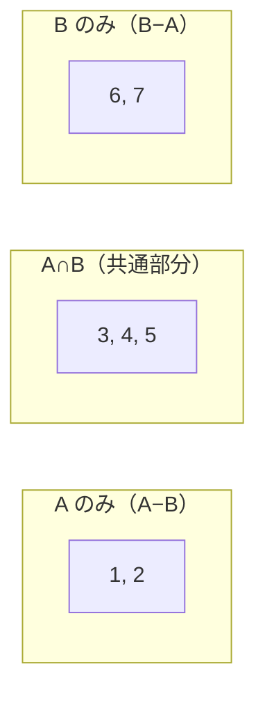
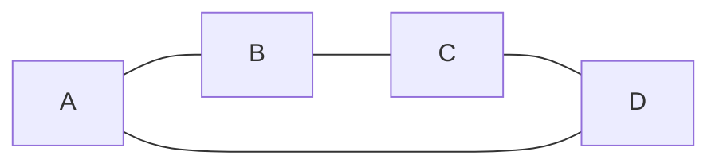
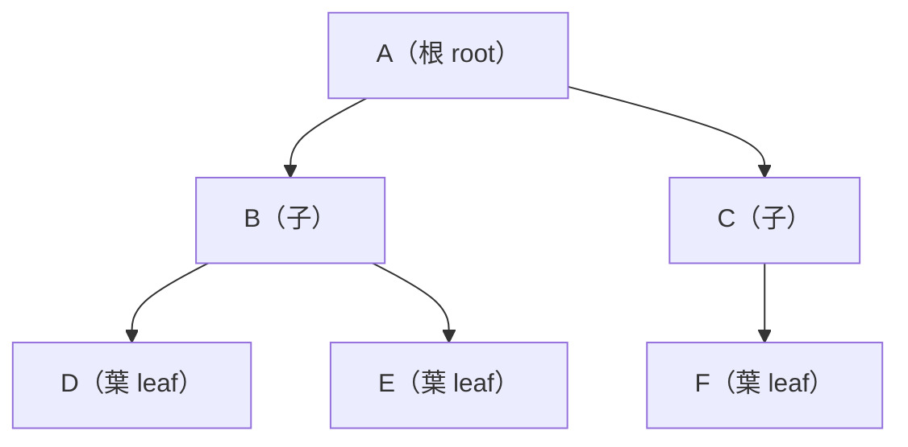
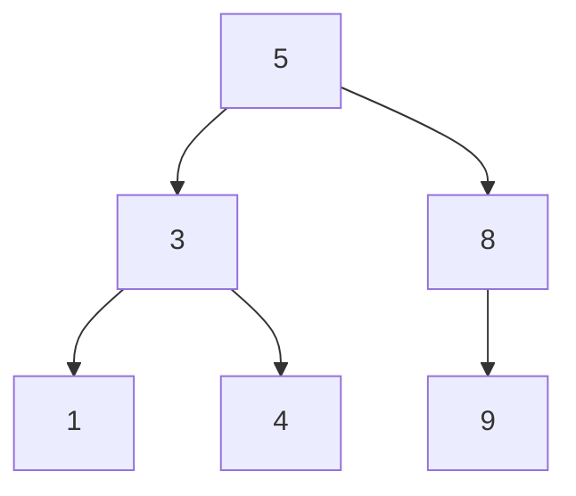

# 離散数学

> コース 7 の入口として、アルゴリズム・データ構造・データベース・暗号理論など、CS 分野の数学的土台を学びます。

---

## はじめて読む人へ

離散数学は、コンピュータサイエンスの土台になる数学です。連続的な量よりも、集合、論理、グラフ、組み合わせのような「数えられる構造」を扱います。


### 読む前に押さえること

- 集合は、対象の集まりを整理する考え方です。
- 論理は、条件分岐や証明の基礎になります。
- グラフは、ネットワークや依存関係を表すために使います。

### 読み終えたら説明できること

- 集合、命題、グラフの基本用語を説明できる。
- ド・モルガン則や数学的帰納法の意味を理解できる。
- プログラミングとのつながりを説明できる。

---

## 離散数学とは

「離散（discrete）」とは **連続していない、飛び飛びの** という意味です。

微積分が「なめらかに変化する量」を扱うのに対して、離散数学は

- 「0か1か」（論理）
- 「つながっているかいないか」（グラフ）
- 「何通りあるか」（組み合わせ）

のように、**数え上げられるデータ** を扱います。プログラムの中にある変数・条件分岐・データ構造はすべて「離散」な対象です。

---

## 1. 集合論（Set Theory）

**集合** とは、ものの集まりです。重複なし・順序なし。

```
A = {1, 2, 3, 4, 5}
B = {3, 4, 5, 6, 7}
```

### 基本の演算

| 演算 | 記号 | 意味 | 例（A, B 上） |
|------|------|------|-------------|
| 和集合 | $A \cup B$ | A または B に属する | {1,2,3,4,5,6,7} |
| 積集合 | $A \cap B$ | A かつ B に属する | {3,4,5} |
| 差集合 | $A - B$ | A に属するが B に属さない | {1,2} |
| 補集合 | $\bar{A}$ | 全体集合 U のうち A に属さない部分 | — |
| 部分集合 | $A \subseteq B$ | A のすべての要素が B にも属する | — |

### ベン図



### プログラムとの対応

Python のセット（`set`）は集合そのものです。

```python
A = {1, 2, 3, 4, 5}
B = {3, 4, 5, 6, 7}

print(A | B)   # 和集合 → {1,2,3,4,5,6,7}
print(A & B)   # 積集合 → {3,4,5}
print(A - B)   # 差集合 → {1,2}
```

`A | B` はどちらかに含まれる要素を集めます。`A & B` は両方に含まれる要素だけを取り出します。`A - B` はAにあるがBにはない要素です。Python の `set` は重複を持たないため、集合論の考え方をそのまま試せます。

データベースの JOIN 操作も集合演算として理解できます（[データベース詳解](データベース詳解) 参照）。

---

## 2. 命題論理（Propositional Logic）

命題論理は、真か偽かが決まる文を扱う考え方です。プログラムの `if` 文は、条件式が真か偽かによって処理を分けるため、命題論理と直接つながっています。

`and`、`or`、`not` の組み合わせを正しく理解すると、複雑な条件分岐を整理できます。特に「A でない、または B でない」のような否定を含む条件では、ド・モルガン則が役立ちます。

**命題** とは、真（True）か偽（False）のどちらかに定まる文です。

!!! info ""
    ```
    P : 「今日は雨が降っている」  → 真 or 偽
    Q : 「傘を持っている」         → 真 or 偽
    ```

### 論理演算子

| 演算 | 記号 | 読み | 意味 |
|------|------|------|------|
| AND | $P \land Q$ | P かつ Q | 両方が真のとき真 |
| OR  | $P \lor Q$ | P または Q | どちらかが真のとき真 |
| NOT | $\lnot P$   | P でない | 真偽を反転 |
| 含意 | $P \Rightarrow Q$ | P ならば Q | P が真のとき Q も真でなければ偽 |
| 同値 | $P \Leftrightarrow Q$ | P と Q は同値 | 両方が同じ真偽値のとき真 |

### 真理値表

| P | Q | $P \land Q$ | $P \lor Q$ | $\lnot P$ | $P \Rightarrow Q$ |
|---|---|-------|-------|-----|-------|
| T | T | T | T | F | T |
| T | F | F | T | F | F |
| F | T | F | T | T | T |
| F | F | F | F | T | T |

> **P → Q（含意）の見方：**  
> 「P が真なのに Q が偽」のときだけ偽になります。「雨が降っているのに傘を持っていない」ときだけ「約束を破った」になるイメージです。

### 論理的同値

よく使う変換則です。

| 名前 | 式 |
|------|----|
| ド・モルガン則 | $\lnot(P \land Q) \equiv \lnot P \lor \lnot Q$ |
| ド・モルガン則 | $\lnot(P \lor Q) \equiv \lnot P \land \lnot Q$ |
| 二重否定 | $\lnot(\lnot P) \equiv P$ |
| 対偶 | $P \Rightarrow Q \equiv \lnot Q \Rightarrow \lnot P$ |

**プログラムとの対応：**

```python
# ド・モルガン則の確認
P = True
Q = False

print(not (P and Q))      # True
print((not P) or (not Q)) # True  ← 同じ結果
```

条件分岐の `if not (a and b)` を `if (not a) or (not b)` に書き換えるときに使います。

プログラムでは、否定を含む条件が読みにくくなりがちです。ド・モルガン則を使うと、「両方を満たすわけではない」を「少なくとも片方を満たさない」に言い換えられます。条件式の意味を保ったまま、読みやすい形へ変換するための道具です。

---

## 3. 述語論理（Predicate Logic）

命題論理を拡張し、「すべての〜」「ある〜が存在する」を表現できます。

| 記号 | 読み | 意味 |
|------|------|------|
| $\forall x$ | 「すべての x について」 | 全称量化子 |
| $\exists x$ | 「ある x が存在して」 | 存在量化子 |

**例：**

$$\forall x \;(\text{Student}(x) \Rightarrow \text{HasId}(x))$$
「すべての学生は学籍番号を持つ」

$$\exists x \;(\text{Student}(x) \land \text{GPA}(x) > 3.9)$$
「GPA が 3.9 を超える学生が（少なくとも一人）存在する」

**量化子の否定（よく使う変換）：**

$$\lnot(\forall x\; P(x)) \equiv \exists x\; \lnot P(x)$$
「すべての x で P が成り立つわけではない」≡「P が成り立たない x が存在する」

$$\lnot(\exists x\; P(x)) \equiv \forall x\; \lnot P(x)$$
「P が成り立つ x は存在しない」≡「すべての x で P は成り立たない」

---

## 4. 証明の方法

数学的な主張を正しいと示す技法です。アルゴリズムの正しさの証明で使います。

### 直接証明

「P → Q」を、P から出発して論理的に Q を導く。

**例：「n が偶数なら n² も偶数」**

!!! info ""
    ```
    n が偶数 → n = 2k（整数 k が存在する）
    n² = (2k)² = 4k² = 2(2k²)
    2k² は整数なので、n² は 2 の倍数 → n² は偶数  □
    ```

### 対偶証明

「P → Q」の代わりに「¬Q → ¬P」を証明する。

**例：「n² が奇数なら n も奇数」**

!!! info ""
    ```
    対偶：「n が偶数なら n² は偶数」← これは直接証明できる（上記参照）
    よって対偶が真 → 元の命題も真  □
    ```

### 数学的帰納法

「すべての自然数 n について命題 P(n) が成り立つ」ことを示す。

**ドミノ倒しのたとえ：**

!!! info ""
    ```
    目標：「すべてのドミノが倒れることを証明したい」
    
    証明のステップ：
      1. 【基底】「1 番目のドミノが倒れる」ことを示す
      2. 【帰納】「k 番目が倒れたら、k+1 番目も必ず倒れる」ことを示す
    
    → この 2 つが成り立てば、「すべてのドミノが倒れる」と言える！
    ```

なぜこの 2 ステップで「すべての n」が証明できるのかを考えましょう。

基底ステップで n=1 が成り立つことを示します。次に帰納ステップで「P(k) が成り立てば P(k+1) も成り立つ」ことを示します。すると、P(1) が成り立つ → P(2) が成り立つ（k=1 を帰納ステップに代入）→ P(3) が成り立つ → … と、無限のドミノが順番に倒れていきます。これが「すべての n」に対して成り立つことの根拠です。

1. **基底ステップ**：P(1)（または P(0)）が成り立つことを示す
2. **帰納ステップ**：P(k) が成り立つと仮定したとき、P(k+1) も成り立つことを示す

**例：「$1 + 2 + \cdots + n = \dfrac{n(n+1)}{2}$」を証明する**

まず小さい値で確認します：

- $n=1$: 左辺 $= 1$、右辺 $= \frac{1 \times 2}{2} = 1$ ✓
- $n=2$: 左辺 $= 3$、右辺 $= \frac{2 \times 3}{2} = 3$ ✓
- $n=3$: 左辺 $= 6$、右辺 $= \frac{3 \times 4}{2} = 6$ ✓
- $n=4$: 左辺 $= 10$、右辺 $= \frac{4 \times 5}{2} = 10$ ✓

→ すべての n で成り立ちそう。でも「すべて」は確認できない → 帰納法を使う

証明：

**STEP 1：基底**　$n=1$ のとき

$$\text{左辺} = 1, \quad \text{右辺} = \frac{1 \times (1+1)}{2} = 1 \quad \checkmark$$

**STEP 2：帰納ステップ**　「$n=k$ のとき成り立つ」と仮定する（帰納法の仮定）：

$$1 + 2 + \cdots + k = \frac{k(k+1)}{2}$$

$n=k+1$ のとき成り立つことを示す：

$$1 + 2 + \cdots + k + (k+1) = \frac{k(k+1)}{2} + (k+1) = (k+1)\left(\frac{k}{2} + 1\right) = \frac{(k+1)(k+2)}{2} \quad \checkmark$$

$P(k) \Rightarrow P(k+1)$ が示せた。

**結論** STEP 1 と STEP 2 より、すべての自然数 $n$ について成り立つ。$\square$

> **帰納法はプログラムのループと対応します：**  
> 基底 ↔ ループの初期状態、帰納ステップ ↔ 各ステップで不変条件が保たれること（**ループ不変条件**）。「このループは正しく終了するか」の証明はこの考え方に基づいています。

---

## 5. 組み合わせ論（Combinatorics）

「何通りあるか」を数える理論です。アルゴリズムの計算量分析に必要です。

### 順列（Permutation）

n 個から r 個を選んで **並べる** 方法の数：

$$P(n, r) = \frac{n!}{(n-r)!}$$

例：5人から3人を並べる

$$P(5, 3) = \frac{5!}{2!} = \frac{120}{2} = 60 \text{ 通り}$$

### 組み合わせ（Combination）

n 個から r 個を **選ぶ**（順序不問）方法の数：

$$\binom{n}{r} = \frac{n!}{r!\,(n-r)!}$$

例：5人から3人を選ぶ

$$\binom{5}{3} = \frac{5!}{3!\times 2!} = \frac{120}{12} = 10 \text{ 通り}$$

```python
from math import comb, perm

print(perm(5, 3))  # 60
print(comb(5, 3))  # 10
```

`perm(5, 3)` は「5個から3個を選んで並べる」数です。選ぶ順番が違えば別物として数えます。`comb(5, 3)` は「5個から3個を選ぶ」数なので、順番は無視します。コーディングテストで全探索の通り数を見積もるとき、この違いが重要です。

### 計算量との関係

| アルゴリズム | 計算量 | 組み合わせ的な意味 |
|------------|--------|-----------------|
| 全探索 | $O(n!)$ | n 要素の全順列 |
| 部分集合全列挙 | $O(2^n)$ | n 要素の全部分集合 |
| 二分探索 | $O(\log n)$ | 毎回半分に絞る |

---

## 6. グラフ理論（Graph Theory）

**グラフ** とは、**頂点（ノード）** と **辺（エッジ）** の集まりです。

頂点 = {A, B, C, D}、辺 = {(A,B), (B,C), (C,D), (A,D)}



### グラフの種類

| 種類 | 特徴 | 例 |
|------|------|---|
| 無向グラフ | 辺に方向がない | 友人関係、道路網 |
| 有向グラフ（有向グラフ） | 辺に方向がある | フォロー関係、依存関係 |
| 重み付きグラフ | 辺にコスト・距離がある | 地図の距離、通信コスト |
| 木（Tree） | 閉路がない連結グラフ | ファイルシステム、DOM |
| DAG | 有向かつ閉路がない | タスクの依存関係、Git のコミット |

### グラフの表現

**隣接リスト（メモリ効率が良い）：**

```python
graph = {
    'A': ['B', 'D'],
    'B': ['A', 'C'],
    'C': ['B', 'D'],
    'D': ['A', 'C'],
}
```

隣接リストでは、各頂点から直接つながっている頂点だけをリストで持ちます。辺が少ないグラフではメモリ効率がよく、BFSやDFSで「隣に進む」処理を書きやすい表現です。

**隣接行列（辺の有無をO(1)で確認できる）：**

```
  A B C D
A 0 1 0 1
B 1 0 1 0
C 0 1 0 1
D 1 0 1 0
```

隣接行列では、行と列の交点が1なら辺あり、0なら辺なしを表します。任意の2頂点がつながっているかはすぐ分かりますが、頂点数が多いと `n × n` の表が必要になります。辺が密なグラフや、辺の有無を頻繁に確認する場合に向いています。

### 重要な概念

| 用語 | 意味 |
|------|------|
| 次数（degree） | 頂点に接続する辺の数 |
| 連結グラフ | 任意の2頂点間にパスが存在する |
| 閉路（cycle） | 出発点に戻れる経路がある |
| 木（tree） | 連結かつ閉路なし（辺の数 = 頂点数 − 1） |

### グラフ探索

**BFS（幅優先探索）**：近い頂点から順に探索。最短経路を求めるときに使う。

```python
from collections import deque

def bfs(graph, start):
    visited = set()
    queue = deque([start])
    visited.add(start)
    order = []

    while queue:
        v = queue.popleft()
        order.append(v)
        for neighbor in graph[v]:
            if neighbor not in visited:
                visited.add(neighbor)
                queue.append(neighbor)
    return order

print(bfs(graph, 'A'))  # ['A', 'B', 'D', 'C']
```

このBFSでは、まず `A` を訪れ、次に `A` から1本で行ける `B` と `D`、最後にそこから行ける `C` を訪れます。`queue` は先に入れたものから取り出すため、近い頂点から順に処理できます。

**DFS（深さ優先探索）**：一方向に進めるだけ進んでから戻る。迷路・トポロジカルソートに使う。

```python
def dfs(graph, v, visited=None):
    if visited is None:
        visited = set()
    visited.add(v)
    print(v)
    for neighbor in graph[v]:
        if neighbor not in visited:
            dfs(graph, neighbor, visited)
```

DFSでは、隣の頂点へ進めるだけ進み、行き止まりになったら再帰呼び出しから戻ります。`visited` は訪問済みの頂点を覚える集合です。これがないと、AからB、BからAのように戻り続けて無限再帰になることがあります。

---

## 7. 木（Tree）

閉路のない連結グラフを特に **木** と呼びます。CS で最もよく現れるデータ構造です。



| 用語 | 意味 |
|------|------|
| 根（root） | 最上位の頂点 |
| 葉（leaf） | 子を持たない頂点 |
| 高さ（height） | 根から最も深い葉までの辺の数 |
| 深さ（depth） | 根からその頂点までの辺の数 |

### 二分木

各頂点の子が 0〜2 個の木。



**二分探索木（BST）**：左の子 < 親 < 右の子 という性質を満たす。探索が $O(\log n)$。

> この構造は [アルゴリズム・データ構造](アルゴリズム-データ構造) で実装します。データベースのインデックス（B-tree）も木の一種です（[データベース詳解](データベース詳解) 参照）。

---

## まとめ：各トピックがどこで使われるか

| 離散数学のトピック | 使われる場所 |
|-----------------|-----------|
| 集合論 | DB の JOIN、Python の set、集合演算 |
| 命題論理 | 条件分岐、SQL の WHERE 句、ブール回路 |
| 述語論理 | SQL クエリ、型システムの理論 |
| 数学的帰納法 | アルゴリズムの正しさの証明、ループ不変条件 |
| 組み合わせ論 | 計算量分析、確率・統計の基礎 |
| グラフ理論 | BFS/DFS、最短経路、SNS の友人関係 |
| 木 | データ構造、ファイルシステム、DOM、B-tree |

---


## 数学的導出

### ド・モルガン則の証明

**定理：** $\overline{A \cup B} = \bar{A} \cap \bar{B}$

**証明（要素の属性による）：**

任意の要素 $x$ について：

$$
x \in \overline{A \cup B}
\Leftrightarrow x \notin (A \cup B)
\Leftrightarrow x \notin A \text{ かつ } x \notin B
\Leftrightarrow x \in \bar{A} \text{ かつ } x \in \bar{B}
\Leftrightarrow x \in \bar{A} \cap \bar{B}
$$

各ステップは定義から直接従うため、証明完了。

**論理的対応（ブール代数）：**

$$
\overline{p \lor q} \equiv \bar{p} \land \bar{q}
$$

これは Python の `not (A or B) == (not A) and (not B)` と同じです。

---

### 握手補題（Handshaking Lemma）の証明

**定理：** 無向グラフ $G = (V, E)$ において、全頂点の次数の和は辺数の 2 倍に等しい：

$$
\sum_{v \in V} \deg(v) = 2|E|
$$

**系：** 次数が奇数の頂点の数は偶数個。

**証明：** 各辺 $(u, v)$ は $u$ の次数にも $v$ の次数にも 1 ずつ寄与します。つまり各辺は次数の総和に **ちょうど 2** 寄与します。辺が $|E|$ 本あるので合計は $2|E|$。

**応用：** 「奇数人が握手する会がありました。各人が握手した回数の合計が奇数になることはありません」——これは握手補題の直接の帰結です。

---

### 数学的帰納法の正しい使い方

**命題：** $1 + 2 + 3 + \cdots + n = \frac{n(n+1)}{2}$

**証明（強い帰納法）：**

**基底：** $n=1$ のとき、左辺 $= 1$、右辺 $= \frac{1 \cdot 2}{2} = 1$ ✓

**帰納步：** $n=k$ で成立すると仮定する（$\sum_{i=1}^k i = \frac{k(k+1)}{2}$）。

$n = k+1$ のとき：

$$
\sum_{i=1}^{k+1} i = \sum_{i=1}^k i + (k+1) = \frac{k(k+1)}{2} + (k+1) = (k+1)\frac{k+2}{2} = \frac{(k+1)(k+2)}{2}
$$

これは $n = k+1$ での命題と一致する。■

**プログラミングとの接続：** 数学的帰納法は「ループ不変条件（loop invariant）」の証明と同じ構造です。ループが始まる前（基底）と各反復後（帰納步）でループ不変条件が成立することを示せば、ループ終了時に正しさが保証されます。

---

## 確認問題

1. ド・モルガン則 $\overline{A \cup B} = \bar{A} \cap \bar{B}$ を、要素の属性による証明で示してください。
2. グラフに 5 本の辺があるとき、全頂点の次数の総和はいくつですか？握手補題を使って答えてください。
3. 数学的帰納法で $\sum_{i=1}^n i^2 = \frac{n(n+1)(2n+1)}{6}$ を証明してください。

---

## 関連ページ

- [アルゴリズム・データ構造](アルゴリズム-データ構造) — グラフ探索・木の実装
- [データベース詳解](データベース詳解) — 集合演算・B-tree インデックス
- [コーディングテスト対策](コーディングテスト対策) — BFS/DFS・DP の実践

---

[← ホームへ](Home)
