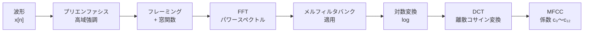

# 音声処理基礎

「音」をコンピュータで扱うための数学的・工学的な基礎です。波形のデジタル化・周波数分析・人間の聴覚特性に合わせた特徴量抽出を扱います。音声認識・話者認識・音楽情報処理・Diffusion モデルによる音声生成——すべてここで学ぶ概念の上に成り立っています。

---

## はじめて読む人へ

音は空気の振動です。コンピュータで扱うには「連続する振動」を「数値の列」に変換し、さらに「人間が知覚しやすい形」に変換する必要があります。このページでは「なぜ wav2vec の入力はメルスペクトログラムなのか」「なぜ MFCC が音声認識の特徴量として長年使われてきたのか」の答えを示します。

### 読む前に押さえること

- [フーリエ解析](フーリエ解析) — DFT・FFT・スペクトル
- [確率・統計基礎](確率・統計基礎) — 基本的な統計量

### 読み終えたら説明できること

- サンプリング定理が音声のデジタル化にどう使われるかを説明できる
- STFTがなぜ「時間 × 周波数」の2次元表現を作るかを説明できる
- メルスケールとMFCCが人間の聴覚特性をどう模倣するかを説明できる

---

## 音のデジタル化

### アナログ音声とは

音は媒質（空気）の圧力変化が伝わる現象で、時刻 $t$ における気圧変化 $x(t)$ を連続関数として表せます。

時間軸上の気圧変化は周期的な振動として現れ、山（高圧）と谷（低圧）が繰り返されます。この振動の繰り返し速さが**周波数**（Hz）、振幅の大きさが**音の大きさ**に対応します。
### サンプリングと量子化

**サンプリング（標本化）：** 連続信号を一定間隔 $T_s$ で離散的に記録します。

$$
x[n] = x(nT_s), \quad n = 0, 1, 2, \ldots
$$

サンプリング周波数 $f_s = 1/T_s$（Hz）が高いほど元の音に忠実です。

**量子化：** 各サンプルの振幅を有限ビット数で表現します。16bit なら $2^{16} = 65536$ 段階です。

### ナイキストのサンプリング定理

> 信号に含まれる最大周波数 $f_{\max}$ の **2 倍以上** のサンプリング周波数 $f_s \geq 2f_{\max}$ があれば、アナログ信号を完全に復元できる。

| 用途 | サンプリング周波数 | 最大再現周波数 |
|------|---------------|-------------|
| 電話音声 | 8,000 Hz | 4,000 Hz |
| CD 音質 | 44,100 Hz | 22,050 Hz |
| スタジオ録音 | 96,000 Hz | 48,000 Hz |

人間の可聴域は 20 Hz〜20,000 Hz なので、44,100 Hz（CD 品質）で十分です。これを下回ると**エイリアシング**（折り返し雑音）が発生し、本来は存在しない低い周波数成分が現れます。

---

## フーリエ変換と音声

### なぜ周波数域が必要か

時間域 x[n]:  「いつ大きな音がしたか」はわかるが
「どんな音程か（何 Hz の音か）」はわからない

周波数域 X[k]: 「どんな周波数成分が含まれるか」がわかるが
「いつ」かがわからない
音の「質」（音色・音程）は **周波数成分の分布** で決まります。「ド」の音は 261.6 Hz を基本周波数として、その整数倍の倍音成分を含みます。

### 離散フーリエ変換（DFT）

長さ $N$ の信号 $x[n]$ の DFT：

$$
X[k] = \sum_{n=0}^{N-1} x[n] e^{-j 2\pi k n / N}, \quad k = 0, 1, \ldots, N-1
$$

- $X[k]$ は周波数 $k \cdot f_s / N$ [Hz] 成分の複素振幅
- $|X[k]|$ が振幅スペクトル、$\arg(X[k])$ が位相

FFT を使えば $O(N \log N)$ で計算できます（`np.fft.fft`）。

---

## 短時間フーリエ変換（STFT）

### 問題：音楽は時間とともに変化する

DFT は信号全体を一度に変換するため、「どの時刻でどの音程が鳴っているか」が分かりません。そこで**窓関数**で信号を短い区間に切り出し、各区間に DFT を適用します。

### STFT の定義

$$
\text{STFT}\{x[n]\}(m, k) = \sum_{n=-\infty}^{\infty} x[n] \cdot w[n - mH] \cdot e^{-j 2\pi k n / N}
$$

- $w[n]$：窓関数（ハン窓・ハミング窓など。端での不連続を緩和）
- $N$：FFT サイズ（周波数解像度を決める）
- $H$：ホップ長（窓をずらすサンプル数）
- $m$：時間フレームのインデックス

### 時間-周波数トレードオフ

$$
\Delta t \cdot \Delta f \geq 1
$$

**ハイゼンベルク的不確定性**：時間解像度と周波数解像度はトレードオフです。

| FFT サイズ $N$ | 周波数解像度 | 時間解像度 | 適した用途 |
|--------------|------------|----------|----------|
| 大（2048） | 高い | 低い | 音楽・ピッチ分析 |
| 小（256） | 低い | 高い | 音声・過渡成分 |

### スペクトログラム

STFT の振幅の二乗を**パワースペクトログラム**と呼びます。

$$
P(m, k) = |\text{STFT}(m, k)|^2
$$

縦軸が周波数、横軸が時間、色の濃さがパワーを表す 2 次元画像として可視化できます。

---

## メルスケールとメルスペクトログラム

### 人間の聴覚特性

人間の耳は**対数的**に周波数を知覚します。

- 100 Hz → 200 Hz の変化は「1 オクターブ上がった」と感じる
- 5000 Hz → 5100 Hz の変化はほとんど気づかない

低周波の変化に敏感で、高周波には鈍感——これを模倣したのが**メルスケール**です。

### メルスケールの定義

$$
m = 2595 \log_{10}\!\left(1 + \frac{f}{700}\right)
$$

$$
f = 700 \left(10^{m/2595} - 1\right)
$$

| 周波数 $f$ [Hz] | メル $m$ |
|---------------|---------|
| 0 | 0 |
| 1,000 | 1,000 |
| 4,000 | 2,146 |
| 10,000 | 2,840 |

低周波域では Hz とメルがほぼ比例しますが、高周波では Hz が増えてもメルはゆっくり増えます。

### メルフィルタバンク

スペクトログラムの周波数軸をメルスケールに変換するため、三角形のフィルタを **メルスケール上で等間隔** に並べます。

三角形フィルタの配置は Hz スケールでは不均一（低域に密・高域に疎）ですが、メルスケール上では等間隔になります。これにより、人間の聴覚が低周波数の変化に敏感である性質を反映した特徴量が得られます。
### メルスペクトログラム

$$
\text{MelSpec}(m, b) = \sum_{k} \text{STFT}(m, k)^2 \cdot H_b[k]
$$

$H_b[k]$ は $b$ 番目のメルフィルタです。出力は「時間 × メルビン数」の 2 次元行列。音声・音楽の深層学習では最もよく使われる入力表現です。

---

## MFCC（メル周波数ケプストラム係数）

### ケプストラムとは

スペクトルの「形」（包絡線）と「細かい凸凹」（倍音構造）を分離する技術です。

Source-Filter 理論では、音の生成を次の 2 段階でモデル化します：

- **Source（声帯振動）**：倍音列を生成する音源。ピッチ（基本周波数）を決定します
- **Filter（声道フィルタ）**：共鳴特性によって音色を形成。音韻情報（母音・子音の違い）を決定します

対数スペクトル上では「音源スペクトル + フィルタスペクトル」の加法的な構造になるため、DCT によってピッチ成分と音韻成分を分離できます。
### MFCC の計算手順



1. **プリエンファシス：** $y[n] = x[n] - \alpha x[n-1]$（$\alpha \approx 0.97$）で高域を補正
2. **フレーミング：** 20〜30 ms 程度の窓（音素の変化より短い）
3. **FFT** でパワースペクトルを計算
4. **メルフィルタバンク**（通常 40 個）を適用して次元削減
5. **対数変換** で人間の音量知覚（対数的）を模倣
6. **DCT** で包絡線を抽出。最初の 13 係数（$c_0 \sim c_{12}$）が MFCC

### MFCC の性質

| 係数 | 意味 |
|------|------|
| $c_0$ | ログエネルギー（音量）— 音韻識別には使わないことが多い |
| $c_1 \sim c_4$ | スペクトル包絡の大まかな形（母音の種類など） |
| $c_5 \sim c_{12}$ | より細かいスペクトル形状 |

**デルタ係数・デルタデルタ係数：** MFCC の時間的変化（速度・加速度）も特徴量として追加することで、音素の動的な変化を捉えます。最終的な特徴ベクトルは 39 次元（13 + 13 + 13）になるのが典型です。

---

## LibROSA による実装

```python
import librosa
import numpy as np

# 音声ファイルの読み込み
y, sr = librosa.load("audio.wav", sr=22050)  # y: 波形, sr: サンプリングレート

# スペクトログラム
D = librosa.stft(y, n_fft=2048, hop_length=512, win_length=2048)
S = np.abs(D) ** 2                  # パワースペクトログラム

# メルスペクトログラム（対数スケール）
mel_spec = librosa.feature.melspectrogram(y=y, sr=sr, n_mels=128)
log_mel = librosa.power_to_db(mel_spec)  # dB スケール

# MFCC
mfcc = librosa.feature.mfcc(y=y, sr=sr, n_mfcc=13)
# shape: (13, フレーム数)

# デルタ係数
delta = librosa.feature.delta(mfcc)
delta2 = librosa.feature.delta(mfcc, order=2)
features = np.vstack([mfcc, delta, delta2])  # (39, フレーム数)
```

| パラメータ | 一般的な値 | 意味 |
|-----------|---------|------|
| `sr` | 22050 / 16000 | サンプリング周波数（音楽：22050、音声：16000） |
| `n_fft` | 2048 | FFT サイズ（周波数解像度） |
| `hop_length` | 512 | ホップ長（時間解像度；n_fft/4 が目安） |
| `n_mels` | 80〜128 | メルビン数 |
| `n_mfcc` | 13〜40 | 抽出する MFCC 係数の数 |

---

## 現代の音声処理との接続

| 手法 | 入力特徴量 | 備考 |
|------|----------|------|
| 古典的 HMM-GMM 音声認識 | MFCC（39 次元） | 1990〜2010 年代の主流 |
| DNN-HMM ハイブリッド | MFCC / FBANK | 深層学習との組み合わせ |
| wav2vec 2.0 / HuBERT | 生波形 | CNN で特徴抽出を学習 |
| Whisper | ログメルスペクトログラム（80 メルビン） | OpenAI の音声認識モデル |
| AudioLM / MusicGen | 離散音声トークン | 音声の言語モデリング |

Whisper は 80 メルビン×3000 フレームのログメルスペクトログラムを Transformer に入力します。古典的な MFCC から概念は連続しており、「人間の聴覚に合わせた周波数変換」という本質は変わっていません。

---

## 数学的導出

### サンプリング定理の直感的証明

信号 $x(t)$ の帯域が $[-f_{\max}, f_{\max}]$ に制限されているとします。

サンプリングはインパルス列との乗算 $x_s(t) = x(t) \sum_n \delta(t - nT_s)$ に相当します。周波数域では周期 $f_s = 1/T_s$ での折り返しが生じます：

$$
X_s(f) = f_s \sum_{k=-\infty}^{\infty} X(f - k f_s)
$$

元のスペクトル $X(f)$ が周期 $f_s$ で繰り返されます。隣接するコピーが重なる（エイリアシング）には $f_s < 2f_{\max}$ が条件であり、重ならないためには：

$$
\boxed{f_s \geq 2f_{\max}}
$$

### メルスケール変換の導出

等比周波数比で等しい音程差を感じるという**ウェーバー-フェヒナーの法則**から、感覚量 $m$ と物理量 $f$ の関係は：

$$
dm = c \frac{df}{f + f_0}
$$

$f_0 = 700$ Hz（低域での聴覚感度調整）を代入して積分すると：

$$
m = c \int_0^f \frac{df'}{f' + 700} = c \ln\!\left(1 + \frac{f}{700}\right)
$$

定数 $c = 2595 / \ln 10 = 1127$ を選ぶと（1,000 Hz のとき $m = 1,000$ になるよう規格化）：

$$
\boxed{m = 2595 \log_{10}\!\left(1 + \frac{f}{700}\right)}
$$

---

## 確認問題

1. サンプリング周波数 16,000 Hz でサンプリングした音声に含められる最大周波数を求めてください。
2. FFT サイズを 2 倍にすると、時間解像度と周波数解像度はそれぞれどう変化しますか？
3. MFCC のデルタ係数を追加する理由を「音素の動的変化」の観点から説明してください。
4. メルスケールが「低周波に密・高周波に疎」なフィルタバンクになる理由をサンプリング定理の観点から説明してください。

---

## 関連ページ

- [フーリエ解析](フーリエ解析) — DFT・FFT・スペクトルの数学的基礎
- [ラプラス変換・Z変換](ラプラス変換) — 伝達関数・フィルタの周波数特性
- [音楽情報処理](音楽情報処理) — MFCC の応用・ビート検出・音源分離
- [RNN・時系列](RNN-時系列) — 音声の系列モデリング
- [Transformer・Attention](Transformer-Attention) — 音声認識への応用（Whisper の構造）
- [生成モデル](生成モデル) — Diffusion モデルによる音声生成

---

[← ホームへ](Home)
