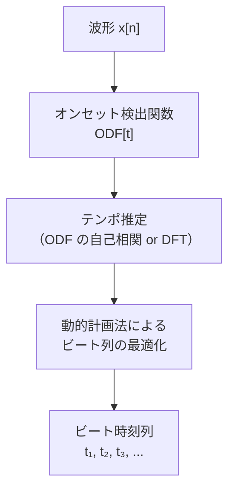

# 音楽情報処理（MIR）

音楽を「データ」として分析・検索・生成する研究分野です。ビート検出・コード認識・調性推定・音源分離・類似楽曲検索——Spotify の「似た曲の推薦」や自動採譜アプリの背後にある技術を扱います。音声処理基礎で学んだスペクトル分析の応用です。

---

## はじめて読む人へ

MIR（Music Information Retrieval）は「音楽に関する情報をコンピュータで取り出す」研究分野全体を指します。「この曲は何 BPM か」「今 C メジャーコードが鳴っているか」「ドラムとボーカルを分離できるか」——これらはすべて音声処理基礎の特徴量（STFT・スペクトログラム・クロマグラム）の上に成り立っています。

### 読む前に押さえること

- [音声処理基礎](音声処理基礎) — STFT・メルスペクトログラム・MFCC
- [フーリエ解析](フーリエ解析) — 周波数分析の基礎

### 読み終えたら説明できること

- クロマグラムが音楽の調性情報をどう表現するかを説明できる
- ビート追跡のアルゴリズムの流れを説明できる
- 音源分離の主要なアプローチ（NMF・深層学習）を比較できる

---

## 音楽の要素

### 音楽信号の階層構造

!!! info ""
    波形 x[n]
        │
        ▼ STFT / DFT
    スペクトログラム（時間 × 周波数）
        │
        ├── 音高情報 → クロマグラム・ピッチ検出
        ├── 音色情報 → MFCC・スペクトル形状
        ├── リズム情報 → ビート・テンポ
        └── 音量情報 → オンセット（音の立ち上がり）

### 音楽の物理的特性

| 要素 | 物理量 | 知覚量 |
|------|--------|--------|
| 音高（ピッチ） | 基本周波数 $f_0$ [Hz] | 音程（ドレミ） |
| 音量 | 振幅・エネルギー | ラウドネス [dB] |
| 音色 | スペクトル形状・倍音構造 | 楽器の種類 |
| リズム | テンポ [BPM]・拍の位置 | ビート・グルーヴ |
| 調性 | クロマ分布 | キー（ハ長調など）|

### 平均律と周波数

西洋音楽の平均律では、半音 1 つで周波数が $2^{1/12} \approx 1.059$ 倍になります。

$$
f_n = 440 \times 2^{(n-69)/12} \quad \text{[Hz]}
$$

$n$：MIDI ノート番号（A4 = 440 Hz は $n = 69$）。1 オクターブ上がると周波数は 2 倍になります。

---

## クロマグラム

### 音楽の「調性」を表す特徴量

12 半音（C, C#, D, ..., B）の各音高クラスにエネルギーがどれだけ含まれるかを表します。

$$
\text{Chroma}[t, c] = \sum_{k : \text{pitch class}(k) = c} |X[t, k]|^2
$$

$k$：周波数ビン、$c \in \{0, 1, \ldots, 11\}$：音高クラス（C=0, C#=1, ...）

!!! info ""
    時刻 t=10 でのクロマグラム:
    C  ██████████████  エネルギー大（C が鳴っている）
    C# ██
    D  ████
    D# █
    E  ███████████     エネルギー大（E も鳴っている）
    F  ██
    F# █
    G  ████████████    エネルギー大（G も）
    G# ██
    A  ███
    A# █
    B  ██
    
    → C・E・G が大きい → C メジャーコードが鳴っている

**クロマグラムの性質：**
- オクターブが違う同じ音名は同じ bin に集約される（オクターブ不変性）
- コード認識・調性推定・楽曲カバー検出に有用
- `librosa.feature.chroma_stft(y, sr)` で計算できます

---

## テンポとビート検出

### テンポ（BPM：Beats Per Minute）

1 分間の拍の数です。ポップスは 120 BPM 前後、ヘビーメタルは 180 BPM 以上が多いです。

### オンセット検出

音の立ち上がり（ノートの開始点）を検出することがビート追跡の第一歩です。

$$
\text{ODF}[t] = \sum_k \max\!\left(0,\, |X[t,k]| - |X[t-1,k]|\right)
$$

ODF（Onset Detection Function）：隣接フレーム間で振幅が増加した成分の総和。打楽器系の音（急激な振幅増加）でピークを持ちます。

### ビート追跡



**動的計画法によるビート追跡：** 前のビートから「妥当な間隔（テンポに近い）」で次のビートが来るという制約を使い、コストが最小のビート系列を探します。`librosa.beat.beat_track(y, sr)` で実装されています。

---

## コード認識

### テンプレートマッチング法

各コードのクロマ「テンプレート」と実測クロマを比較し、最も類似するコードを判定します。

**C メジャーのテンプレート例：**

$$
\mathbf{t}_{C\text{maj}} = [1, 0, 0, 0, 1, 0, 0, 1, 0, 0, 0, 0]
$$

（C=1, E=1, G=1 が含まれる）

$$
\hat{c}(t) = \arg\max_c \frac{\mathbf{t}_c \cdot \text{Chroma}[t]}{\|\mathbf{t}_c\| \|\text{Chroma}[t]\|}
$$

### HMM ベースのコード認識

コードは急に変わらない（C メジャーの次も C メジャーである確率が高い）という「時系列の滑らかさ」を利用します。隠れマルコフモデル（HMM）で：

- **観測：** クロマグラム
- **隠れ状態：** コード（C メジャー・C マイナー・G7 など）
- **遷移確率：** 音楽理論に基づくコード進行のコスト

---

## 調性推定

楽曲全体の調（キー：ハ長調・ニ短調など）を推定します。

### Krumhansl-Schmuckler アルゴリズム

1. 楽曲全体のクロマヒストグラム $c = [c_0, c_1, \ldots, c_{11}]$ を計算
2. 長調・短調の調プロファイル $p^{\text{maj}}, p^{\text{min}}$（心理音響実験で測定）との相関を計算
3. 最も相関が高い調が推定結果

長調プロファイル（Krumhansl, 1990）の最初の数値（C メジャー基準）：

$$
p^{\text{maj}} = [6.35, 2.23, 3.48, 2.33, 4.38, 4.09, 2.52, 5.19, 2.39, 3.66, 2.29, 2.88]
$$

C（6.35）と G（5.19）と E（4.38）が高い——C メジャースケールの主音・属音・3度音です。

---

## 音源分離

1 つの混合音源から、複数の音源（ボーカル・ドラム・ベース）を分離します。

### NMF（非負値行列因子分解）

スペクトログラム $V \approx WH$（$V, W, H \geq 0$）に分解します。

- $W$：基底スペクトル（各音源の「音色」）
- $H$：時間的活性化（各音源が「いつ鳴っているか」）

$$
V \approx WH, \quad \min_{W, H \geq 0} \|V - WH\|_F^2
$$

楽器が少数で音色が安定している場合に有効ですが、ボーカルのような複雑な音色には限界があります。

### 深層学習による音源分離

| モデル | 特徴 |
|-------|------|
| **Demucs** | U-Net 系の波形ドメイン分離。4 音源（ドラム・ベース・ボーカル・その他）を高精度に分離 |
| **Open-Unmix** | スペクトログラムドメインのBLSTM |
| **HTDemucs** | Transformer + 波形の融合モデル（2023年の最高性能） |

```python
# Demucs の使用例（pip install demucs）
# demucs --two-stems vocals audio.mp3
# → audio_vocals.wav と audio_no_vocals.wav に分離
```

---

## 類似楽曲検索

### カバー曲検出

同じ楽曲の異なるアレンジ（テンポ・移調が異なる場合も含む）を検出します。

**主要手法：**

1. **クロマグラムの時系列照合（DTW）：** 動的時間伸縮法で、テンポが異なる2つの演奏のクロマ系列を比較
2. **2次トーナルピッチクラス（2DFT）：** 移調に不変な特徴量
3. **CQT スペクトログラム：** 対数周波数スケールで移調シフトが平行移動になる

### 楽曲推薦

Spotify の「Discover Weekly」は：

1. 楽曲の音響特徴量（MFCC・クロマ・テンポ）を抽出
2. ユーザーの聴取履歴と組み合わせた協調フィルタリング
3. コンテンツベースフィルタリングとのハイブリッド

で類似楽曲を推薦しています。

---

## 自動採譜（Automatic Music Transcription）

音楽信号から楽譜を生成します。最も困難な MIR タスクの一つです。

### ピッチ検出（単音）

基本周波数 $f_0$ の推定。CREPE（深層学習ベース）が現在の最高性能です。

### ポリフォニック転写（和音）

複数の音が同時に鳴る場合の転写。ピアノロール形式（時間 × ピッチ × 音量の 3D 表現）で出力することが多いです。

**Onsets and Frames（Google）：** オンセット検出と音符の持続時間推定を同時に学習する深層学習モデル。

---

## Suno / MusicGen などの音楽生成

現代の音楽生成モデルは：

1. 音楽を**離散トークン**（Encodec・DAC などの音声コーデック）に変換
2. 言語モデル（Transformer）でトークン列を予測・生成
3. トークンをデコードして波形に変換

MIR の特徴量（クロマ・テンポ・ジャンル）を条件付けに使うことで、「明るい BPM 120 のポップス」のような指示に基づく生成が可能になります。

---

## 数学的導出

### DTW（動的時間伸縮）の再帰式

2 つの特徴量系列 $X = (x_1, \ldots, x_M)$ と $Y = (y_1, \ldots, y_N)$ の距離を、各要素の対応を最適に決めながら計算します。

$$
D(i, j) = d(x_i, y_j) + \min\begin{cases} D(i-1, j) \\ D(i, j-1) \\ D(i-1, j-1) \end{cases}
$$

$d(x_i, y_j)$：局所距離（例：コサイン距離）。$D(M, N)$ が DTW 距離です。

**性質：** ユークリッド距離は同じインデックスの比較のみ（$O(N)$）ですが、DTW は時間軸の「伸び縮み」を許容します（$O(MN)$）。曲の演奏テンポが違っても类似度を計算できる点が音楽向けです。

### クロマグラムの周波数-音高クラス対応

FFT ビン $k$ に対応する周波数：

$$
f_k = k \cdot \frac{f_s}{N}
$$

音高クラス $c(k)$ への変換（MIDI ノート番号を 12 で割ったあまり）：

$$
c(k) = \left\lfloor 12 \log_2\!\left(\frac{f_k}{f_{\text{ref}}}\right) \right\rfloor \mod 12
$$

$f_{\text{ref}} = 440 / 2^{(69-69)/12} = 440$ Hz（A4 基準、または C1 = 32.7 Hz）。同じ音高クラスの全ビンのエネルギーを合算することでクロマグラムが構築されます。

---

## 確認問題

1. クロマグラムが「オクターブ不変」な理由を、周波数-音高クラス変換の数式から説明してください。
2. ビート追跡で動的計画法を使う理由を、「正確なビート間隔の制約」の観点から説明してください。
3. NMF による音源分離の限界（ボーカル分離が難しい理由）を説明してください。
4. DTW がカバー曲検出に有用な理由を、通常のユークリッド距離との違いから説明してください。

---

## 関連ページ

- [音声処理基礎](音声処理基礎) — STFT・MFCC・LibROSA の基礎
- [フーリエ解析](フーリエ解析) — DFT・スペクトル分析
- [生成モデル](生成モデル) — Diffusion による音声生成・音楽生成
- [RNN・時系列](RNN-時系列) — 音楽の系列モデリング
- [教師なし学習](教師なし学習) — NMF・クラスタリング
- [レコメンデーションシステム](レコメンデーション) — 楽曲推薦への応用

---

[← ホームへ](Home)
